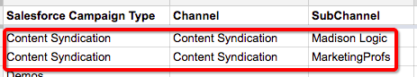
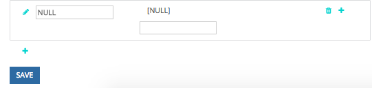
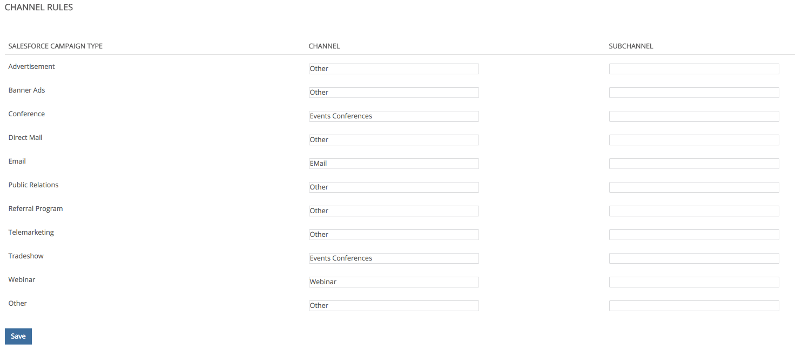

# Offline Custom Channel Setup {#offline-custom-channel-setup}

Offline Custom Channel Setup - Bizible - Product Documentation

### What's in this article? {#what-s-in-this-article}

[Getting Started](#offlinecustomchannelsetup-gettingstarted)  
[Offline Channel Logic](#offlinecustomchannelsetup-offlinechannellogic)  
[Channel Mapping Example](#offlinecustomchannelsetup-channelmappingexample)  
[Handling SFDC Campaigns for Online Marketing Efforts](#offlinecustomchannelsetup-handlingsfdccampaignsforonlinemarketingefforts)  
[Entering Your Offline Channel Rules to the App](#offlinecustomchannelsetup-enteringyourofflinechannelrulestotheapp)

#### Getting Started {#offlinecustomchannelsetup-gettingstarted}

Compared to how Bizible handles online channel rules, you will notice the offline channel rules do not require the use of a spreadsheet. However, there is still a sheet provided in the implementation plan because that can be helpful for thinking through the way you want to organize your offline channels.

The spreadsheet has three columns:

**Salesforce Campaign Type**- add Campaign Types identified in Salesforce here

* For example this could be an email, webinar, conference, or any values you created for this field to which you would like to attribute Touchpoints.

**Channel**- add your various marketing channels here

**Subchannel **- add any corresponding subchannels here

#### Offline Channel Logic {#offlinecustomchannelsetup-offlinechannellogic}

Bizible's offline channel logic is determined by the Campaign object, specifically the Salesforce Campaign Type. Each offline effort must have a Salesforce Campaign Type, such as dinner or tradeshow, because Bizible relies on this field to understand which Channel and SubChannel to map to.

The SFDC campaign types will appear in the Offline Channel's tab, listed under Salesforce Campaign Type. Please note that Bizible is only able to import SFDC Campaign Types for campaigns that have Bizible touchpoints associated to them.

This is where you can create the Channel/Subchannel mapping in the Bizible app. This will likely involve creating new Channels and Subchannels in the Bizible app, which is done in the Create Channels section of the app--shown in the image below. New Channels and Subchannels need to be created for Bizible to understand where to push Touchpoints. You are able to decide how you would like campaign types to be mapped.

#### Channel Mapping Example {#offlinecustomchannelsetup-channelmappingexample}

For example, imagine you attend two Salesforce conferences a year. Each conference however is very different and has a unique target audience. You want to know which of the two brings in more value. In your Salesforce environment, you may give the January event the Campaign Type “Conference,” name your channel “Salesforce,” and your subchannel “January Conference.”

Now you want to do the same for the June conference. You figure since this is a conference also, it can be given the same Campaign Type, in this case, “Conference.” The channel is the same, Salesforce, and the subchannel for this second conference is “June Conference.” This makes sense from an organizational perspective. However, it is very confusing to Bizible’s logic to read and apply these rules because both campaigns have the same Campaign Type. Bizible script cannot map data from one type to two different subchannels. This means you would need to create a new Campaign Type for each subchannel, but the subchannels can have the same channel.

Below is an example of logic that Bizible would not be able to read:

In the scenario above, you will want to create a unique Campaign Type because you can't map the same Campaign Type to two different subchannels. Instead, you would want to set up unique types like the following:

Any existing campaign types must be included in your channel map and “NULL” should be added as the channel.

Take time to go into Salesforce to determine the number and nature of your existing record types, which you want to include, and whether you need to create additional campaigns based on the information above. Once you have filled out all the necessary information, you are ready to upload

Learn more about [syncing offline Salesforce Campaigns with Bizible](http://docs.marketo.com/x/6AAgAQ).

#### Handling SFDC Campaigns for Online Marketing Efforts {#offlinecustomchannelsetup-handlingsfdccampaignsforonlinemarketingefforts}

It is common for Marketing teams to create Salesforce campaigns to track various digital marketing efforts. There is no problem with this practice; however, it is important to treat these campaigns differently than true offline campaigns such as direct mail or conferences, for example. Campaigns that are related to digital events (interactions taking place on your website) should not be synced with Bizible. Syncing these campaigns would result in duplication of Touchpoints because Bizible's JavaScript is already tracking online efforts.

Another tip for handling campaigns for online activities is to map the Salesforce Campaign Type to NULL. To do this, first create a channel in the Bizible app titled NULL as demonstrated in the image below. This is found in the Bizible app under the**Create Channels**section. This will be helpful in case a campaign that should not be synced is synced accidentally. It is easy to find the campaign and correct the sync status by looking at everything bucketed under NULL.

#### Entering Your Offline Channel Rules to the App {#offlinecustomchannelsetup-enteringyourofflinechannelrulestotheapp}

Once you have edited and updated the spreadsheet with your custom rules, the next step is to recreate this channel mapping in the Bizible app--you won't actually upload a spreadsheet for offline channels. Rather, you will enter the information in the picklist boxes as displayed in the image below. This is found by clicking**Offline Channels**under the **Channels **section.

>[!TIP]
>
>Want to determine *when *a Salesforce Campaign Type gets pulled down into Bizible channel mapping? Simply go to **Setup** > **Campaigns** > **Fields** > **Type**. You can then see which values are in the picklist, and which are inactive. Inactive ones won't show up as a selectable type in our "Offline Channels" section. Please note, this process can take anywhere from a few minutes up to 48 hours.

Click**Save **when you're finished and Bizible will upload the changes and reprocess the data.

>[!NOTE]
>
>**Related Articles**
>
>[Bizible University: Mapping Offline Channels](https://universityonline.marketo.com/courses/bizible-fundamentals-channel-management/#/page/5c630eca34d9f0367662b77f)
>
>[Bizible University: Syncing Offline Campaigns](https://universityonline.marketo.com/courses/bizible-fundamentals-channel-management/#/page/5c63286e34d9f0367662b78b)

