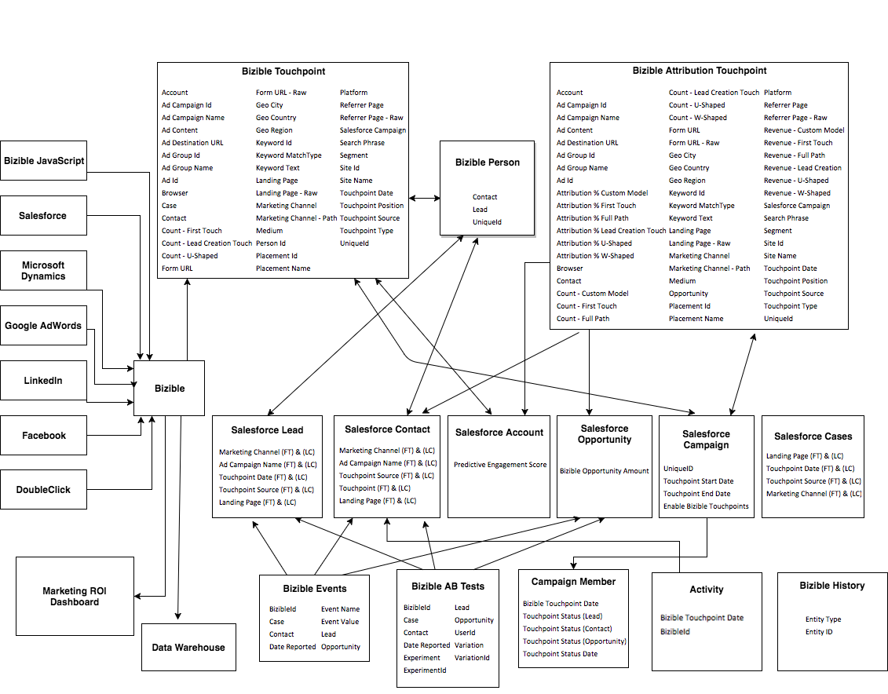

# Bizible Object and Field Taxonomy {#bizible-object-and-field-taxonomy}

Bizible Object and Field Taxonomy - Bizible - Product Documentation

Below is a flow chart&nbsp;that represents how Bizible's Custom Objects relate to Salesforce Standard Objects.

For the full-sized image, [click here](http://docs.marketo.com/display/biz/assets/bizible-taxonomy.png).  
  
`Definitions of the Bizible fields that live in each object [can be found here](http://docs.marketo.com/x/2gAgAQ). `&nbsp;

#### FAQ {#bizibleobjectandfieldtaxonomy-faq}

##### Q: What is the logic in the arrows? {#bizibleobjectandfieldtaxonomy-q-whatisthelogicinthearrows?}

`A: Each arrow describes the relationship between an object and the other. For example, you'll see that the Bizible Person populates fields on the standard Salesforce Lead Object. If it's pointing to it, then it means that it's populating the receiving end of the arrow.`

##### Q: What is the Bizible Person? {#bizibleobjectandfieldtaxonomy-q-whatisthebizibleperson?}

`A: It's a Custom Bizible Object in Salesforce that links Bizible Touchpoints to Leads and Contacts.`

##### Q: What is the Bizible.JS? {#bizibleobjectandfieldtaxonomy-q-whatisthebizible.js?}

`A: It's our custom JavaScript that we utilize to track web information that a person has on a specific site.`

##### Q: What is the&nbsp;Marketing ROI Dashboard? {#bizibleobjectandfieldtaxonomy-q-whatisthemarketingroidashboard?}

`A: It's a custom marketing channels dashboard that lives in the Bizible app. It can be accessed by going to your Bizible tab in Salesforce.`

