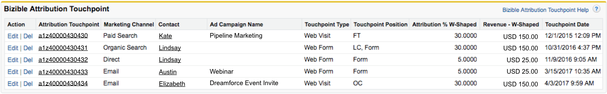

# Bizible Salesforce Objects {#bizible-salesforce-objects}

Bizible Salesforce Objects - Bizible - Product Documentation

When Bizible is installed in Salesforce (SFDC), several custom Bizible Objects are added. This lesson provides an explanation of several of those custom Bizible Objects.&nbsp;Some Objects that Bizible adds to Salesforce are:

* [Bizible Touchpoint](#BizibleSalesforceObjects-touchpoint)
* [Bizible Attribution Touchpoint](#BizibleSalesforceObjects-attribution)
* [Bizible Person](#BizibleSalesforceObjects-person)
* [Bizible A/B Testing](#BizibleSalesforceObjects-ab)
* [Bizible Events](#BizibleSalesforceObjects-events)&nbsp;

It is important to note that Bizible will not create any standard SFDC Objects with data gathered from Bizible's Javascript. This data will only be populated within Bizible's custom objects or in Bizible fields that live on standard SFDC objects.

Bizible Objects relate to specific standard Salesforce Objects. This allows you to to&nbsp;report on Bizible and Salesforce Objects together. The table below shows which Salesforce Object the Bizible Object relates to.&nbsp;

#### Bizible Touchpoint {#biziblesalesforceobjects-touchpointbizibletouchpoint}

The Bizible Touchpoint (BT) Object tells the marketing story of an individual. It houses all the data related to the marketing touchpoints generated by Leads and Contacts. The BT shows you information like which marketing channel the touchpoint came from, or which Ad Campaign brought that particular Lead/Contact to your website.&nbsp;

The BT Object is visible on Leads and Contacts pages as a**Related List**(see image below).

The BT Related List displays all the touchpoints that belong to the Lead or Contact. Within the list are custom Bizible Fields which provide further details about each touchpoint. Clicking on the Bizible Touchpoint ID number will direct you to the Bizible Touchpoint Detail page, which provides even more details about the touchpoint, like the first web page the Lead/Contact visited during that web session (**landing page**).

#### Bizible Attribution Touchpoint {#biziblesalesforceobjects-attributionbizibleattributiontouchpoint}

The Bizible Attribution Touchpoint Object tells the story of many marketing interactions of many contacts related to an opportunity. It displays the*attribution*data related to the marketing touchpoints. This Object allows you to see how much revenue credit is attributed to each marketing touchpoint. The type of attribution model that you are using will determine the percentage of revenue attributed to touchpoints.

Bizible Attribution Touchpoints (BATs) are only created once an Opportunity is created which relates to contacts that have Bizible Touchpoint (BT) data. BATs will not be created without an Opportunity. Once the Opportunity has been created, the BAT Object will use&nbsp;the Salesforce*Amount*field on the Opportunity to understand how much revenue to attribute to the touchpoints.&nbsp;

A**workflow**must be created if you&nbsp;use a [custom Amount field](http://docs.marketo.com/x/qQEgAQ) to show revenue&nbsp;on the Opportunity Object. Bizible is&nbsp;not able to read the information surfaced in custom Amount fields&nbsp;and&nbsp;consequently is unable to populate revenue attribution data on the touchpoints. This workflow will use the&nbsp;**Bizible Opportunity Amount&nbsp;**Field, one of Bizible's custom fields, to map the revenue value from the&nbsp;custom Amount field to the Opportunity Amount field.&nbsp;

The BAT Object is visible on the Opportunity, Contact, and Account Object as a Related List. This list displays all the touchpoints with the attribution data belonging to an Opportunity. Clicking into the Bizible Attribution Touchpoint ID will direct you to the Bizible Attribution Touchpoint Detail page. Here you will be able to see more specific attribution data and information about where the touchpoint came from (similar to what is provided from the Bizible Touchpoint Object).

#### Bizible Person {#biziblesalesforceobjects-personbizibleperson}

The Bizible Person Object relates the Lead and Contact objects together. Out of the box, Salesforce does not provide the option to create reports using the Lead and Contact object in the same report. By relating to the Lead and Contact Object, the Bizible Person allows you to report on both Objects within the same report. This is especially helpful when a Lead has been converted into a Contact. On a Bizible Person record you'll see a look-up to the corresponding Lead and/or Contact record, a related list of the Touchpoints tied to the person, and the Person ID (which is always the email address of the Lead/Contact). Since the Bizible Person relates to the Lead & Contact Object, there won't ever be a Bizible Person record that is tied to a Bizible Attribution Touchpoint. Below is an example of a Bizible Person record within Salesforce:

#### Bizible A/B Test {#biziblesalesforceobjects-abbiziblea/btest}

If you are running A/B tests through Optimizely or VWO (Visual Web Optimizer), you can connect those accounts to your Bizible account to view A/B test data within Salesforce. The Bizible A/B Test Object essentially allows you to take A/B test data from Optimizely/VWO and tie the data to Leads and Contacts.

The Bizible A/B Test Object is displayed as a Related List on Leads, Contacts and Opportunity pages. The list surfaces all the experiments and variations that you’re running through Optimizely or VWO, and allows you to see the experiments/variations as they relate to specific Leads and Contacts.

#### Bizible Events {#biziblesalesforceobjects-eventsbizibleevents}

The Bizible Events Object allows you to track specific events that occur on your website. To [track specific events](http://docs.marketo.com/x/aAEgAQ)that happen on your website, custom code must be added to your pages in addition to the Bizible Javascript. The captured information will be displayed within the Bizible Object Related List, which can be found on the Leads, Contacts and Opportunity pages. The Bizible Events Object&nbsp;*does not*tie to attribution data. The purpose of this Object is to see if people are taking specific actions on your website.

#### Bizible Fields {#biziblesalesforceobjects-fieldsbiziblefields}

Data captured by Bizible’s Javascript will be pushed into the custom Bizible Fields within our Bizible Objects. Certain fields will only be present on certain objects. For a glossary&nbsp;of&nbsp;all the Bizible fields, please [click here](http://docs.marketo.com/x/2gAgAQ). For a visualization of which Bizible Object each Bizible Field relates to, please [click here](http://docs.marketo.com/x/2AAgAQ).

#### Bizible Reports and Dashboards {#biziblesalesforceobjects-reportsbiziblereportsanddashboards}

The Bizible Reports and Dashboards that are added to your Salesforce provides you with out-of-the-box reporting and data visualization capabilities. These are basic Bizible reports to allow you to quickly organize, analyze and understand touchpoint data.

