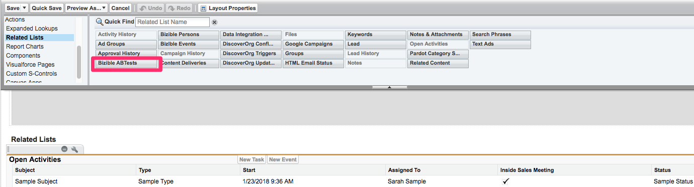
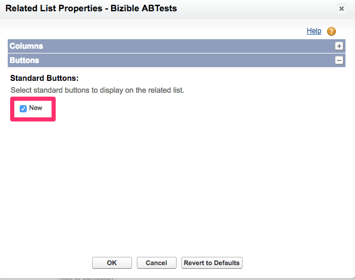
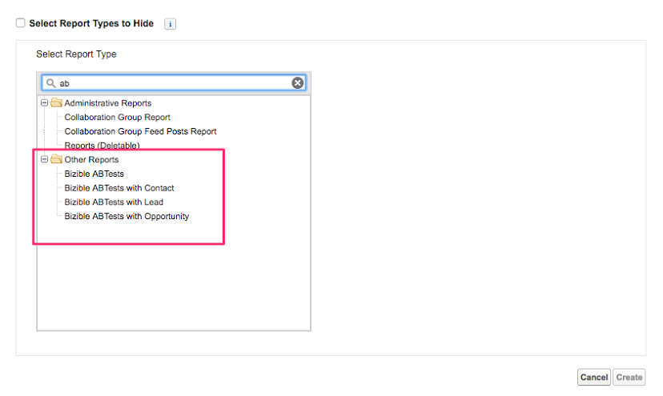
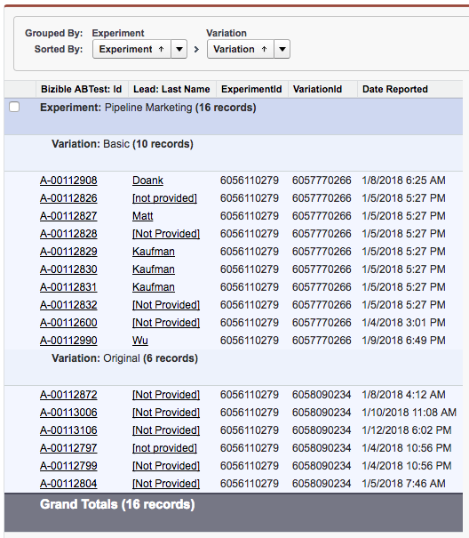

# AB Testing Set Up and Reporting {#ab-testing-set-up-and-reporting}

AB Testing Set Up and Reporting - Bizible - Product Documentation

`The Bizible AB Test integration allows you to track the revenue impact of your` [Optimizely](http://optimizely.com/) `and VWO site experiments. This article guides provides instructions on how to add Bizible AB Test sections to the Lead, Contact, Case, and Opportunity page layouts. We will also cover general reporting practices and recommendations for running Bizible AB report types.`

### What's in this article? {#what-s-in-this-article}

[Set Up](#abtestingsetupandreporting-setup)  
[Reporting](#abtestingsetupandreporting-reporting)  
[Salesforce Example Reports](#abtestingsetupandreporting-salesforceexamplereports)

#### Set Up {#abtestingsetupandreporting-setup}

`Add the Bizible AB Test sections on Lead, Contact, Case, and Opportunity. Bizible AB Test integration allows you to track the revenue impact of your` [Optimizely](http://optimizely.com/) `and` [VWO](http://vwo.com/) `site experiments.`

##### 1. Verify you are using package [Bizible v3.9 or later](http://bizible.com/sf). You can do this by going to Salesforce > Set Up > Installed packages. {#abtestingsetupandreporting-verifyyouareusingpackagebiziblev3.9orlater.youcandothisbygoingtosalesforce>setup>installedpackages.}

##### 2. Edit the Lead page layout and add the Bizible AB Tests Related List to the page.   
{#abtestingsetupandreporting-edittheleadpagelayoutandaddthebizibleabtestsrelatedlisttothepage.}

##### 3. Click the Wrench button. Remove the stock "Id" field from the list of Selected fields. Add Experiment, Variation, and DateReported fields. Change "Sort by" to Date Reported, and select Descending in the drop-down.   
{#abtestingsetupandreporting-clickthewrenchbutton.removethestock"id"fieldfromthelistofselectedfields.addexperiment-variation-anddatereportedfields.change"sortby"todatereported-andselectdescendinginthedrop-down.}

##### 4. Under Buttons, uncheck New. {#abtestingsetupandreporting-underbuttons-unchecknew.}

##### 5. Contact your Bizible rep or email [[email protected]](http://docs.marketo.com/cdn-cgi/l/email-protection#8ffcfaffffe0fdfbcfede6f5e6ede3eaa1ece0e2)to enable the feature. {#abtestingsetupandreporting-contactyourbiziblereporemailsupport@bizible.comtoenablethefeature.}

#### Reporting {#abtestingsetupandreporting-reporting}

Customers have access to a couple of Bizible AB report types that allow you to report on AB Test in relation to Leads, Contacts, and Opportunities:

* Bizible ABTests
* Bizible ABTests with Contact
* Bizible ABTests with Lead
* Bizible ABTests with Opportunity

AB report types are used to report on which Lead or Contact or Opportunity has been exposed to an AB test. Additionally, these reports can show you the amount of revenue tied to an Opportunity that was exposed to an AB test.

It's important to note that Optimizely/VWO is a content variation platform and not a marketing channel. Therefore, these Bizible AB report types are used differently than Bizible Touchpoint reports. Bizible touchpoint reports types are used to understand which marketing channel (e.g., paid advertising, web direct, social) drove a Lead or Contact to a specific page. However, Bizible AB report types cannot be used to report on how a variation influenced a Lead or Opportunity. Additionally, since an AB test variation is not a channel, details about the variation will not appear on the Bizible touchpoint.

Here are some common fields we recommend using when reporting on AB test to help increase clarity and insight:

* Lead converted
* Experiment
* Experiment ID
* Variation
* Variation ID
* Date Reported

#### Salesforce Example Reports {#abtestingsetupandreporting-salesforceexamplereports}

**Bizible AB Test with Lead**

**Bizible AB Test with Opportunity**

