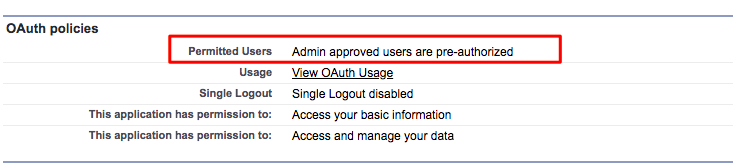
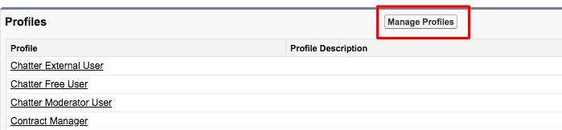

# Bizible Insights Configuration {#bizible-insights-configuration}

Bizible Insights Configuration - Bizible - Product Documentation

The Bizible Insights Canvas App should be added to the Lead Page Layout but it requires additional setup in the Connected Apps section of your Salesforce Setup. Please follow these instructions to ensure the Canvas App has the appropriate permissions.

##### 1. Navigate to Salesforce Setup and click Connected Apps under the Manage Apps tab. {#bizibleinsightsconfiguration-navigatetosalesforcesetupandclickconnectedappsunderthemanageappstab.}

##### 2. Select the Bizible Insights from the list that populates. {#bizibleinsightsconfiguration-selectthebizibleinsightsfromthelistthatpopulates.}

##### 3. Under the OAuth policies section, change the Permitted Users setting to “Admin approved users are pre-authorized.” A pop-up will appear, click OK and then Save. {#bizibleinsightsconfiguration-undertheoauthpoliciessection-changethepermitteduserssettingto“adminapprovedusersarepre-authorized.”apop-upwillappear-clickokandthensave.}

##### 4. Once the page is saved, you'll be able to click the Manage Profiles button. {#bizibleinsightsconfiguration-oncethepageissaved-you'llbeabletoclickthemanageprofilesbutton.}

##### 5. Select all the profiles that should have access to Bizible Insights and click Save. {#bizibleinsightsconfiguration-selectalltheprofilesthatshouldhaveaccesstobizibleinsightsandclicksave.}

