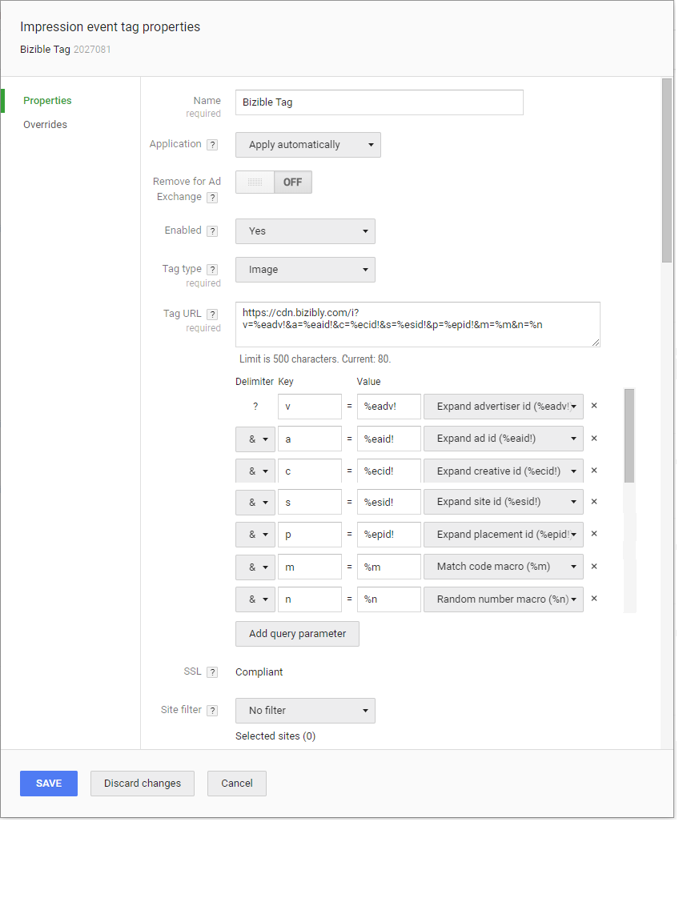

# Configuring Doubleclick Campaign Manager View Through Attribution {#configuring-doubleclick-campaign-manager-view-through-attribution}

Configuring Doubleclick Campaign Manager View Through Attribution - Bizible - Product Documentation

### What's in this article? {#what-s-in-this-article}

[Measuring View Through Attribution](#configuringdoubleclickcampaignmanagerviewthroughattribution-measuringviewthroughattribution)  
[How to add the Image Tag](#configuringdoubleclickcampaignmanagerviewthroughattribution-howtoaddtheimagetag)  
[FAQ](#configuringdoubleclickcampaignmanagerviewthroughattribution-faq)

#### Measuring View Through Attribution {#configuringdoubleclickcampaignmanagerviewthroughattribution-measuringviewthroughattribution}

To begin gaining more granular insight from view through tracking with Doubleclick Campaign Manager, our tracking pixel needs to be configured.

Please [click here](http://docs.marketo.com/x/HAEgAQ)for more information about Bizible's View Through Attribution functionality.

Bizible is considered a piggyback tag because it’s a third party call through the DCM ad tag. Piggyback tags do not work with image tags, only iframe or javascript tags. According to DCM Support, this did not change recently and has always been the case. Standard tags were deprecated on Oct 2, 2017 but do not affect Bizible’s ability to track the impressions.

In the event you leverage a Parent and Child hierarchy in DCM, we will need our tag applied to all levels for impression tracking.

#### How to add the Image Tag {#configuringdoubleclickcampaignmanagerviewthroughattribution-howtoaddtheimagetag}

You will add the tag into Doubleclick under the Advertiser setting and you'll want to create an Impression Event Tag.

##### 1. Add the following code as a 1x1 image pixel. {#configuringdoubleclickcampaignmanagerviewthroughattribution-addthefollowingcodeasa1x1imagepixel.}

* `https://cdn.bizibly.com/i?v=%eadv!&a=%eaid!&c=%ecid!&s=%esid!&p=%epid!&m=%m&n=%n`*

##### 2. Once it's added, confirm the delimiters are mapped as follows. This should be automatic once the tag is applied: {#configuringdoubleclickcampaignmanagerviewthroughattribution-onceit'sadded-confirmthedelimitersaremappedasfollows.thisshouldbeautomaticoncethetagisapplied-}

v = %eadv! Expand Advertiser Id  
a = %eaid! Expand Ad Id  
c = %ecid! Expand Creative Id  
s = %esid! Expand Site Id  
p = %epid! Expand Placement Id  
m = %m Match Code Macro  
n = %n Random Number Macro

#### FAQ {#configuringdoubleclickcampaignmanagerviewthroughattribution-faq}

**Q: Is the image tag secure?** 
`A: Yes. It is not a JavaScript tag, it is an image tag.`

**Q: What permissions does the connected user need? ** `  
A: dfatrafficking, dfareporting, userinfo.email`

**Q: How long can it take to import spend data? ** `  
A: Up to 6 hours`

**Q: How long can it take to import ad data?** 
`A: Up to 6 hours`
