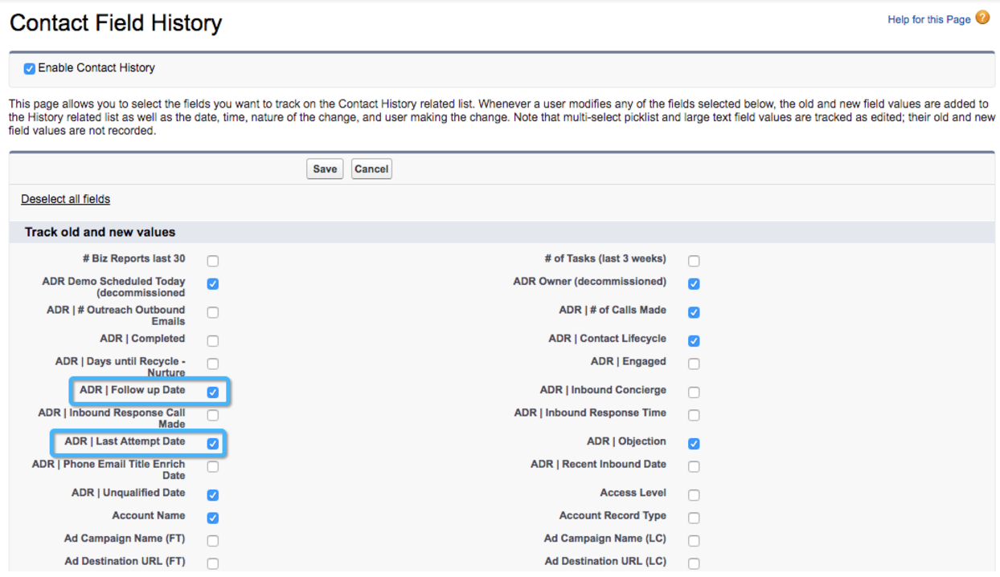

# Custom Model Setup: Enable Field History Tracking {#custom-model-setup-enable-field-history-tracking}

Custom Model Setup: Enable Field History Tracking - Bizible - Product Documentation

### What's in this article? {#what-s-in-this-article}

[Why and When to Enable Field History Tracking](#custommodelsetup-enablefieldhistorytracking-whyandwhentoenablefieldhistorytracking)  
[Enable Field History Tracking](#custommodelsetup-enablefieldhistorytracking-enablefieldhistorytracking)

#### Why and When to Enable Field History Tracking {#custommodelsetup-enablefieldhistorytracking-whyandwhentoenablefieldhistorytracking}

If you decide to include a custom field as a stage in your custom attribution model, field history tracking**must be enabled**for this field. Enabling field history tracking will allow Salesforce to track any time the custom field is edited by creating a `record in the History Tracking table. Bizible can download that table and use this information to measure the time and day that a "transition" occurred. Without field history tracking, Bizible is unable to track changes related to this field.`

If only Lead Status or Opportunity Stages are used in the custom model, there is no need to turn on Field History tracking because it will tracked automatically as a stage transition.

To enable field history tracking, please follow the instructions below.

#### Enable Field History Tracking {#custommodelsetup-enablefieldhistorytracking-enablefieldhistorytracking}

>[!NOTE]
>
>You will need to be a System Administrator in order to make these changes to the fields on the Lead/Contact/Opportunity object.

##### 1. Go to the Object where the custom field lives and click the Set History Tracking button. {#custommodelsetup-enablefieldhistorytracking-gototheobjectwherethecustomfieldlivesandclickthesethistorytrackingbutton.}

##### 2. Select the fields you wish to track changes on. {#custommodelsetup-enablefieldhistorytracking-selectthefieldsyouwishtotrackchangeson.}

`Bizible can only re-import a record if it sees that the record has recently been modified.`Formula fields `technically do not modify a record when it changes since it does the calculation in the background. We have seen issues where a rule is skipped because Bizible did not see the record change, so it is advised to`**not use formula fields in rule definitions** `. The solution is to create a text field and use a workflow to populate that field with the proper value or calculation any time the record is edited or fits the criteria. This requires that all records get edited so the workflow can work retroactively on old records.`

>[!NOTE]
>
>**Related Articles**
>
>[Bizible University: Custom Modeling & Custom Stages](https://universityonline.marketo.com/courses/additional-features-1/#/page/5c64c6ebac158965be68467c)

