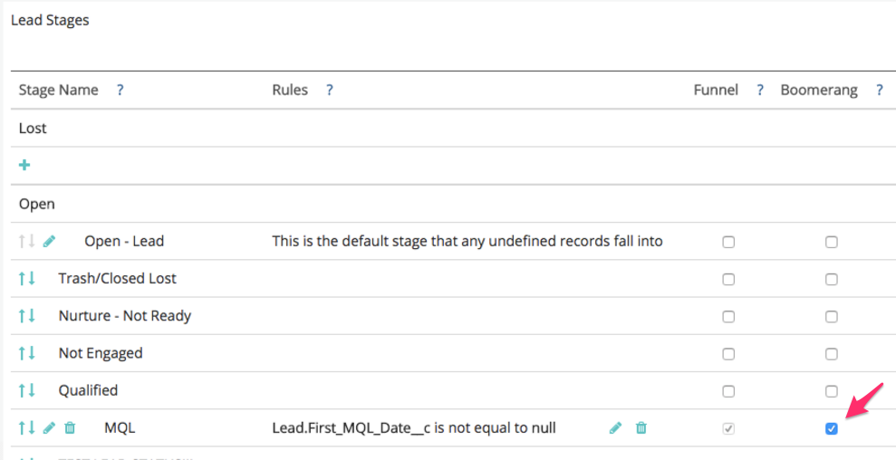
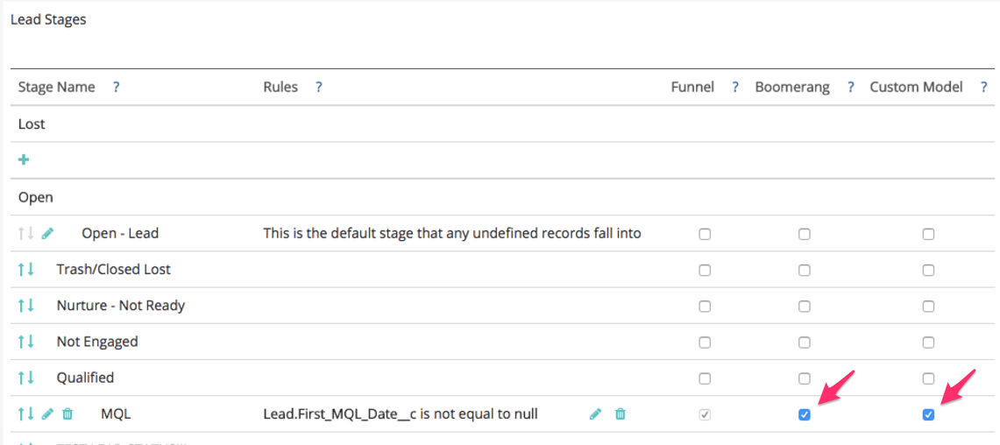
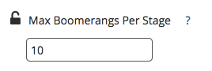
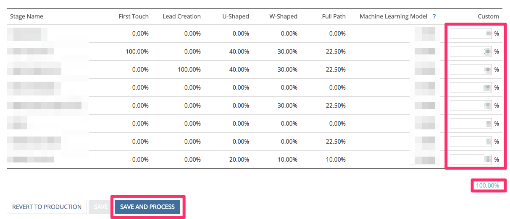

# Setting up Boomerang Stages {#setting-up-boomerang-stages}

Setting up Boomerang Stages - Bizible - Product Documentation

To enable Boomerang Stages for your account, you must be an Account Admin. Or, it can be enabled by reaching out to Bizible Support. Once the feature has been enabled, please follow these instructions to set them up.

### What's in this article? {#what-s-in-this-article}

[Boomerang Stage Setup](#settingupboomerangstages-boomerangstagesetup)  
[Boomerang Stage Setup with Custom Model Attribution](#settingupboomerangstages-boomerangstagesetupwithcustommodelattribution)

#### Boomerang Stage Setup {#settingupboomerangstages-boomerangstagesetup}

##### 1. Go to Stage Mapping. Under the the column titled “Boomerang,” select the boxes next to the stages you would like to track. {#settingupboomerangstages-gotostagemapping.underthethecolumntitled“boomerang-”selecttheboxesnexttothestagesyouwouldliketotrack.}

##### 2. Go to the Attribution Settings tab and input the number of touchpoints for each stage you would like to see. We allow a maximum of 10. The default is set to 1. {#settingupboomerangstages-gototheattributionsettingstabandinputthenumberoftouchpointsforeachstageyouwouldliketosee.weallowamaximumof10.thedefaultissetto1.}

##### 3. Click Save. {#settingupboomerangstages-clicksave.}

>[!NOTE]
>
>Please allow 24-48 hours for your data to be reprocessed according to these changes.

#### Boomerang Stage Setup with Custom Model Attribution {#settingupboomerangstages-boomerangstagesetupwithcustommodelattribution}

##### 1. Go to Stage Mapping. Under the column titled “Boomerang,” select the boxes next to the stages you would like to track. {#settingupboomerangstages-gotostagemapping.underthecolumntitled“boomerang-”selecttheboxesnexttothestagesyouwouldliketotrack.}

##### 2. If you would also like these Boomerang stages to be included in your Custom Model and receive attribution credit, be sure to also select the box under the "Custom Model" column. {#settingupboomerangstages-ifyouwouldalsoliketheseboomerangstagestobeincludedinyourcustommodelandreceiveattributioncredit-besuretoalsoselecttheboxunderthe"custommodel"column.}

##### 3. Go to the Attribution Settings tab. Determine how you would like to weight the attribution for your boomerang stages. The options are to weight the attribution on the first occurrence, the last occurrence, or have it evenly split across all occurrences. {#settingupboomerangstages-gototheattributionsettingstab.determinehowyouwouldliketoweighttheattributionforyourboomerangstages.theoptionsaretoweighttheattributiononthefirstoccurrence-thelastoccurrence-orhaveitevenlysplitacrossalloccurrences.}

##### 4. Input the number of occurrences of each stage you would like to see. We can allow a maximum of 10. The default is set to 1. {#settingupboomerangstages-inputthenumberofoccurrencesofeachstageyouwouldliketosee.wecanallowamaximumof10.thedefaultissetto1.}

##### 5. Set the attribution percentage you would like to allocate to the Boomerang Stages you have included in the custom model. Please ensure total attribution for all stages adds up to 100%. Click Save and Process. {#settingupboomerangstages-settheattributionpercentageyouwouldliketoallocatetotheboomerangstagesyouhaveincludedinthecustommodel.pleaseensuretotalattributionforallstagesaddsupto100%.clicksaveandprocess.}

>[!NOTE]
>
>Please allow 24-48 hours for your data to be reprocessed according to these changes.

