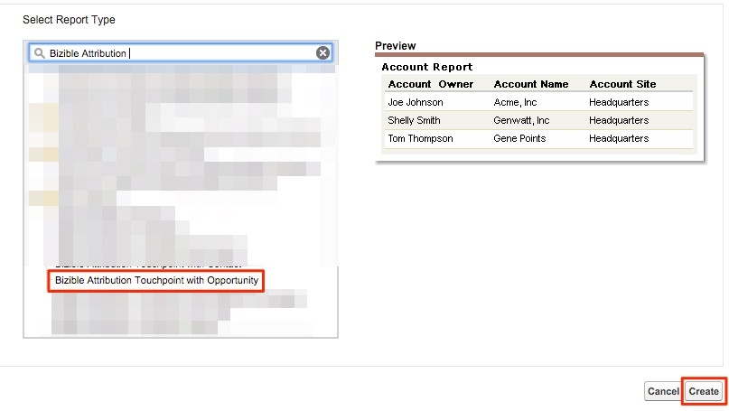

# Opportunities by Marketing Channel {#opportunities-by-marketing-channel}

Opportunities by Marketing Channel - Bizible - Product Documentation

This report surfaces the number of opportunities generated by your Marketing Channels; it includes all of your opportunities. However, you can filter this report to analyze specific types of opportunities.

##### 1. Click the Reports tab in Salesforce and select New Report. {#opportunitiesbymarketingchannel-clickthereportstabinsalesforceandselectnewreport.}

##### 2. In the quick find type in “Bizible Attribution” and select the Bizible Attribution Touchpoint with Opportunity report type and select Create. {#opportunitiesbymarketingchannel-inthequickfindtypein“bizibleattribution”andselectthebizibleattributiontouchpointwithopportunityreporttypeandselectcreate.}

##### 3. Starting from the top of the report, show All Bizible Attribution Touchpoints and adjust the date field according to the timeframe you are looking to report on. In our example, we’re looking at All Time. Additionally, change the report format from Tabular to Summary. {#opportunitiesbymarketingchannel-startingfromthetopofthereport-showallbizibleattributiontouchpointsandadjustthedatefieldaccordingtothetimeframeyouarelookingtoreporton.inourexample-we’relookingatalltime.additionally-changethereportformatfromtabulartosummary}

##### 4. Now, we will be adding fields to the report. In the quick find on the left, type in “Marketing Channel” and add it to the summary grouping in the report. {#opportunitiesbymarketingchannel-now-wewillbeaddingfieldstothereport.inthequickfindontheleft-typein“marketingchannel”andaddittothesummarygroupinginthereport.}

##### 5. Now, run the report and analyze! {#opportunitiesbymarketingchannel-now-runthereportandanalyze!}

This is an Opportunities report summarized by Marketing Channel. This report is focused on all Opps, but feel free to filter based off stage/type of opportunity. Additionally, feel free to add in any fields that you’d like to report on.

>[!NOTE]
>
>**Related Articles**
>
>[Bizible University: Stock SFDC Reports](https://universityonline.marketo.com/courses/bizible-fundamentals-bizible-102/#/page/5c5cb68dfb384d0c9fb96cc4)

