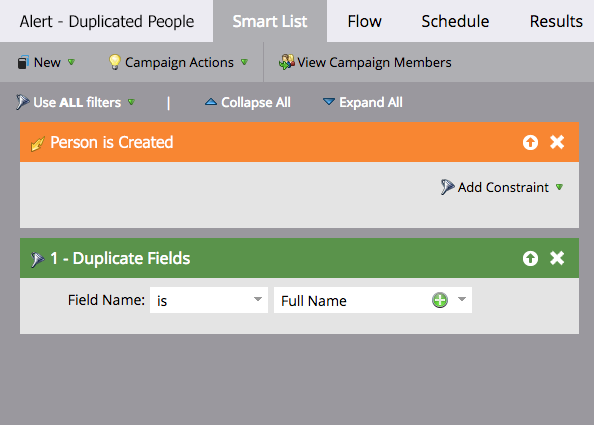
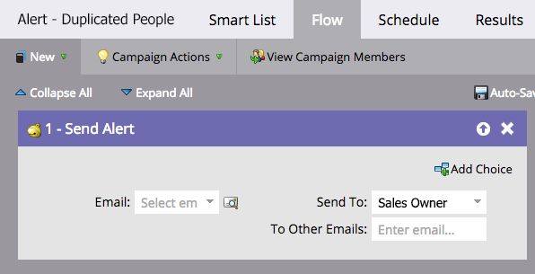
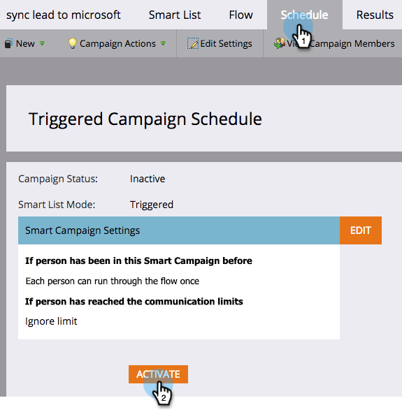

# Automate an Alert for Possible Duplicate People {#automate-an-alert-for-possible-duplicate-people}

Want an alert every time possible duplicate person is created? Here is how to set up a Smart Campaign to do it.

1. [Create a new smart campaign](/help/marketo/product-docs/core-marketo-concepts/smart-campaigns/creating-a-smart-campaign/create-a-new-smart-campaign.md){target="_blank"}. Define the following smart list:

* Trigger: **[!UICONTROL Person is Created]**
* Filter: **[!UICONTROL Duplicate Fields]**. Field Name **[!UICONTROL is] [!UICONTROL Full Name]**

   

   >[!TIP]
   >
   >Be creative. Experiment with different fields to get better filtering results.

1. In the flow step, choose [[!UICONTROL Send Alert]](/help/marketo/product-docs/core-marketo-concepts/smart-campaigns/flow-actions/send-alert.md){target="_blank"} flow action.

   

   >[!TIP]
   >
   >Using the [Send Alert Info token](/help/marketo/product-docs/email-marketing/general/using-tokens/use-the-send-alert-info-token.md){target="_blank"} to include a link to the person in your CRM.

   >[!CAUTION]
   >
   >If you import a large list, you may get a bunch of these alerts all at once!
   >
   >Also, two people with the same name doesn't automatically mean they are the same person.

1. Activate the campaign in the **[!UICONTROL Schedule]** tab.

   

That's it! This smart campaign will trigger every time a new person with an existing full name is created in Marketo.

>[!MORELIKETHIS]
>
>[Find and Merge Duplicate People](/help/marketo/product-docs/core-marketo-concepts/smart-lists-and-static-lists/managing-people-in-smart-lists/find-and-merge-duplicate-people.md){target="_blank"}
