# Alert the Sales Rep {#alert-the-sales-rep}

## Mission: Alert the sales rep when a person fills out a form on your web site {#mission-alert-the-sales-rep-when-a-person-fills-out-a-form-on-your-web-site}

To automatically send alert emails to sales reps, all you need is an alert email and an email campaign. Here's how to do it.

>[!PREREQUISITES]
>
>[Landing Page with a Form](/help/marketo/getting-started/quick-wins/landing-page-with-a-form.md){target="_blank"}

## Step 1: Create an Alert Email {#step-create-an-alert-email}

1. Go to the **Marketing Activities** area.

   

1. Select **My Program** which you created in the [Landing Page with a Form](/help/marketo/getting-started/quick-wins/landing-page-with-a-form.md){target="_blank"} quick win, then under **New** click **New Local Asset**.

   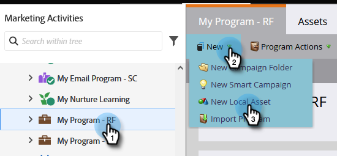

1. Click **Email**.

   

1. **Name** the email "My Email Alert", select a template and click **Create**.

   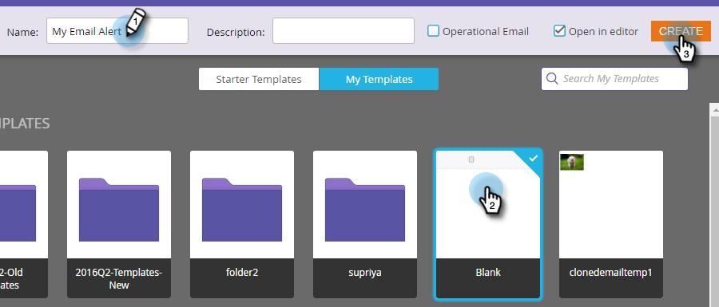

1. Enter the **From Name**, **From Email**, **Reply-to**, and **Subject** that you want your sales team to see.

   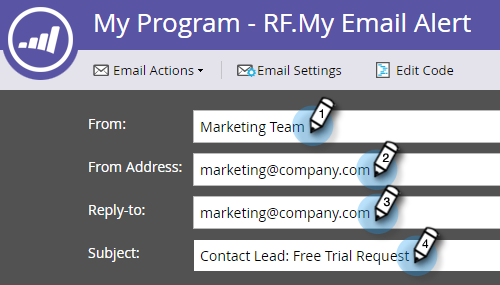

1. Double-click to edit the email text.

   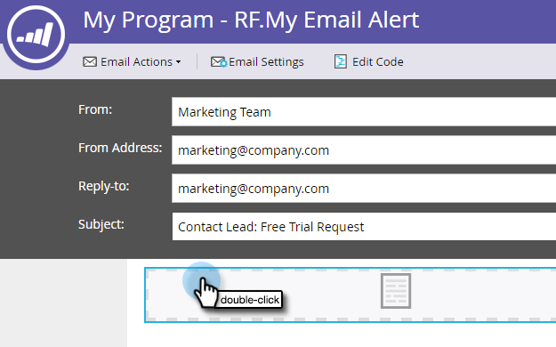

1. Type the email content.

   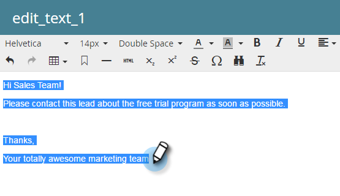

1. Place your cursor where you want to insert the person's contact info and click the **Insert Token** icon.

   

1. Find and select the `{{SP_Send_Alert_Info}}` **Token** and click **Insert**.

   

   >[!NOTE]
   >
   >{{SP_Send_Alert_Info}} is a special token for alert emails. See [Use the Send Alert Info Token](/help/marketo/product-docs/email-marketing/general/using-tokens/use-the-send-alert-info-token.md){target="_blank"}{target="_blank"} to learn more.

1. Click **Save**.

   

1. Click the **Email Actions** drop-down and select **Approve and Close**.

   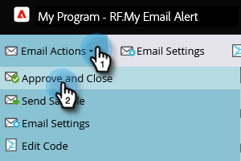

## Step 2: Create an Alert Trigger Campaign {#step-create-an-alert-trigger-campaign}

1. Select **My Program** created previously, then under **New** click **New Smart Campaign**.

   

1. **Name** the campaign "My Alert Campaign" and click **Create**.

   

1. Under the **Smart List** tab, find and drag the **Fills Out Form** trigger to the canvas.

   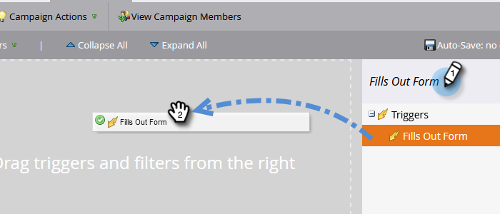

1. Select the form we created earlier.

   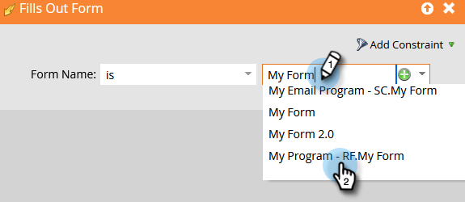

1. Under the **Flow** tab, find and drag the **Send Alert** flow action to the canvas.

   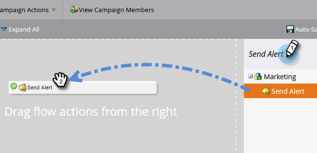

1. Select **My Alert Email** created earlier and leave **Send To** as **Sales Owner**.

   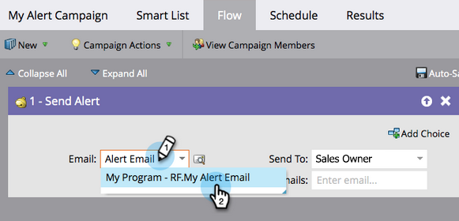

1. Type your email address in the **To Other Emails** field.  

   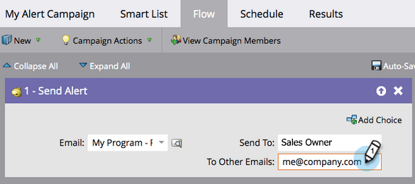

1. Go to the **Schedule** tab and click the **Activate** button.

   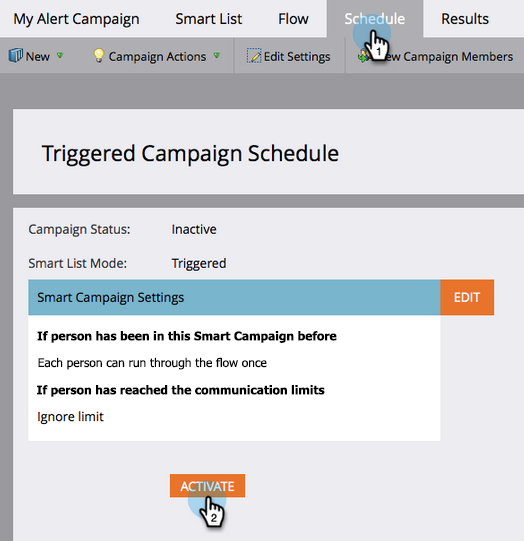

   >[!TIP]
   >
   >Set the **Qualification Rules** to **every time** (by editing the Smart Campaign)  to allow the same person to trigger alerts multiple times.

1. Click **Activate** on the confirmation screen.

   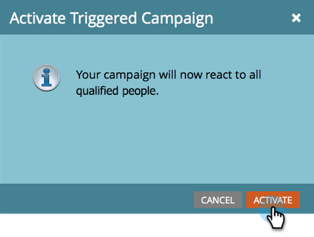

## Step 3: Test It Out! {#step-test-it-out}

1. Select your landing page and click **View Approved Page**.  

   

   >[!NOTE]
   >
   >Don't forget to approve landing pages; they don't go live until approved.

1. Fill out the form and click **Submit**.

   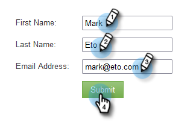

1. You should receive your email shortly. Once you've verified that everything works as it should, remove your email address from the Send Alert flow (see step 2.7 above).

   >[!NOTE]
   >
   >Click the **Person Info** tab in Marketo to see the contact info.

## Mission Complete! {#mission-complete}

 &nbsp;

[◄ Mission 7: Personalize an Email](/help/marketo/getting-started/quick-wins/personalize-an-email.md)

[Mission 9: Update Person Data ►](/help/marketo/getting-started/quick-wins/update-person-data.md)
