# Drip, Drip, Nurture {#drip-drip-nurture}

## Mission: Nurture the people who attended your recent tradeshow {#mission-nurture-the-people-who-attended-your-recent-tradeshow}

You can easily create an advanced and sophisticated nurture system in Marketo. Here's how!

>[!PREREQUISITES]
>
>* [Get Set Up and Add a Person](/help/marketo/getting-started/quick-wins/get-set-up-and-add-a-person.md){target="_blank"}
>* [Import a List of People](/help/marketo/getting-started/quick-wins/import-a-list-of-people.md){target="_blank"}

## Step 1: Create an Engagement Program {#step-create-an-engagement-program}

1. Go to the **[!UICONTROL Marketing Activities]** area.

   

1. Select the **Learning** folder, click the **[!UICONTROL New]** drop-down and select **[!UICONTROL New Program]**.

   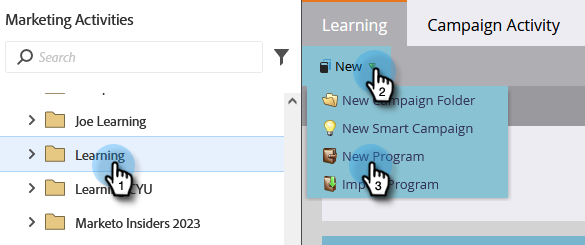

1. Enter a **[!UICONTROL Name]** and select **[!UICONTROL Engagement]** for the **[!UICONTROL Program Type]**.

   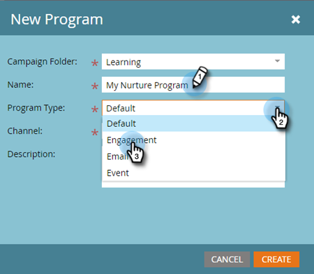

1. Make sure the **[!UICONTROL Channel]** field is **[!UICONTROL Nurture]** and click **[!UICONTROL Create]**.

   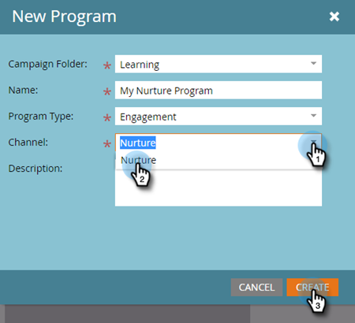

   You've now created an engagement program.

## Step 2: Create an Email {#step-create-an-email}

1. Select your engagement program, click **[!UICONTROL New]** and select **[!UICONTROL New Local Asset]**.

   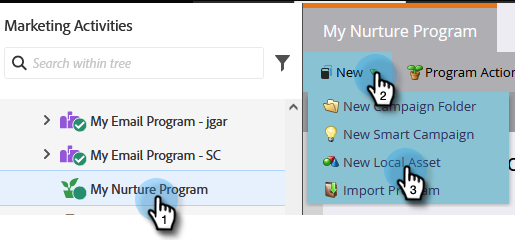

1. Click **[!UICONTROL Email]**.

   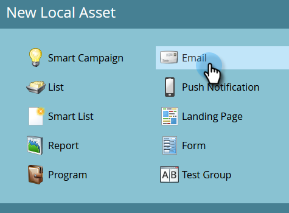

1. Enter a **[!UICONTROL Name]**, select the **[!UICONTROL Template]** you want to use, and click **[!UICONTROL Create]**.

   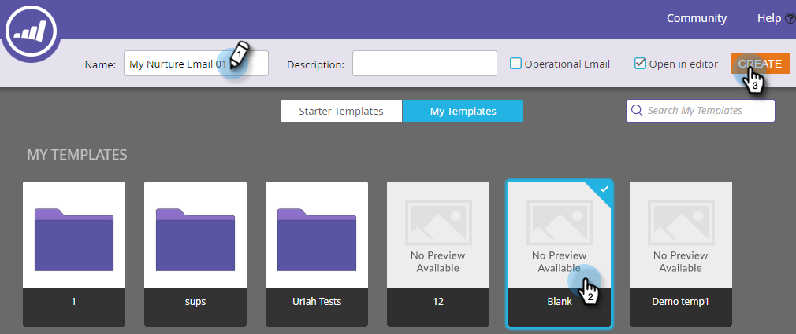

   >[!NOTE]
   >
   >Don't see the email editor? Your browser probably blocked the window. Enable pop-ups from `app.marketo.com` in your browser and click **[!UICONTROL Edit Draft]** in the top menu bar.

1. Enter a subject.

   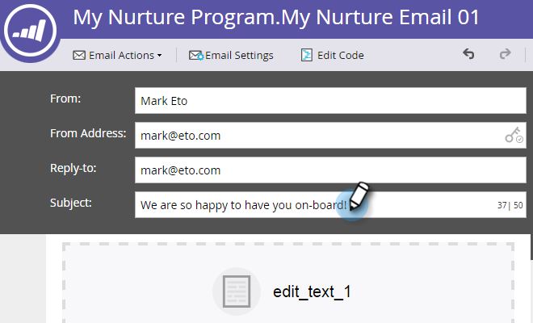

1. Select the area of the email you want to edit, click the gear icon and select **[!UICONTROL Edit]**.

   

1. Edit your email and click **[!UICONTROL Save]**.

   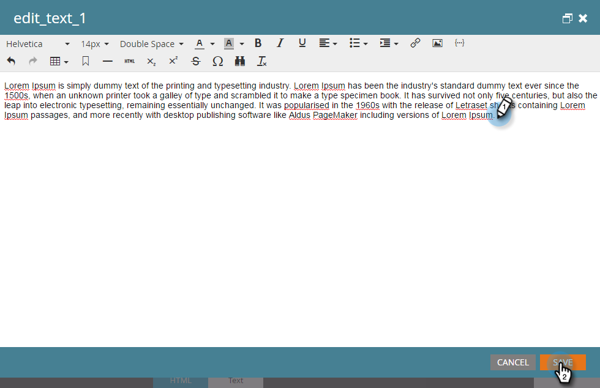

1. Under **[!UICONTROL Email Actions]**, click **[!UICONTROL Approve and Close]**.

   

   >[!NOTE]
   >
   >Remember to approve your emails or you won't be able to activate them later.

1. Now create another email by repeating the actions in Steps 2-7.

   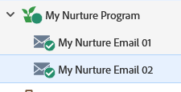

## Step 3: Add Content to Your Stream {#step-add-content-to-your-stream}

Now it's time to create a stream of content for your engagement program using the emails you created.

1. Select your engagement program and click the **[!UICONTROL Streams]** tab.

   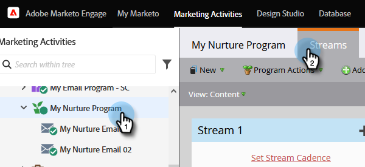

1. Click the **[!UICONTROL Add Content]** button in the stream.

   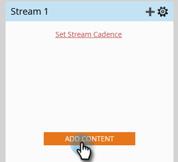

   >[!TIP]
   >
   >You can also use the **+** icon.

1. Leave the "Email" type selected. Find and select the two emails you created.

   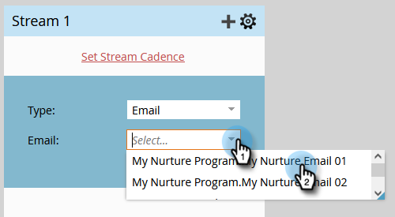

## Step 4: Activate Stream Content {#step-activate-stream-content}

1. Activate all content at once by clicking on the stream gear icon, then click **[!UICONTROL Activate all content]**.

   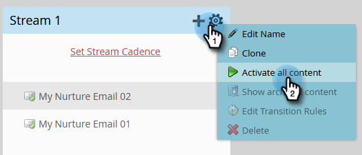

   >[!NOTE]
   >
   >You can't activate content without approving it first.

   Great work! One more step and the engagement program is ready.

## Step 5: Set the Stream Cadence {#step-set-the-stream-cadence}

1. Click **[!UICONTROL Set Stream Cadence]**.

   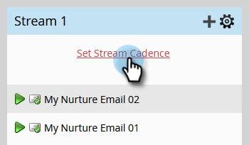

1. Edit the settings to match the schedule you want and click **[!UICONTROL Save]**.

   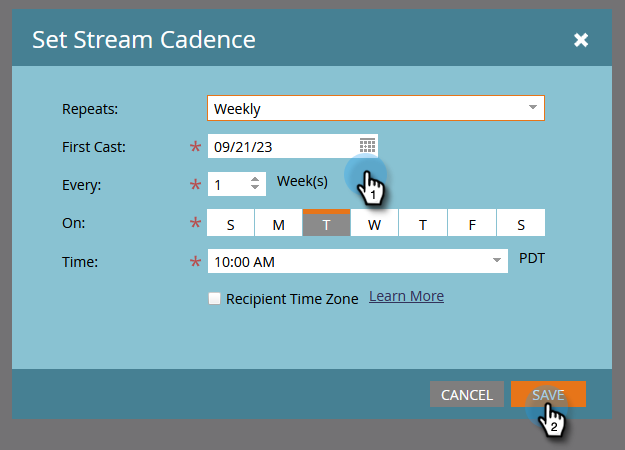

   Your engagement program is all set. Now let's add a test person to your program.

   >[!NOTE]
   >
   >The test person is the person who checks your engagement program to test that it's correct before sending to customers.

## Step 6: Add a Test Person to Your Engagement Program {#step-add-a-test-person-to-your-engagement-program}

1. Go to the **[!UICONTROL Database]** area.

   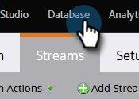

1. Search for your test person.

   

   >[!NOTE]
   >
   >Make sure the test person has a valid email address so you can confirm the receipt of emails when testing.

1. Right-click on the person, then click **[!UICONTROL Programs]** and **[!UICONTROL Add to Engagement Program...]**.

   

1. Select your **[!UICONTROL Program]** and **[!UICONTROL Stream]**, then click **[!UICONTROL Run Now]**.

   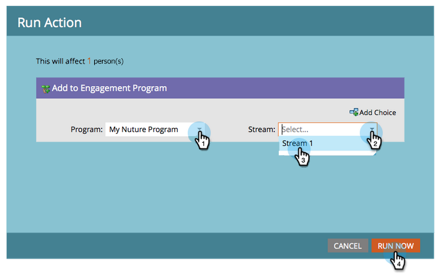

1. Mission Complete!

1. You should receive email at the time and cadence you specified.

   >[!NOTE]
   >
   >Learn more about [Engagement Programs](/help/marketo/product-docs/email-marketing/drip-nurturing/creating-an-engagement-program/understanding-engagement-programs.md){target="_blank"}.

## Mission Complete! {#mission-complete}

 &nbsp;

[◄ Mission 5: Import a List of People](/help/marketo/getting-started/quick-wins/import-a-list-of-people.md)

[Mission 7: Personalize an Email ►](/help/marketo/getting-started/quick-wins/personalize-an-email.md)
