# Email Auto-Response {#email-auto-response}

### Mission: Send out a thank-you email when a person fills out a form {#mission-send-out-a-thank-you-email-when-a-person-fills-out-a-form}

>[!NOTE]
>
>**FYI**
>
>Marketo is now standardizing language across all subscriptions, so you may see lead/leads in your subscription and person/people in docs.marketo.com. These terms mean the same thing; it does not affect article instructions. There are some other changes, too. [Learn more](http://docs.marketo.com/display/DOCS/Updates+to+Marketo+Terminology).

>[!NOTE]
>
>**Prerequisites**
>
>* [Get Set Up and Add a Person](get-set-up-and-add-a-person.md)
>* [Landing Page with a Form](landing-page-with-a-form.md)
>

### What's in this article? {#whats-in-this-article}

[Step 1: Create an Email](#step-create-an-email)  
[Step 2: Create a Smart Campaign](#step-create-a-smart-campaign)

#### Step 1: Create an Email {#step-create-an-email}

##### 1. Go to the Marketing Activities area. {#go-to-the-marketing-activities-area}

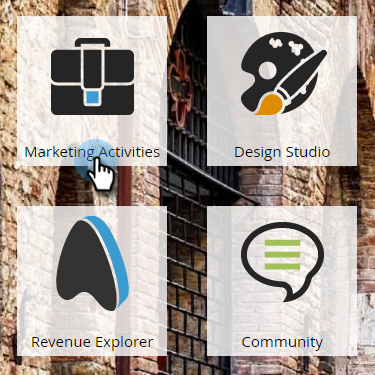  

##### 2. Select My Program in the left menu, click the New drop-down, and select New Local Asset. {#select-my-program-in-the-left-menu-click-the-new-drop-down-and-select-new-local-asset}

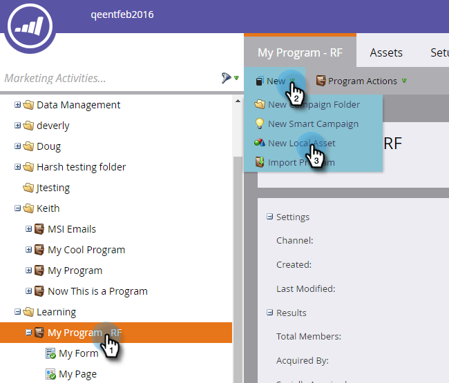  

##### 3. Click Email. {#click-email}

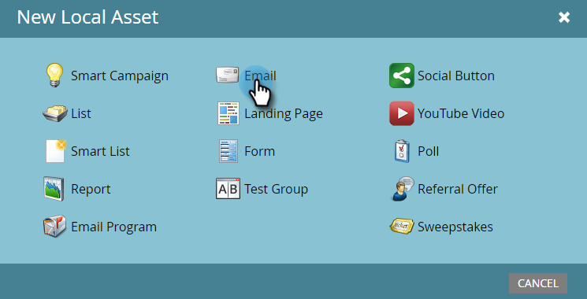  

##### 4. Name your email "Auto Response Email," choose a template and click Create. {#name-your-email-auto-response-email-choose-a-template-and-click-create}

An email editor will open in a new window or tab. If pop-ups are blocked, click** Edit Draft** on the asset summary page to access the email.

##### 5. Enter a subject line, then double-click the editable area of the email. {#enter-a-subject-line-then-double-click-the-editable-area-of-the-email}

A rich text editor will open on top of the email editor.

##### 6. Highlight the existing email content. {#highlight-the-existing-email-content}

  

##### 7. Type your email content and click Save. {#type-your-email-content-and-click-save}

  

##### 8. Your changes are auto-saved. Close the email editor tab/window. {#your-changes-are-auto-saved-close-the-email-editor-tab-window}

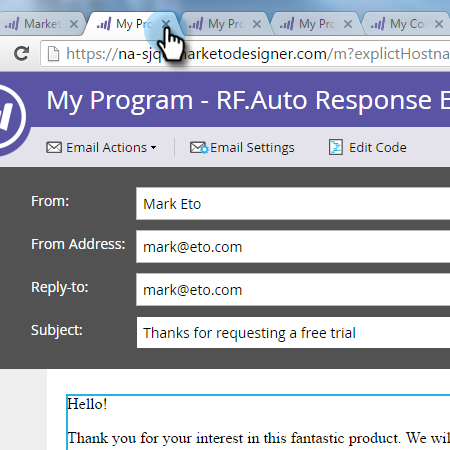  

##### 9. Select your new email. Under Email Actions click Approve. {#select-your-new-email-under-email-actions-click-approve}

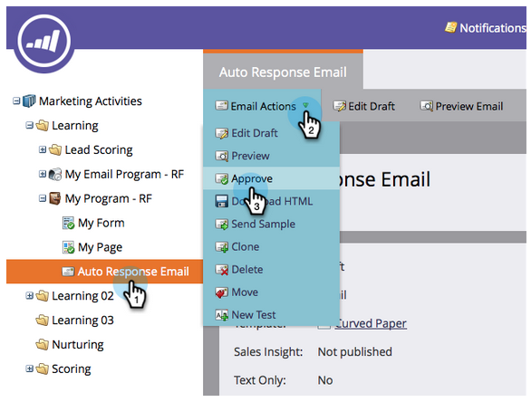 

#### Step 2: Create a Smart Campaign {#step-create-a-smart-campaign}

1. Right-click **My Program** and click **New Smart Campaign**.

   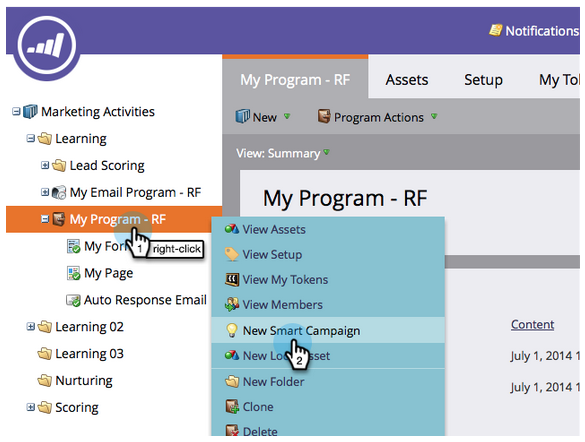

1. **Name** your the smart campaign "Auto Response Campaign" and click **Create**.

   

1. Go to the **Smart List **tab.

   

   We're setting up this campaign to run whenever a person fills out the form you created in [**Landing Page with a Form**](landing-page-with-a-form.md).

1. Find and drag the **Fills Out Form** trigger to the left canvas.

   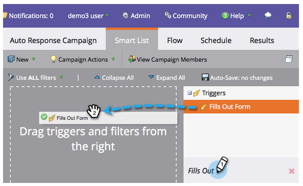

1. Select **My Form** in the drop-down. Click the **Flow **tab.

   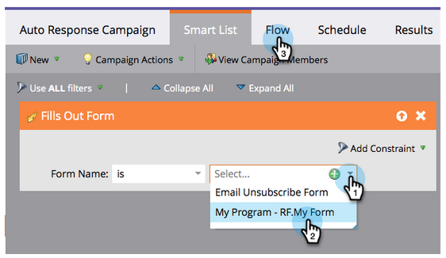

1. Drag the **Send Email **flow action to the left canvas.

   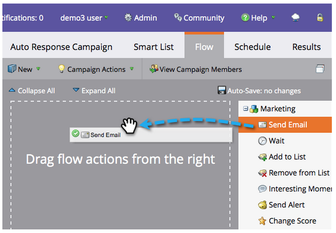

1. Select your **Auto Response Email** and go to the **Schedule **tab.

   

1. Click **Edit**.

   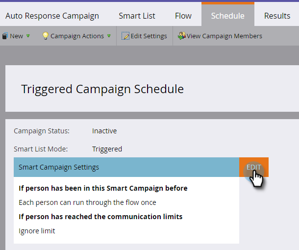

   ##### Select every time and click Save . {#select-every-time-and-click-save}

   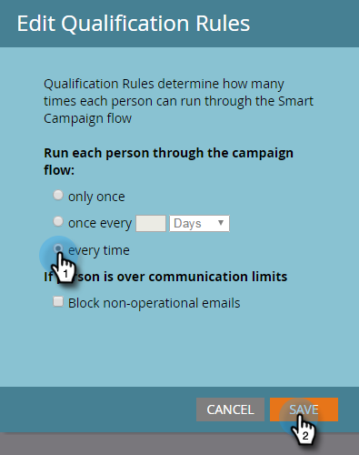

1. Click **Activate**.

   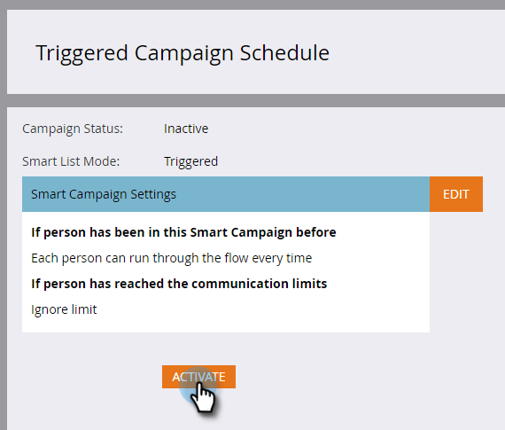

1. Click **Activate **on the confirmation screen.

   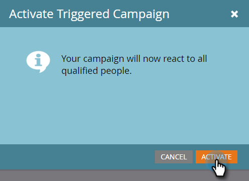

>[!NOTE]
>
>Once active, this campaign will run every time a person fills out the specified form. The campaign will keep running until it's deactivated.

## Step 3: Fill Out the Form {#step-fill-out-the-form}

1. Select **My Page**. This was created in the [Landing Page with a Form](landing-page-with-a-form.md) quick win.

   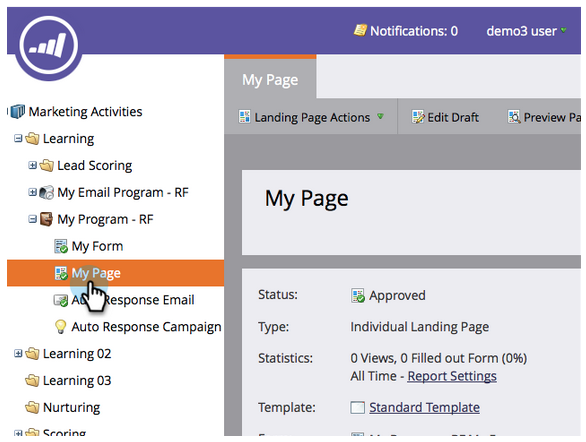

1. Click **View Approved Page**.

   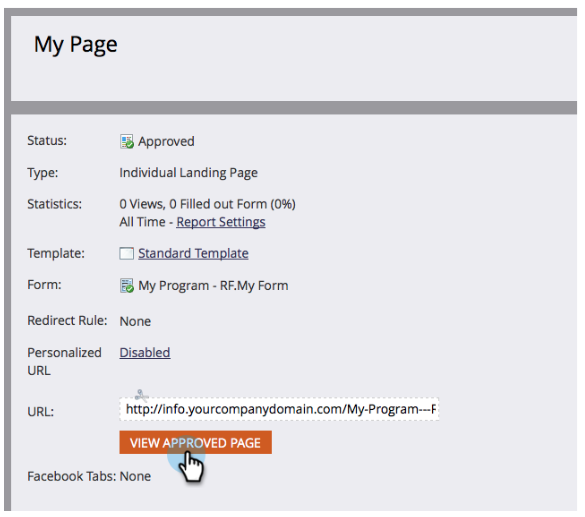

   Your "Free Trial" landing page will open in a new tab.

1. Fill out the form with your first name, last name, and email address, then click **Submit**.

   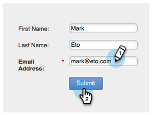

>[!NOTE]
>
>Make sure you use your actual email address so you can get the email.

### Mission Complete {#mission-complete}

Within just a few minutes you should see the auto response email in your inbox. Great job!

---

[◄ Mission 3: Simple Scoring](simple-scoring.md) [Mission 5: Import a List of Leads ►](import-a-list-of-people.md) 