# Email Auto-Response {#email-auto-response}

## Mission: Send out a thank-you email when a person fills out a form {#mission-send-out-a-thank-you-email-when-a-person-fills-out-a-form}

>[!PREREQUISITES]
>
>* [Get Set Up and Add a Person](/help/marketo/getting-started/quick-wins/get-set-up-and-add-a-person.md){target="_blank"}
>* [Landing Page with a Form](/help/marketo/getting-started/quick-wins/landing-page-with-a-form.md){target="_blank"}

## Step 1: Create an Email {#step-create-an-email}

1. Go to the **[!UICONTROL Marketing Activities]** area.

   

1. Select your program in the left menu, click the **[!UICONTROL New]** drop-down, and select **[!UICONTROL New Local Asset]**.

   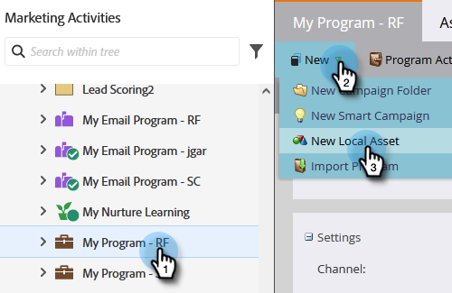

1. Select **[!UICONTROL Email]**.

   

1. Name your email "Auto Response Email," choose a template, and click **[!UICONTROL Create]**.

   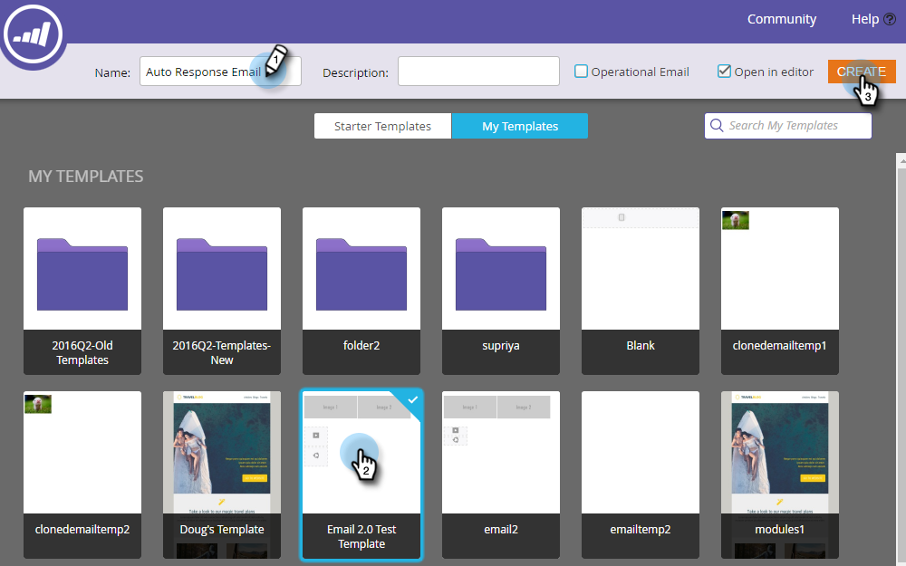

   An email editor will open in a new window or tab. If pop-ups are blocked, click **[!UICONTROL Edit Draft]** on the asset summary page to access the email.

1. Enter a subject line, then double-click the editable area of the email.

   

   _A rich text editor will open on top of the email editor._

1. Highlight the existing email content.

   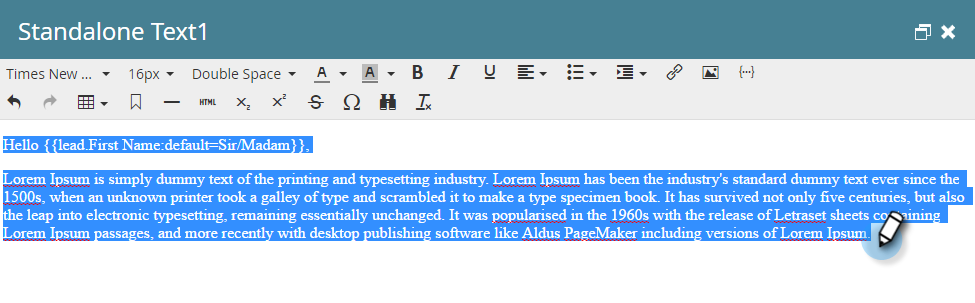

1. Type your email content and click **[!UICONTROL Save]**.

   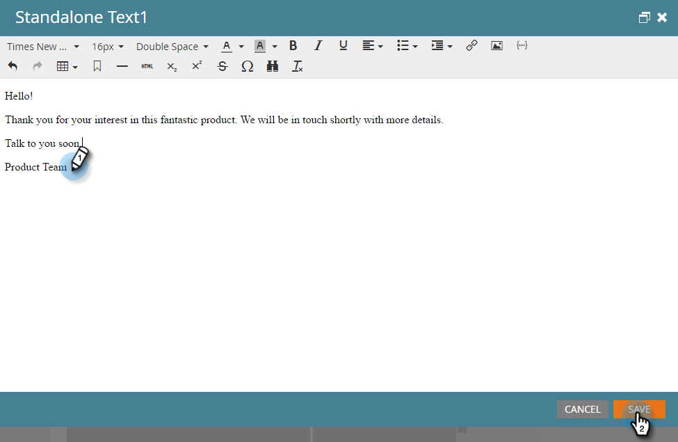

1. Click the **[!UICONTROL Email Actions]** drop-down and select **[!UICONTROL Approve and Close]**.

   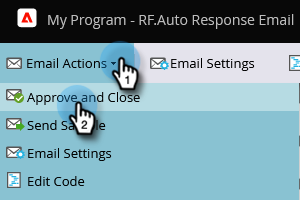

## Step 2: Create a Smart Campaign {#step-create-a-smart-campaign}

1. Select your program, click the **[!UICONTROL New]** drop-down and select **[!UICONTROL New Smart Campaign]**.

   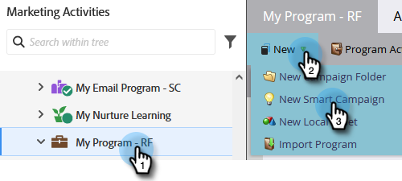

1. **Name** your the smart campaign "Auto Response Campaign" and click **[!UICONTROL Create]**.

   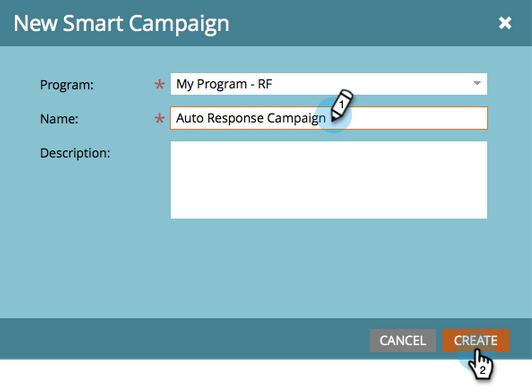

1. Go to the **[!UICONTROL Smart List]** tab.

   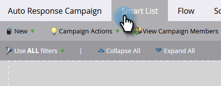

   We're setting up this campaign to run whenever a person fills out the form you created in [**Landing Page with a Form**](/help/marketo/getting-started/quick-wins/landing-page-with-a-form.md){target="_blank"}.

1. Find and drag the **[!UICONTROL Fills Out Form]** trigger to the canvas.

   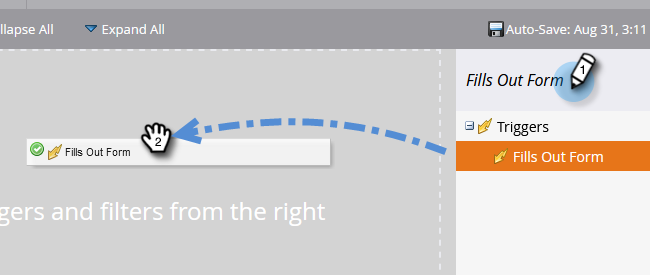

1. Select **[!UICONTROL My Form]** in the drop-down. Then click the **[!UICONTROL Flow]** tab.

   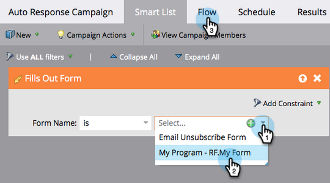

1. Drag the **[!UICONTROL Send Email]** flow action to the left canvas.

   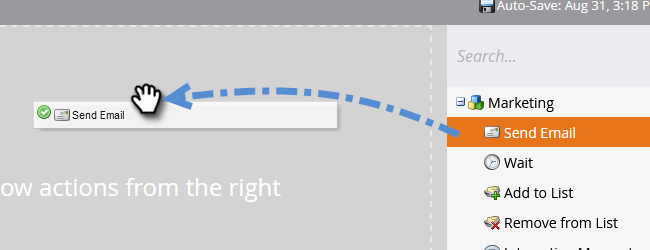

1. Select your **Auto Response Email**. Then click the **[!UICONTROL Schedule]** tab.

   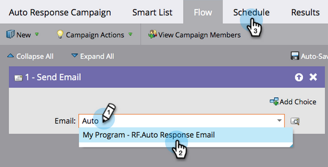

1. Click **[!UICONTROL Edit]**.

   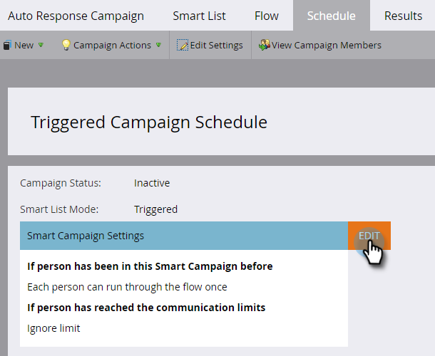

1. Select **[!UICONTROL every time]** and click **[!UICONTROL Save]**.

   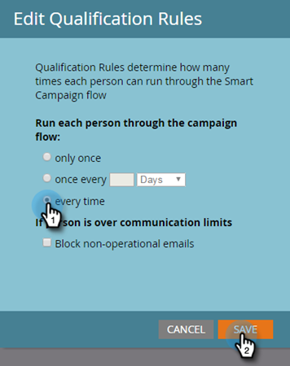

1. Click **[!UICONTROL Activate]**.

   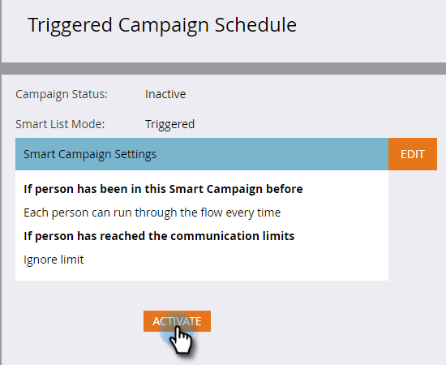

1. Click **[!UICONTROL Activate]** on the confirmation screen.

   

>[!NOTE]
>
>Once active, this campaign will run every time a person fills out the specified form. The campaign will keep running until it's deactivated.

## Step 3: Fill Out the Form {#step-fill-out-the-form}

1. Select **My Page** (this was created in the [Landing Page with a Form](/help/marketo/getting-started/quick-wins/landing-page-with-a-form.md){target="_blank"} quick win) and click **[!UICONTROL Preview]**.

   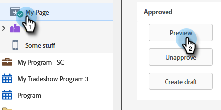

   _Your "Free Trial" landing page will open in a new tab._

1. Fill out the form with your first name, last name, and email address, then click **[!UICONTROL Submit]**.

   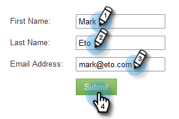

>[!NOTE]
>
>Make sure you use your actual email address so you can get the email.

## Mission Complete {#mission-complete}

Within just a few minutes you should see the auto response email in your inbox. Great job!

 &nbsp;

[◄ Mission 3: Simple Scoring](/help/marketo/getting-started/quick-wins/simple-scoring.md)

[Mission 5: Import a List of People ►](/help/marketo/getting-started/quick-wins/import-a-list-of-people.md)
