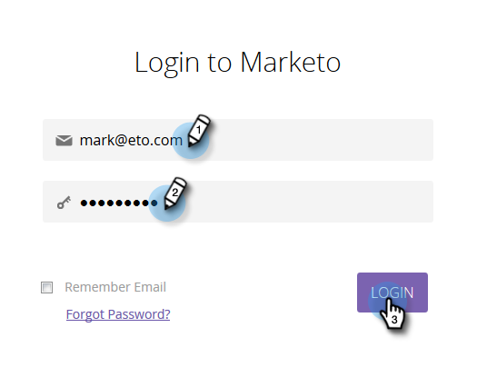
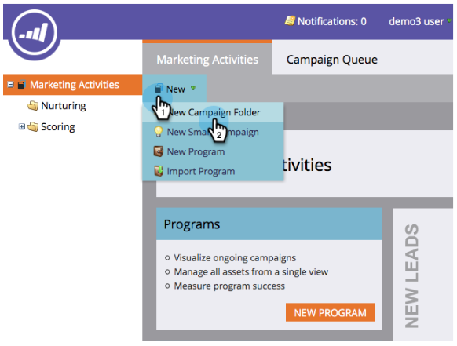
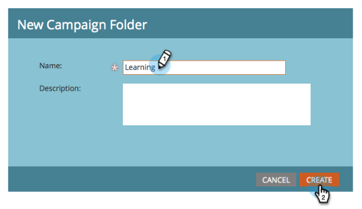
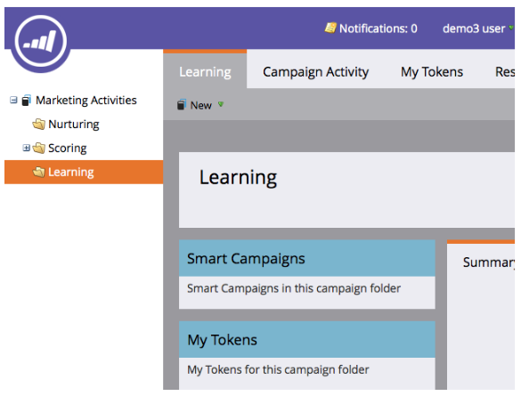
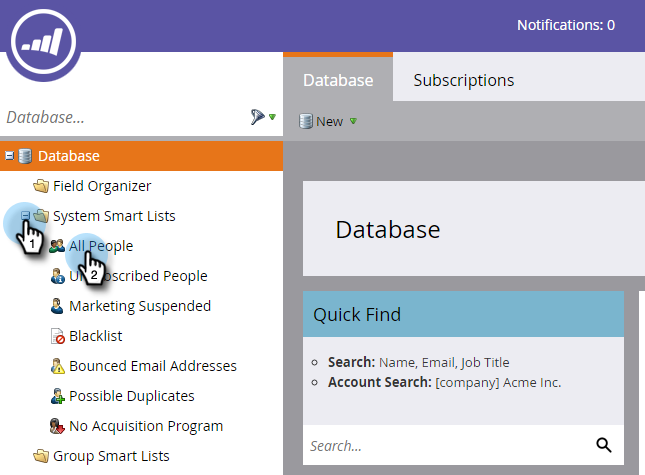
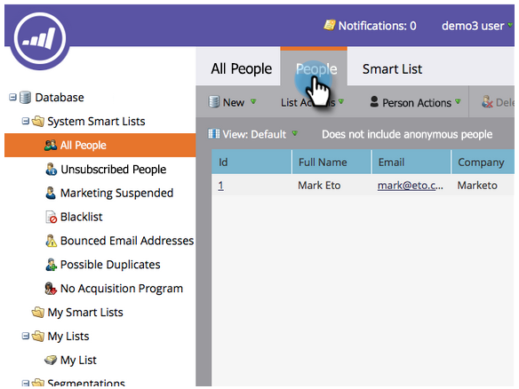

# Get Set up and Add a Person {#get-set-up-and-add-a-person}

There are a few things to do before you begin the missions.

## Step 1: Log In to Marketo {#step-log-in-to-marketo}

1. [Log in to Marketo](https://app.marketo.com){target="_blank"} using the credentials you received by email.

   

## Step 2: Create a Learning Folder {#step-create-a-learning-folder}

   Let's create a folder to hold everything you'll make in the missions.

1. Go to the **Marketing Activities** area.

   

1. Click the **New** drop-down and select **New Campaign Folder**.

   

1. Name the folder "Learning" and click **Create**.

   

1. You'll see the new Learning folder appear in the left menu.

   

## Step 3: Add Yourself as a Person {#step-add-yourself-as-a-person}

   Add yourself as a person in Marketo so you can send out test emails to yourself later.

1. Go to the **Database** area.

   

1. Click the **New** drop-down and select **New Person**.

   

1. Type your first and last name, email address and company name, then click **Create** to add yourself as a person.

   

   >[!CAUTION]
   >
   >Marketo does **not** support email addresses that contain emojis.

1. To view your people, open your System Smart Lists in the left menu, then click All People.

   

1. Click the **People** tab. You should see yourself in the database.

   

## Set Up Complete {#set-up-complete}

You're ready to begin your first mission!  

 &nbsp;

[Mission 1: Send an Email Blast ►](/help/marketo/getting-started/quick-wins/send-an-email.md)
