# Import a List of People {#import-a-list-of-people}

## Mission: Import a spreadsheet list of trade show attendees into your database {#mission-import-a-spreadsheet-list-of-trade-show-attendees-into-your-database}

>[!PREREQUISITES]
>
>[Get Set Up and Add a Person](/help/marketo/getting-started/quick-wins/get-set-up-and-add-a-person.md){target="_blank"}

In this tutorial, you'll learn how to import people from a spreadsheet file into Marketo.

## Step 1: Download and Edit a Spreadsheet {#step-download-and-edit-a-spreadsheet}

1. To start, download our practice spreadsheet file ([**tradeshow-attendees.csv**](/help/marketo/getting-started/assets/tradeshow-attendees.csv){target="_blank"}) to your computer.

   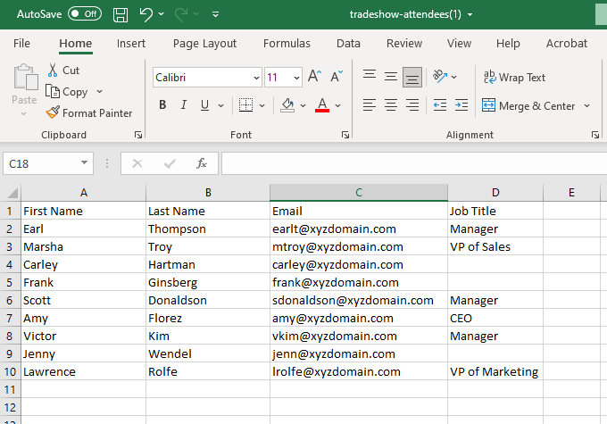

   >[!NOTE]
   >
   >When importing a date, use this format: **9/21/20** (Month/Day/Year).

   >[!NOTE]
   >
   >Any date/time fields being imported are treated as Central Time. If you have date/time fields in a different time zone, you can use an Excel formula to transform it to Central Time (America/Chicago).

1. Add your own first name, last name, actual email address (so you can receive the nurturing emails you'll send in the next mission), and job title. Save the file on your computer.

   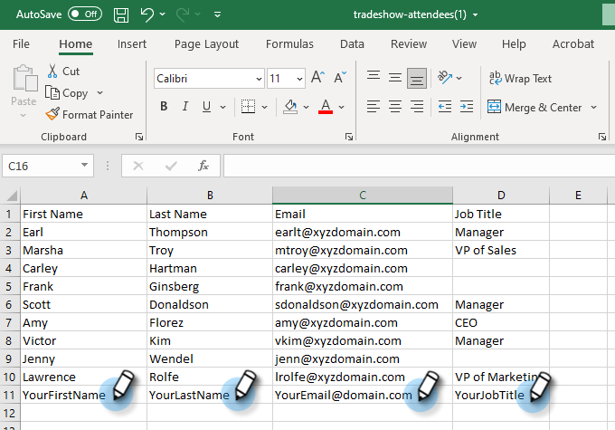

   >[!CAUTION]
   >
   >Marketo does **not** support email addresses that contain emojis.

## Step 2: Create a Program {#step-create-a-program}

1. Go to the **[!UICONTROL Marketing Activities]** area.

   

1. Select your **Learning** folder, then under **[!UICONTROL New]** click **[!UICONTROL New Program]**.

   

1. **Name** the program "My Tradeshow Program" and select "Event" for the **[!UICONTROL Program Type]**.

   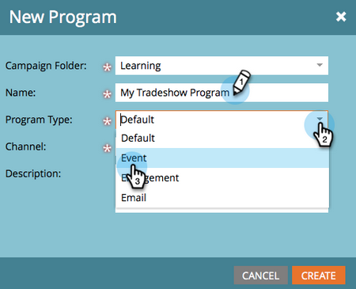

1. Select **[!UICONTROL Tradeshow]** for the **[!UICONTROL Channel]** and click **[!UICONTROL Create]**.

   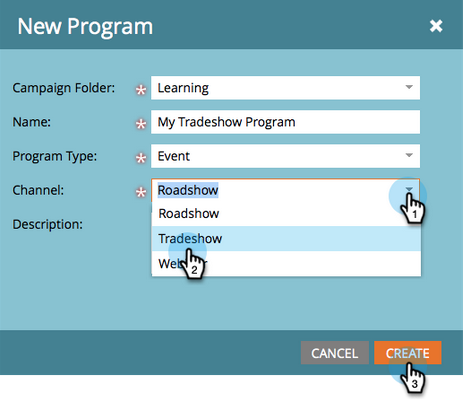

>[!NOTE]
>
>Event programs occur on specific dates. Learn more about [**Events**](/help/marketo/product-docs/demand-generation/events/understanding-events/understanding-event-programs.md){target="_blank"}.

## Step 3: Import Your Spreadsheet into Marketo {#step-import-your-spreadsheet-into-marketo}

1. In **My Tradeshow Program**, click **[!UICONTROL New]** and select **[!UICONTROL New Local Asset]**.

   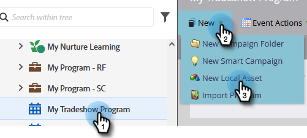

1. Select **[!UICONTROL List]**.

   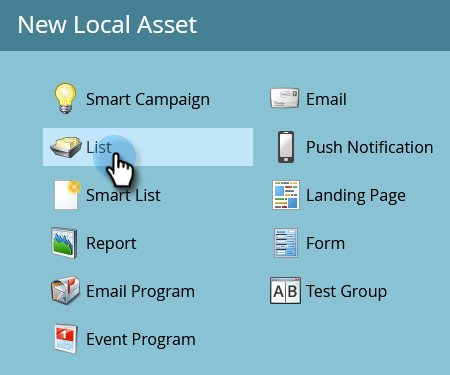

1. **Name** the list "Tradeshow Attendees" and click **[!UICONTROL Create]**.

   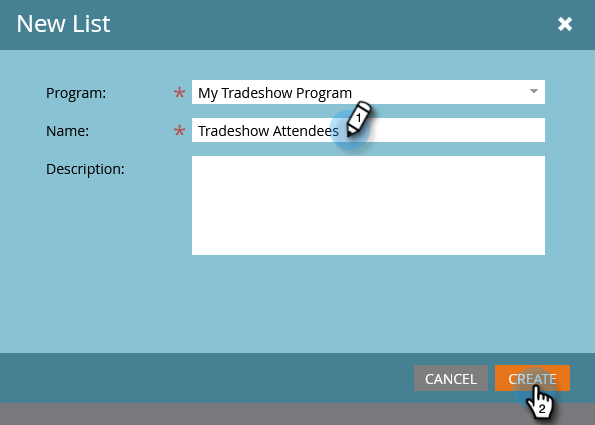

1. In your **[!UICONTROL Tradeshow Attendees]** list, click **[!UICONTROL List Actions]** and select **[!UICONTROL Import List]**.

   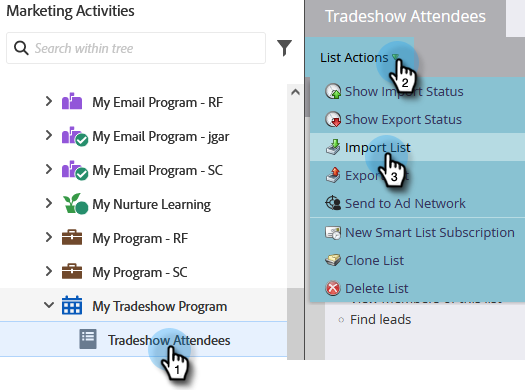

   >[!CAUTION]
   >
   >If you are using your own CSV file, make sure that it is encoded UTF-8, UTF-16, Shift-JIS, or EUC-JP.

   >[!NOTE]
   >
   >The size limit for CSV files is 100MB.

1. **[!UICONTROL Browse]** to the **tradeshow-attendees.csv** spreadsheet file on your computer and click **[!UICONTROL Next]**.

   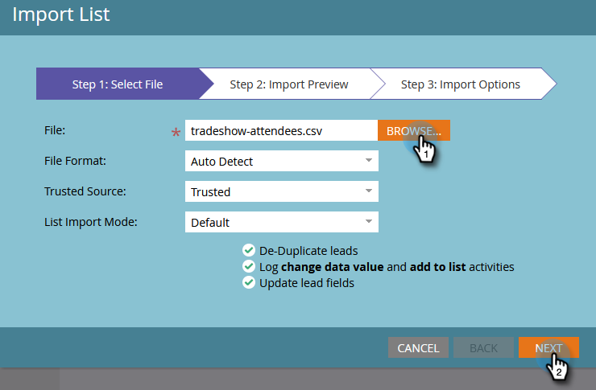

   >[!NOTE]
   >
   >In List Import Mode, choosing **[!UICONTROL Skip new people and updates]** means you will not impact existing person records or log any activities. Use this mode if you want a quick, pre-filtered static list of existing people for use in your marketing activities. Selecting this mode will:
   >
   > * Skip new person creation
   > * Skip person field updates
   > * Skip activity logging

1. Map your [!UICONTROL List Column] fields to their respective Marketo Field and click **[!UICONTROL Next]**.

   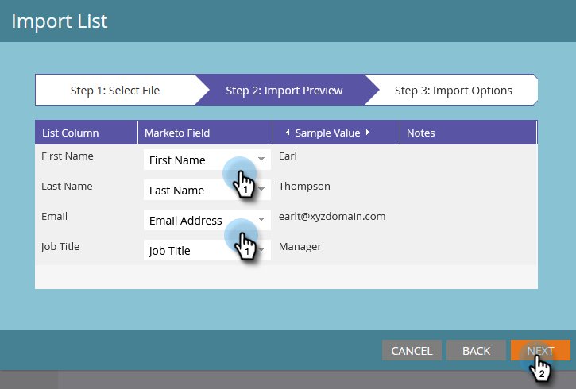

   >[!TIP]
   >
   >Column headers should always match the field exactly (case sensitive) in order to achieve the best auto-mapping results. If you're using custom fields and don't see them in the drop-down, go back and [create them](/help/marketo/product-docs/administration/field-management/create-a-custom-field-in-marketo.md){target="_blank"} so they can become options.

   >[!NOTE]
   >
   >If there are any fields you don't want to import, select **Ignore** in the Marketo Field drop-down menu.

1. Select **My Tradeshow Program** for the **[!UICONTROL Acquisition Program]**, then click **[!UICONTROL Import]**.

   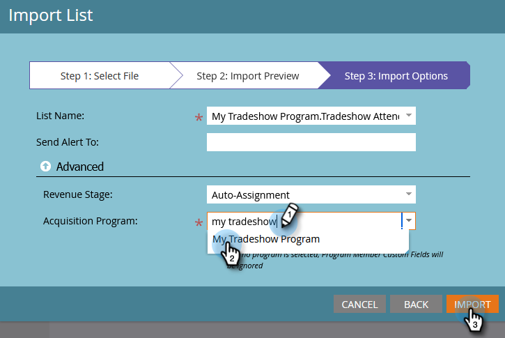

1. Wait for your people to import, then close the import progress pop-up.

   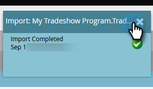

1. Back in **My Tradeshow Program**, click the **[!UICONTROL Members]** tab. You'll see all the people you just imported.

   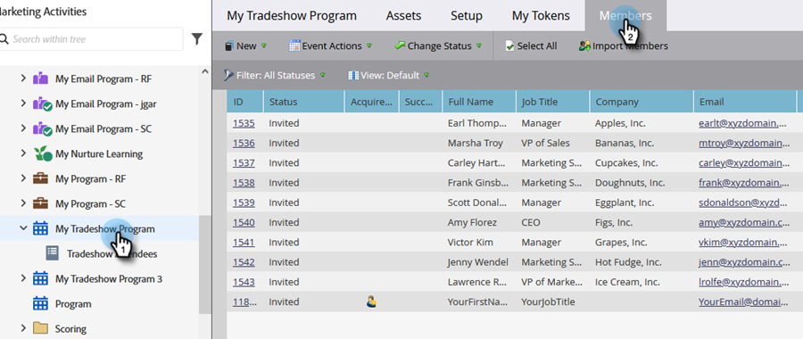

>[!NOTE]
>
>You can analyze the success of your program by tracking program membership. Learn more about [**Programs**](/help/marketo/product-docs/core-marketo-concepts/programs/creating-programs/understanding-programs.md){target="_blank"}.

## Mission Complete {#mission-complete}

Your tradeshow attendees are now members of your Marketo program!

 &nbsp;

[◄ Mission 4: Email Auto Response](/help/marketo/getting-started/quick-wins/email-auto-response.md)

[Mission 6: Drip, Drip, Nurture ►](/help/marketo/getting-started/quick-wins/drip-drip-nurture.md)
