# Landing Page with a Form {#landing-page-with-a-form}

## Mission: Create a landing page with a form to acquire new people. {#mission-create-a-landing-page-with-a-form-to-acquire-new-people}

>[!PREREQUISITES]
>
>[Get Set Up and Add a Person](/help/marketo/getting-started/quick-wins/get-set-up-and-add-a-person.md)

## STEP 1: Create a Program {#step-create-a-program}

1. Go to the **[!UICONTROL Marketing Activities]** area.

   

1. Select the **Learning** folder created in the [previous quick win](/help/marketo/getting-started/quick-wins/send-an-email.md){target="_blank"}. Under **[!UICONTROL New]**, click **[!UICONTROL New Program]**.

   

1. Enter a program **[!UICONTROL Name]**, select a **[!UICONTROL Channel]**, and click **[!UICONTROL Create]**.

   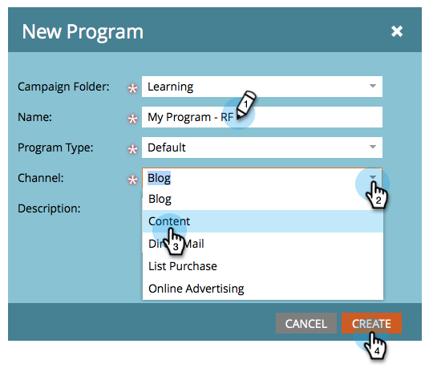

   >[!TIP]
   >
   >Include your initials at the end of the program name to make it unique.

   >[!NOTE]
   >
   >A program is one specific marketing initiative. The **channel** is intended to be the delivery mechanism, like Webinar, Sponsorship, or Online Ad. You may see different channel options in your drop-down, depending on what's available in your own instance. You can also [create your own channel](/help/marketo/product-docs/administration/tags/create-a-program-channel.md){target="_blank"}.

Nicely done! Now that we have created a program, let's move on and create some content.

## STEP 2: Create a Form {#step-create-a-form}

1. With your program selected, click the **[!UICONTROL New]** drop-down and select **[!UICONTROL New Local Asset]**.

   

1. Select **[!UICONTROL Form]**.

   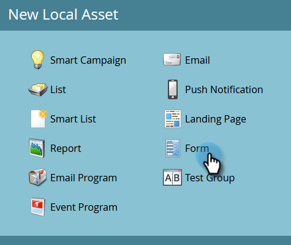

1. Enter a form **[!UICONTROL Name]** and click **[!UICONTROL Create]**.

   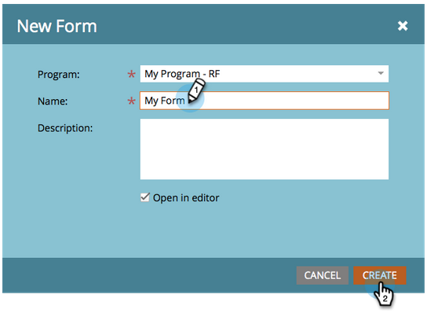

   >[!NOTE]
   >
   >Be sure the **[!UICONTROL Open in editor]** box is checked. If it's not, you'll need to click the **[!UICONTROL Edit Form]** tab.

   >[!TIP]
   >
   >Don't see the form editor? Your browser probably blocked the window. Enable pop-ups from `app.marketo.com` in your browser and click Edit Draft in the top menu bar.

1. Select the **[!UICONTROL Email Address]** field and check **[!UICONTROL Is Required][!UICONTROL **.

   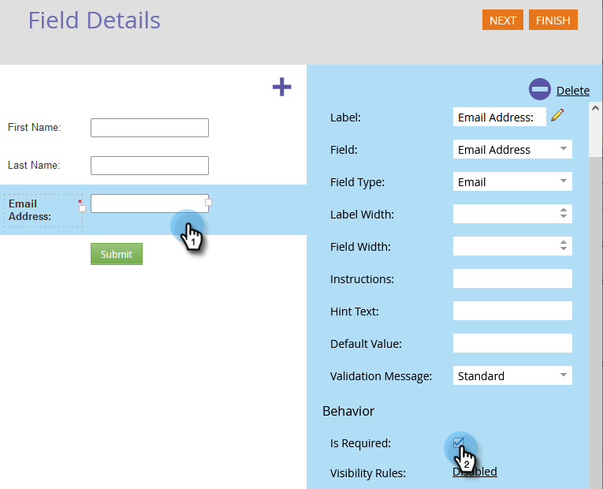

1. Click **[!UICONTROL Next]**.

   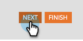

1. Click the arrows to scroll through the themes. Select one.

   

1. Click **[!UICONTROL Next]**.

   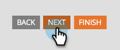

1. Under the Thank You Page section, select **[!UICONTROL External URL]** for **[!UICONTROL Follow Up With]**.

   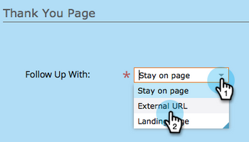

1. Enter the URL.

   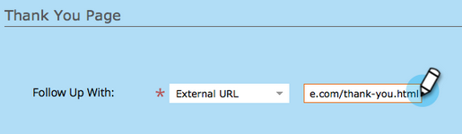

   >[!NOTE]
   >
   >The Follow Up Page is where the visitor is re-directed after filling out the form. External URL is one option but there are more. See [Set a Form Thank You Page](/help/marketo/product-docs/demand-generation/forms/creating-a-form/set-a-form-thank-you-page.md){target="_blank"}.

1. Click **[!UICONTROL Finish]**.

   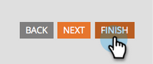

1. Click **[!UICONTROL Approve and Close]**.

   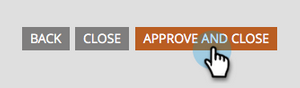

   Great! Now you have a program with a form in it. Let's move on and create a page.

## STEP 3: Create a Landing Page and Add Your Form {#step-create-a-landing-page-and-add-your-form}

1. With your program selected, click the **[!UICONTROL New]** drop-down and select **[!UICONTROL New Local Asset]**.

   

1. Select **[!UICONTROL Landing Page]**.

   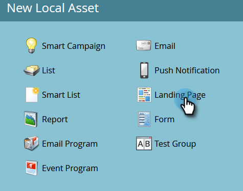

1. Enter a page **[!UICONTROL Name]**, select a template and click **[!UICONTROL Create]**.

   >[!NOTE]
   >
   >You may have a different template than the one in our screenshot, it's okay, just pick one and keep going.

   

1. Once the landing page editor opens, drag the [!UICONTROL Form] element onto the canvas.

   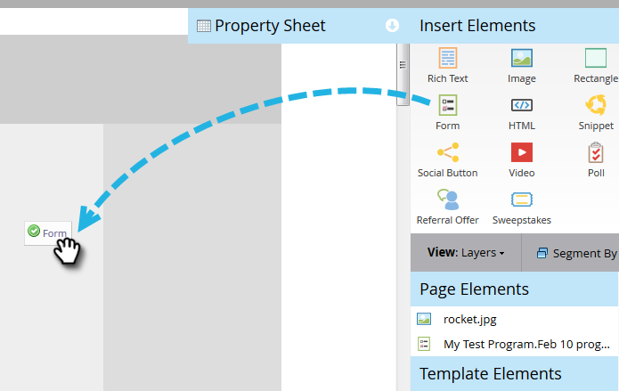

1. Find and select your form and click **[!UICONTROL Insert]**.

   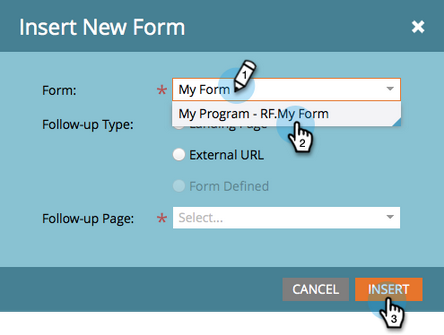

1. Drag the form around to the desired location.

   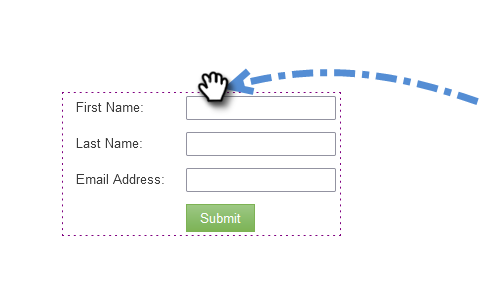

1. All your changes are auto saved. Close the form editor tab/window.

   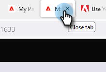

   Great job! You now have a landing page with a form on it. Let's approve your page to make it live.

## STEP 4: Approve Your Landing Page {#step-approve-your-landing-page}

1. Select your landing page and click **[!UICONTROL Approve draft]**.

   

   >[!NOTE]
   >
   >Approving the landing page will make it live and available to access on the internet.

   Perfect! See the green checkmark on it?

   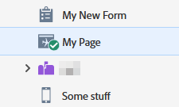

## STEP 5: Test Your Form {#step-test-your-form}

1. Select your landing page and click **[!UICONTROL View Approved Page]**.

   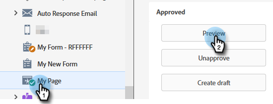

1. Fill out the form with information you know is unique and click **[!UICONTROL Submit]**.

   

1. Go to the **[!UICONTROL Database]** area.

   

1. Search for the unique email address you used when filling out the form.

   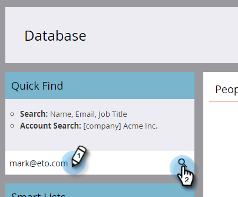

   There it is! You created a new landing page with a form on it and used it to generate a new person.

   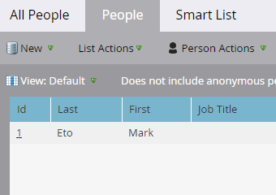

## Mission Complete! {#mission-complete}

 &nbsp;

[◄ Mission 1: Send an Email Blast](/help/marketo/getting-started/quick-wins/send-an-email.md)

[Mission 3: Simple Scoring ►](/help/marketo/getting-started/quick-wins/simple-scoring.md)
