# Landing Page with a Form {#landing-page-with-a-form}

## Mission: Create a landing page with a form to acquire new people. {#mission-create-a-landing-page-with-a-form-to-acquire-new-people}

>[!NOTE]
>
>**FYI**
>
>Marketo is now standardizing language across all subscriptions, so you may see lead/leads in your subscription and person/people in docs.marketo.com. These terms mean the same thing; it does not affect article instructions. There are some other changes, too. [Learn more](http://docs.marketo.com/display/DOCS/Updates+to+Marketo+Terminology).

>[!NOTE]
>
>**Prerequisites**
>
>* [Get Set Up and Add a Person](get-set-up-and-add-a-person.md)

## STEP 1: Create a Program {#step-create-a-program}

1. Go to the **Marketing Activities** area.

   

1. Select the** Learning** folder created in the [previous quick win](send-an-email.md).

   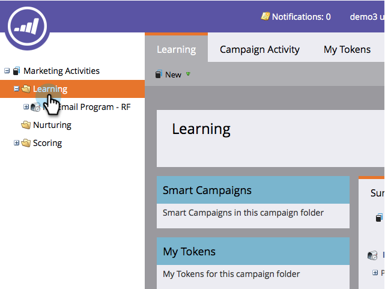

1. Under **New**, click **New Program**.

   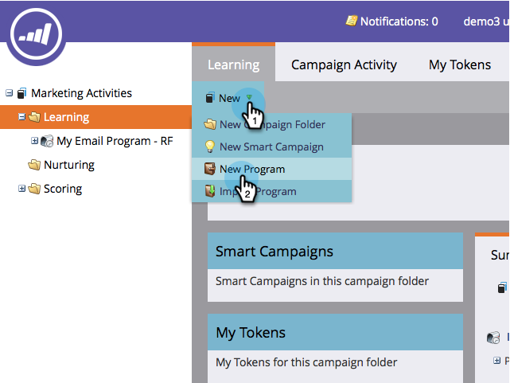

1. Enter a program **Name**, select a** Channel** and click** Create**.

   >[!NOTE]
   >
   >**Reminder**
   >
   >
   >Include your initials at the end of the program Name to make it unique.

   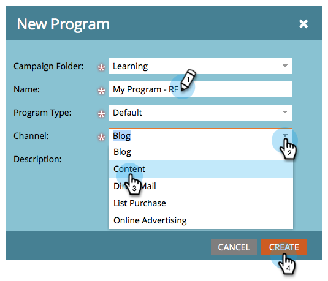

   >[!NOTE]
   >
   >**Definition**
   >
   >
   >A program is one specific marketing initiative. The **channel** is intended to be the delivery mechanism, like Webinar, Sponsorship, or Online Ad. You may see different channel options in your drop-down, depending on what's available in your own instance. You can also [create your own channel.](../../product-docs/administration/tags/create-a-program-channel.md)

   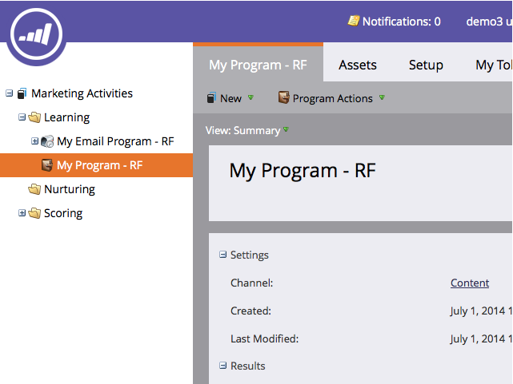

Nicely done! Now that we have created a program, let's move on and create some content. 

## STEP 2: Create a Form {#step-create-a-form}

1. With your program selected, click on **New** then** New Local Asset**.

   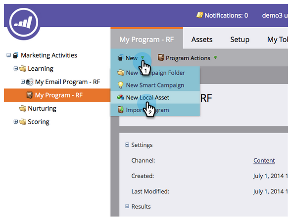

1. Select **Form**.

   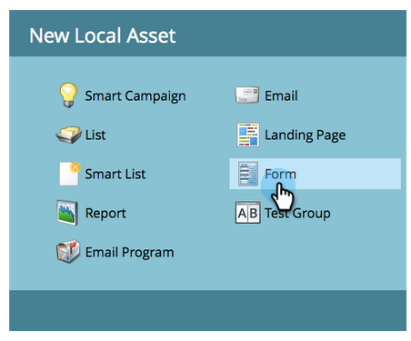

1. Enter a form **Name** and click **Create**.

   

   >[!NOTE]
   >
   >Be sure the **Open in editor** box is checked. If it's not, you'll need to click the **Edit Form **tab**.**

   >[!TIP]
   >
   >Don't see the form editor? Your browser probably blocked the window. Enable pop-ups from [app.marketo.com](http://app.marketo.com/) in your browser and click Edit Draft in the top menu bar.

1. Select the** Email Address** field and check Is **Required**.

   

1. Click **Next**.

   

1. Click the arrows to scroll through the themes. Select one.

   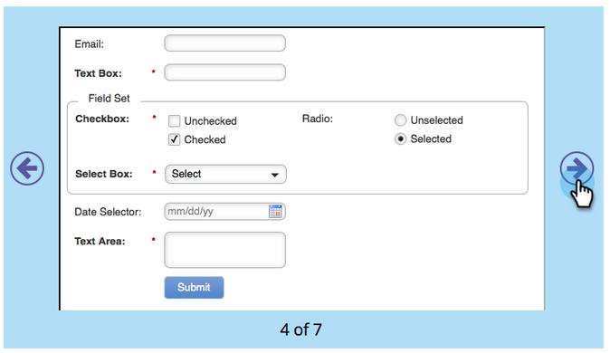

1. Click** Next**.

   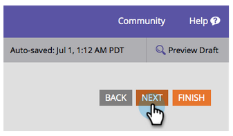

1. Under the Thank You Page section, select **External URL** for **Follow Up With**.

   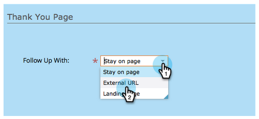

1. Enter the URL.

   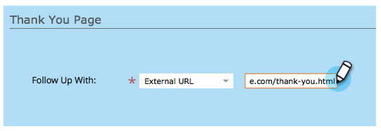

   >[!NOTE]
   >
   >**Definition**
   >
   >The Follow Up Page is where the visitor is re-directed after filling out the form. External URL is one option but there are more. See [Set a Form Thank You Page](../../product-docs/demand-generation/forms/creating-a-form/set-a-form-thank-you-page.md).

1. Click **Finish**.

   

1. Click **Approve and Close**.

   

   Super! Now you have a program with a form in it. Let's move on and create a page.

   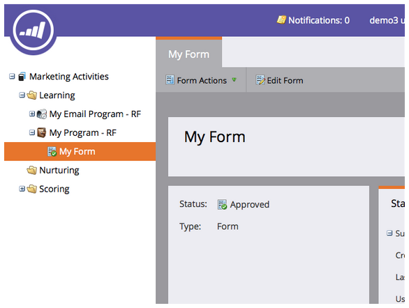

## STEP 3: Create a Landing Page and Add Your Form {#step-create-a-landing-page-and-add-your-form}

1. With your program selected, click **New** and then **New Local Asset**.

   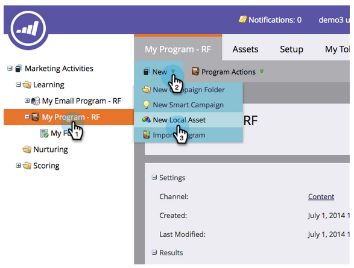

1. Select **Landing Page**.

   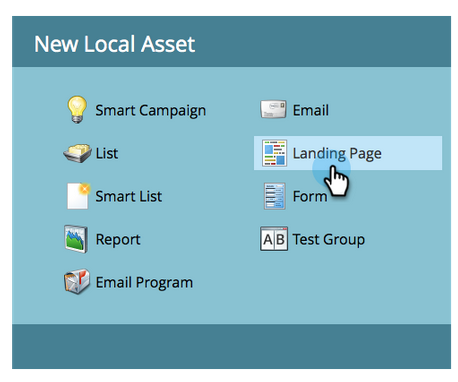

1. Enter a page** Name**, select a template and click **Create**.

   >[!NOTE]
   >
   >You may have a different template than the one in our screenshot, it's ok, just pick one and keep going.

   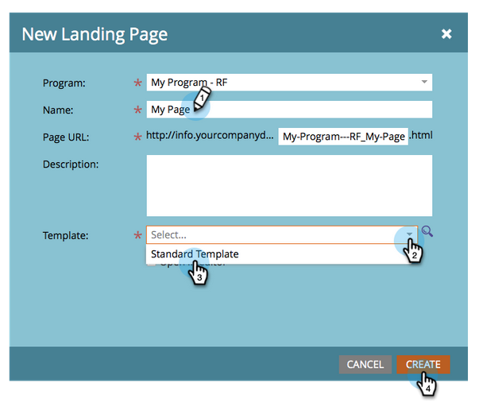

1. Once the landing page editor opens, drag the Form element into the canvas.

   

1. Find and select your form and click **Insert**.

   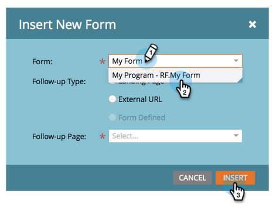

1. Drag the form around to the desired location.

   

1. All your changes are auto saved. Close the form editor tab/window.

   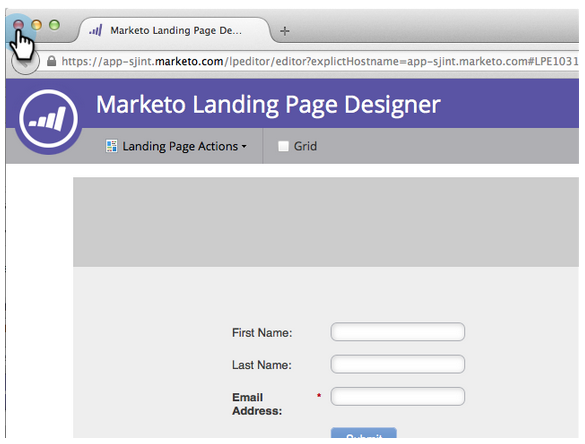

   Great job! You now have a landing page with a form on it. Let's approve your page to make it live.

## STEP 4: Approve Your Landing Page {#step-approve-your-landing-page}

1. Select your landing page, under **Landing Page Actions** click **Approve**.

   >[!NOTE]
   >
   >**Definition**
   >
   >
   >Approving the landing page will make it live and available to access on the internet.

   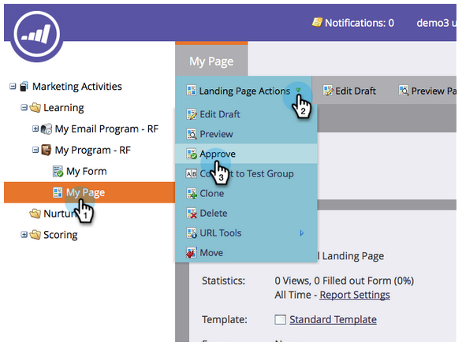

   Perfect! See the green checkmark on it?

   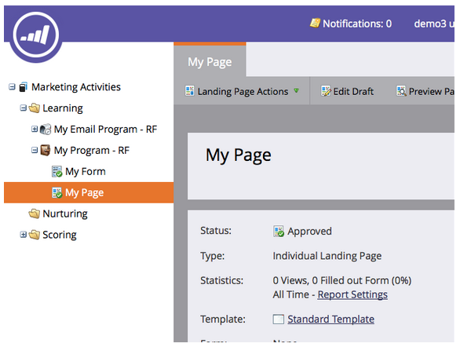

## STEP 5: Test Your Form {#step-test-your-form}

1. Select your landing page and click** View Approved Page**.

   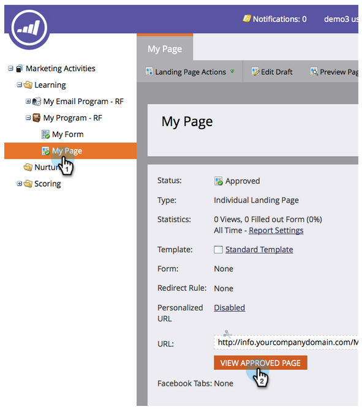

1. Fill out the form with information you know is unique and click **Submit**.

   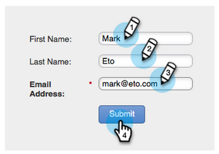

1. Go to the **Database** area.

   

1. Search for the unique email address you used when filling out the form.

   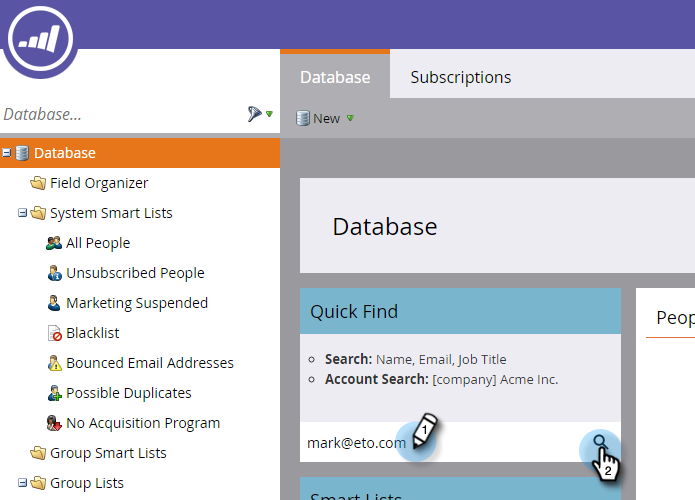

   There it is! You created a new landing page with a form on it and used it to generate a new person.

   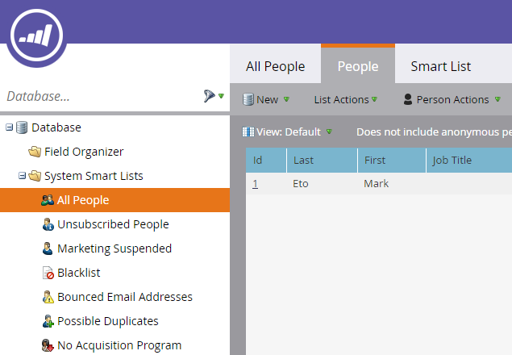

## Mission Complete! {#mission-complete}

 &nbsp;

[◄ Send an Email Blast](send-an-email.md) [Simple Scoring ►](simple-scoring.md) 