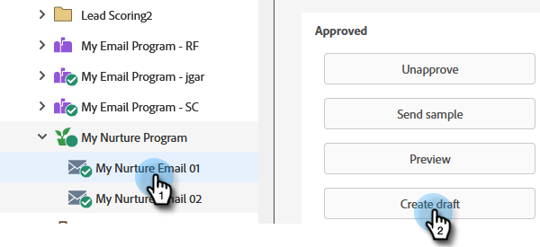
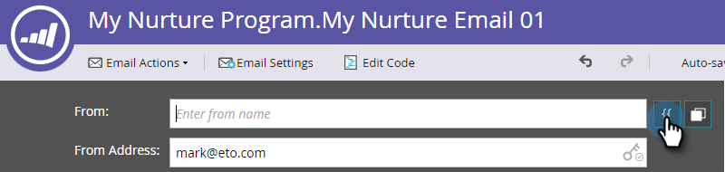
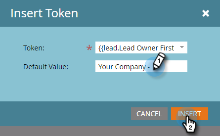
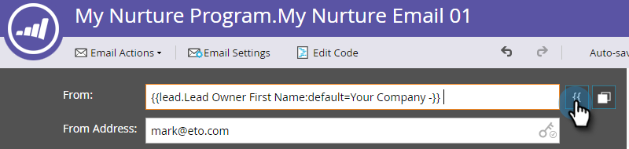
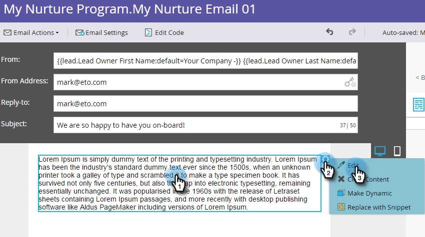
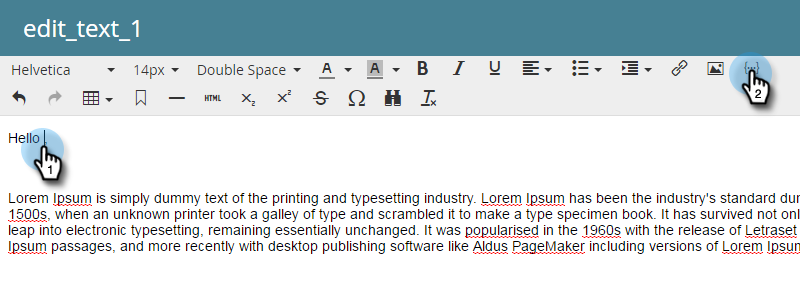
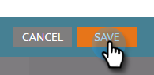
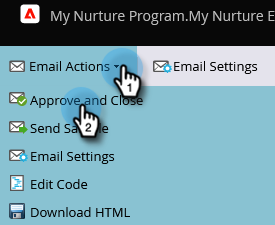

# Personalize an Email {#personalize-an-email}

## Mission: Make your emails personal by adding data tokens {#mission-make-your-emails-personal-by-adding-data-tokens}

>[!PREREQUISITES]
>
>* [Get Set Up and Add a Person](/help/marketo/getting-started/quick-wins/get-set-up-and-add-a-person.md){target="_blank"}
>* [Send an Email Blast](/help/marketo/getting-started/quick-wins/send-an-email.md){target="_blank"}
>* [Drip, Drip, Nurture](/help/marketo/getting-started/quick-wins/drip-drip-nurture.md){target="_blank"}

## Step 1: Select an Email to Personalize {#step-select-an-email-to-personalize}

1. Select one of the nurture emails created in the [previous quick win](/help/marketo/getting-started/quick-wins/drip-drip-nurture.md){target="_blank"} and click **[!UICONTROL Create draft]**.

   

   >[!NOTE]
   >
   >This creates a copy of the email as a draft. Remember to approve the draft for the changes to go live.

If you haven't enabled a pop-up blocker, the email editor will open in a new tab/window. Otherwise, click **[!UICONTROL Create Draft]** twice.

## Step 2: Make the Salesperson the Sender {#step-make-the-salesperson-the-sender}

1. Select the **[!UICONTROL From]** field, highlight and **delete** the current name.

   

1. Click the **Token** icon to the right of the **[!UICONTROL From]** field.

   

1. Find and select the **`{{lead.Lead Owner First Name}}`** token.

   

1. Type your company name and a dash for the **Default Value** to ensure something is displayed in case the sale rep's first name is unavailable. Click **Insert**.

   

1. Hit the space bar in the **[!UICONTROL From]** field, making sure the cursor is flashing one space after the token you just inserted. Then click the **Token** icon again.

   

1. Find and select the **`{{lead.Lead Owner Last Name}}`** token.

   

1. Type "Sales" for the **Default Value** and click **Insert**.

   

## Step 3: Add the Lead's Name to the Email {#step-add-the-leads-name-to-the-email}

1. Select the top editable section, click the gear icon and select **[!UICONTROL Edit]**.

   

1. Add a space after "Hello" and place your cursor in front of the comma, then click the **Insert Token** icon.

   

1. Find and select the **`{{lead.First Name}}`** token.

   

1. Enter "Friend" (or any label you'd like) in the **[!UICONTROL Default Value]** field and click **[!UICONTROL Insert]**.

   

   >[!TIP]
   >
   >Always include a default value for tokens; this ensures the default value will be displayed in the email if some part of the personal information is missing.

1. Click **[!UICONTROL Save]**.

   

1. Under **[!UICONTROL Email Actions]** and select **[!UICONTROL Approve and Close]**.

   

>[!TIP]
>
>Need a quick refresher on how to send yourself the email? See [Send an Email Blast](/help/marketo/getting-started/quick-wins/send-an-email.md){target="_blank"}.

### Mission Complete {#mission-complete}

Congratulations, you've personalized your email!

 &nbsp;

[◄ Mission 6: Drip, Drip, Nurture](/help/marketo/getting-started/quick-wins/drip-drip-nurture.md)

[Mission 8: Alert the Sales Rep ►](/help/marketo/getting-started/quick-wins/alert-the-sales-rep.md)
