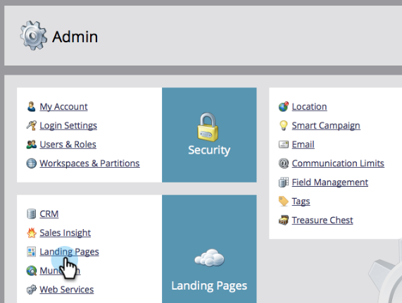
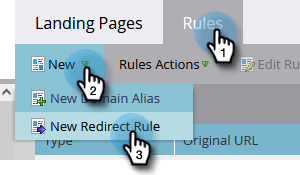
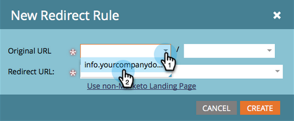
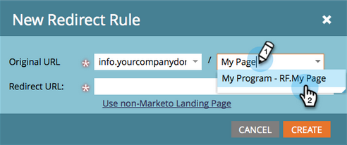

# Redirect a Landing Page {#redirect-a-landing-page}

## Mission: Redirect a landing page to a different web page {#mission-redirect-a-landing-page-to-a-different-web-page}

>[!NOTE]
>
>**Admin Permissions Required**

>[!PREREQUISITES]
>
>* [Landing Page with a Form](/help/marketo/getting-started/quick-wins/landing-page-with-a-form.md){target="_blank"}
>* [Customize Your Landing Page URL with a CNAME](/help/marketo/product-docs/demand-generation/landing-pages/landing-page-actions/customize-your-landing-page-urls-with-a-cname.md){target="_blank"}

## Step 1: Start a New Redirect Rule {#step-start-a-new-redirect-rule}

1. Go to the **[!UICONTROL Admin]** area.

   

1. Go to **[!UICONTROL Landing Pages]**.

   

1. Click the **[!UICONTROL Rules]** tab, then click **[!UICONTROL New]** and **[!UICONTROL New Redirect Rule]**.

   

## Step 2: Define the Redirect Rule {#step-define-the-redirect-rule}

1. Click the first **[!UICONTROL Original URL]** drop-down and select your Marketo CNAME.

   

   >[!NOTE]
   >
   >Remember, you can only redirect landing pages that start with your Marketo [CNAME](/help/marketo/product-docs/demand-generation/landing-pages/landing-page-actions/customize-your-landing-page-urls-with-a-cname.md){target="_blank"}.

1. Click the second **[!UICONTROL Original URL]** drop-down and select the landing page you want to redirect.

   

1. For **[!UICONTROL Redirect URL]** select the page you want to redirect to and click **[!UICONTROL Create]**.

   

## Mission Complete {#mission-complete}

Congratulations! You've successfully redirected a landing page.  

 &nbsp;

[◄ Mission 9: Update Lead Data](/help/marketo/getting-started/quick-wins/update-person-data.md)
