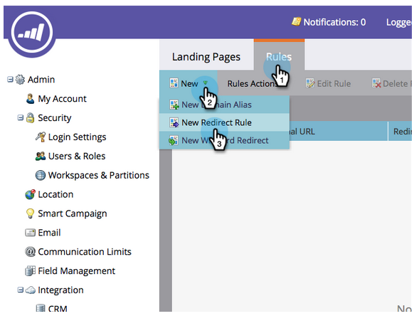
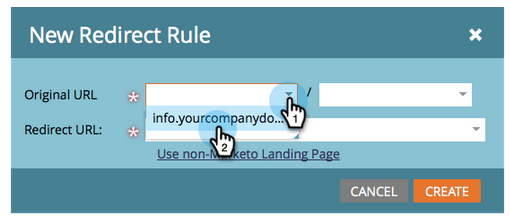
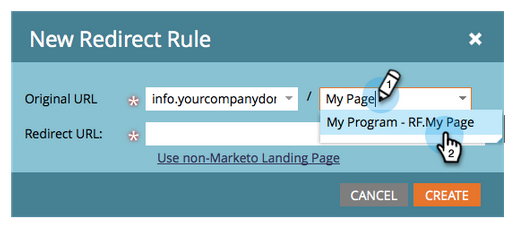
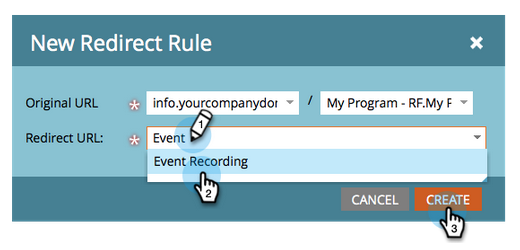

# Redirect a Landing Page {#redirect-a-landing-page}

## Mission: Redirect a landing page to a different web page {#mission-redirect-a-landing-page-to-a-different-web-page}

>[!NOTE]
>
>**Admin Permissions Required**

>[!NOTE]
>
>**Prerequisites**
>
>* [Get Set Up and Add a Person](get-set-up-and-add-a-person.md)
>* [Landing Page with a Form](landing-page-with-a-form.md)
>* [Customize Your Landing Page URL with a CNAME](../../product-docs/demand-generation/landing-pages/landing-page-actions/customize-your-landing-page-urls-with-a-cname.md)
>

## Step 1: Start a New Redirect Rule {#step-start-a-new-redirect-rule}

1. Go to the **Admin** area.

   

1. Go to** Landing Pages**.

   

1. Click the **Rules** tab, then click **New** and **New Redirect Rule**.

   

## Step 2: Define the Redirect Rule {#step-define-the-redirect-rule}

1. Click the first  **Original URL ** drop-down and select your Marketo CNAME.

   

   >[!NOTE]
   >
   >**Reminder**
   >
   >
   >Remember, you can only redirect landing pages that start with your Marketo [CNAME](../../product-docs/demand-generation/landing-pages/landing-page-actions/customize-your-landing-page-urls-with-a-cname.md).

1. Click the second **Original URL **drop-down and select the landing page you want to redirect.

   

1. For **Redirect URL** select the page you want to redirect to and click **CREATE**.

   

## Mission Complete {#mission-complete}

Congratulations! You've successfully redirected a landing page.  

---

[◄ Mission 9: Update Lead Data](update-person-data.md) 