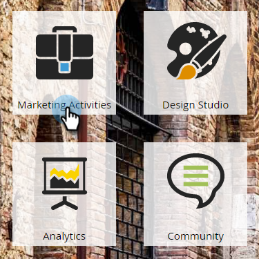
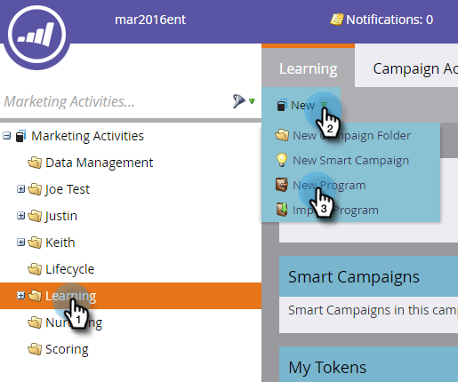
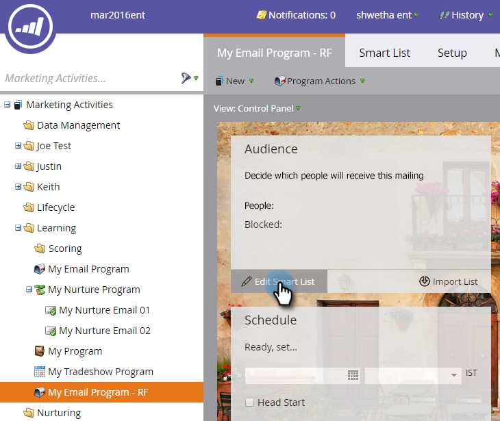
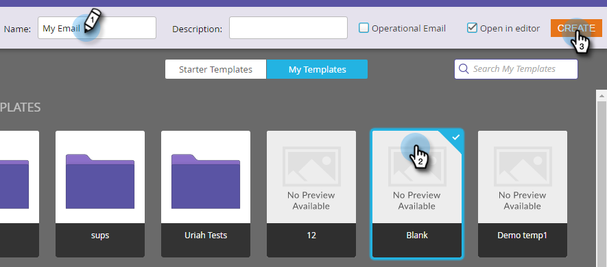
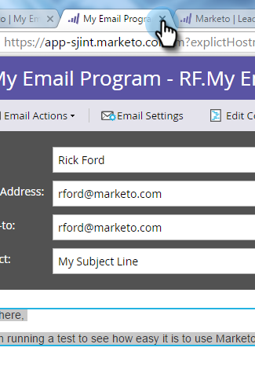
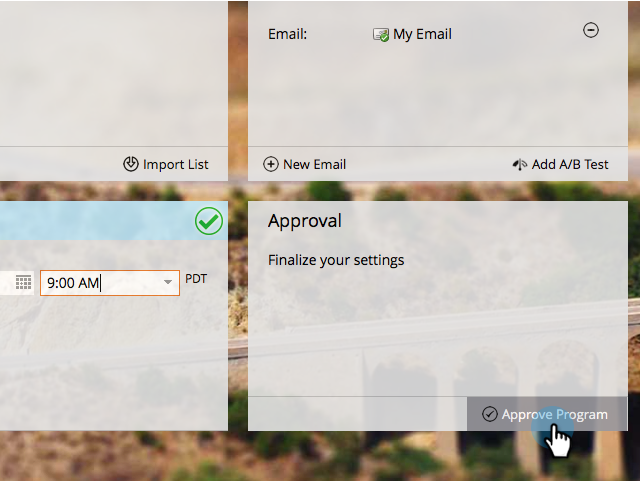

# Send an Email {#send-an-email}

It's the first thing everyone wants to do. Let's send an email out of Marketo!

>[!PREREQUISITES]
>
>[Get Set Up and Add a Person](/help/marketo/getting-started/quick-wins/get-set-up-and-add-a-person.md)

## Create an Email Program {#create-an-email-program}

1. Go to the **Marketing Activities** area.

   

1. Select your **Learning** folder. Click the **New** drop-down and select **New Program**.

   

1. Enter a **Name** and select **Email** for **Program Type.**

   >[!TIP]
   >
   >Add your initials at the end of the program name to make it unique.

   

1. Under **Channel**, select **Email Send** and click **Create**.

   

## Define your Audience {#define-your-audience}

1. Click **Edit Smart List** under the Audience tile.

   

1. Find and drag the Email Address filter into the canvas.

   

   >[!TIP]
   >
   >Use **Search** at the top of the Filters list to find the filter more easily.

1. Find and select your email address.

   

   >[!NOTE]
   >
   >If your email doesn't auto-populate, you may have forgotten to [Get Set Up and Add a Lead.](/help/marketo/getting-started/quick-wins/get-set-up-and-add-a-person.md)

   >[!NOTE]
   >
   >In this example we're having you send the email to only yourself, but you can customize the audience as you see fit.

1. Go back to the main program tab and click the refresh icon for **Person**.

   

   You should see the person count go up to 1. That's you!

## Create an Email {#create-an-email}

1. Under the Email tile click **New Email**.

   

1. Enter a **Name**, select a **Template**, and click **Create**.

   

1. The email editor window will open. Enter a subject that's 50 characters or less (recommended).

   

   >[!NOTE]
   >
   >If you have a pop-up blocker, click **Edit Draft** to enter the email editor.

1. Select the area you want to edit, click the gear icon on the right, then select **Edit** (you can also double-click the editable section to edit).

   

1. Enter the content you want and click **Save**.

   

1. The changes will auto-save. Close the editor tab/window.

   

1. Click the **Email Actions** drop-down and select **Approve**.

   

   >[!TIP]
   >
   >Want to send yourself a quick sample to see how your email looks prior to launching? Select **Send Sample** in the menu above, or click **Email Actions** then [**Send Sample**](/help/marketo/product-docs/email-marketing/general/creating-an-email/send-a-sample-email.md).

1. Select the Email Program in the left tree.

   

1. Under the Schedule tile, set the launch day for the email to **Today.**

   

1. Select a time that's at least 15 minutes in the future.

   

   >[!TIP]
   >
   >Is the default time zone not yours? Learn how to [update it here](/help/marketo/product-docs/administration/settings/select-your-language-locale-and-time-zone.md).

1. Click **Approve Program** under the Approval tile and you're done!

   

You should receive the email shortly after the scheduled day/time.

 &nbsp;

[◄ Get Set Up and Add a Lead](/help/marketo/getting-started/quick-wins/get-set-up-and-add-a-person.md)

[Landing Page with a Form ►](/help/marketo/getting-started/quick-wins/landing-page-with-a-form.md)
