# Send an Email {#send-an-email}

It's the first thing everyone wants to do. Let's send an email out of Marketo!

>[!PREREQUISITES]
>
>[Get Set Up and Add a Person](/help/marketo/getting-started/quick-wins/get-set-up-and-add-a-person.md){target="_blank"}

## Create an Email Program {#create-an-email-program}

1. Go to the **[!UICONTROL Marketing Activities]** area.

   

1. Select your **[!UICONTROL Learning]** folder. Click the **[!UICONTROL New]** drop-down and select **[!UICONTROL New Program]**.

   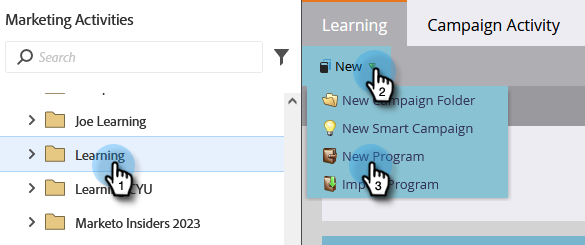

1. Enter a **[!UICONTROL Name]** and select **[!UICONTROL Email]** for **[!UICONTROL Program Type]**.

   >[!TIP]
   >
   >Add your initials at the end of the program name to make it unique.

   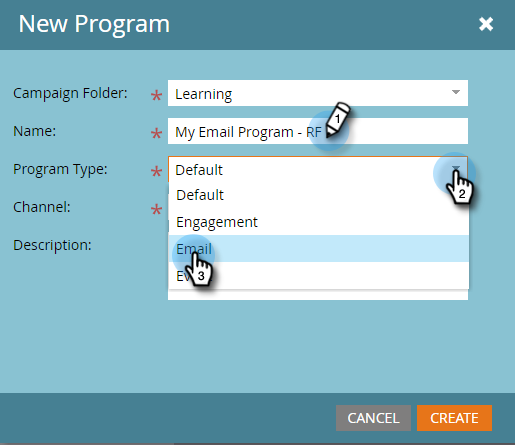

1. Under **[!UICONTROL Channel]**, select **[!UICONTROL Email Send]** and click **[!UICONTROL Create]**.

   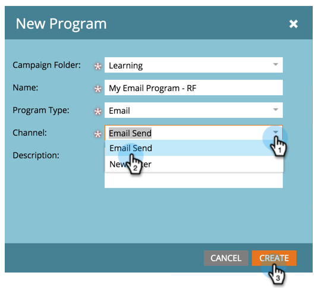

## Define your Audience {#define-your-audience}

1. Click **[!UICONTROL Edit Smart List]** under the [!UICONTROL Audience] tile.

   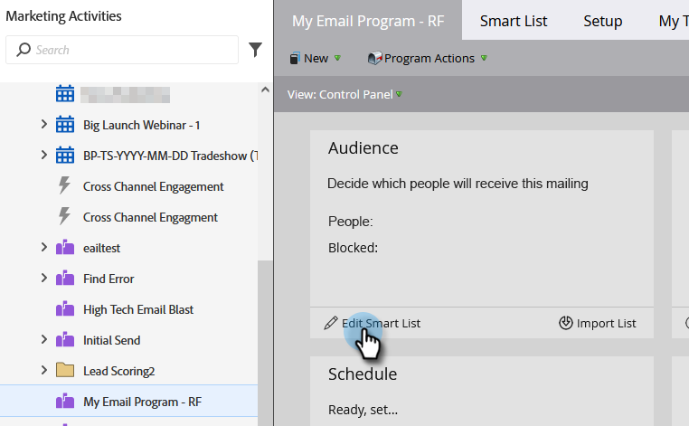

1. Find and drag the [!UICONTROL Email Address] filter onto the canvas.

   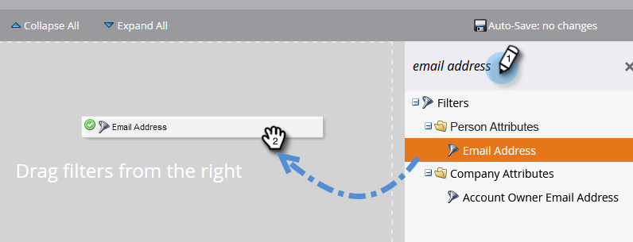

   >[!TIP]
   >
   >Use the **[!UICONTROL Search]** function to find filters more easily.

1. Find and select your email address.

   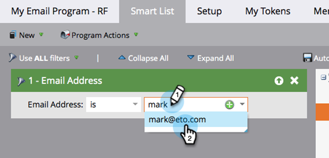

   >[!NOTE]
   >
   >If your email doesn't auto-populate, you may have forgotten to [Get Set Up and Add a Lead.](/help/marketo/getting-started/quick-wins/get-set-up-and-add-a-person.md){target="_blank"}

   >[!NOTE]
   >
   >In this example we're having you send the email to only yourself, but you can customize the audience as you see fit.

1. Go back to the main program tab and click the refresh icon for **[!UICONTROL Person]**.

   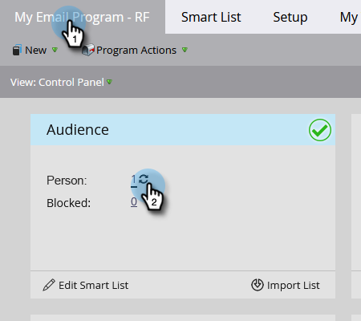

   You should see the person count go up to 1. That's you!

## Create an Email {#create-an-email}

1. Under the Email tile click **[!UICONTROL New Email]**.

   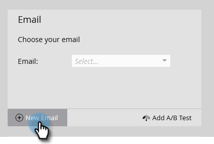

1. Enter a **[!UICONTROL Name]**, select a **Template**, and click **[!UICONTROL Create]**.

   

1. The email editor window will open. Enter a subject that's 50 characters or less (recommended).

   

   >[!NOTE]
   >
   >If you have a pop-up blocker, click **[!UICONTROL Edit Draft]** to enter the email editor.

1. Select the area you want to edit, click the gear icon on the right, then select **[!UICONTROL Edit]** (you can also double-click the editable section to edit).

   

1. Enter the content you want and click **[!UICONTROL Save]**.

   

1. Click the **[!UICONTROL Email Actions]** drop-down and select **[!UICONTROL Approve and Close]**.

   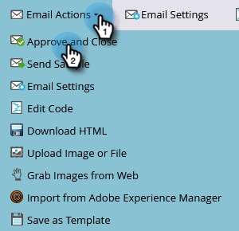

   >[!TIP]
   >
   >Want to send yourself a quick sample to see how your email looks prior to launching? Select **[!UICONTROL Send Sample]** in the menu above, or click **[!UICONTROL Email Actions]** then [**[!UICONTROL Send Sample]**](/help/marketo/product-docs/email-marketing/general/creating-an-email/send-a-sample-email.md){target="_blank"}.

1. Select the Email Program in the left tree.

   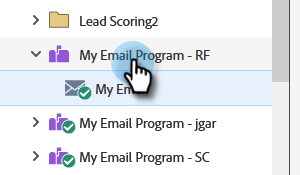

1. Under the [!UICONTROL Schedule] tile, set the launch day for the email to **[!UICONTROL Today]**.

   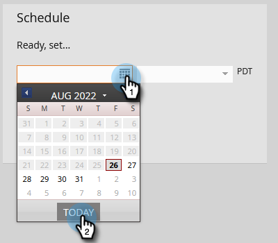

   >[!NOTE]
   >
   >Learn more about [Recipient Time Zone](/help/marketo/product-docs/email-marketing/email-programs/email-program-actions/scheduling-with-recipient-time-zone/schedule-email-programs-with-recipient-time-zone.md){target="_blank"} and [Head Start](/help/marketo/product-docs/email-marketing/email-programs/email-program-actions/head-start-for-email-programs.md){target="_blank"}.

1. Select a time that's at least 15 minutes in the future.

   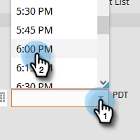

   >[!TIP]
   >
   >Is the default time zone not yours? Learn how to [update it here](/help/marketo/product-docs/administration/settings/select-your-language-locale-and-time-zone.md){target="_blank"}.

1. Click **[!UICONTROL Approve Program]** under the [!UICONTROL Approval] tile and you're done!

   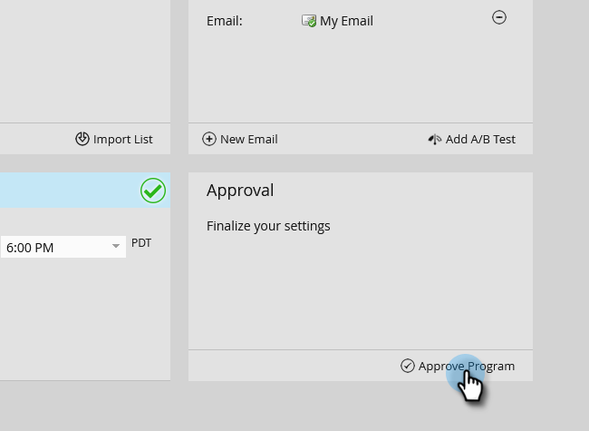

You should receive the email shortly after the scheduled day/time.

## Mission Complete! {#mission-complete}

 &nbsp;

[◄ Get Set Up and Add a Person](/help/marketo/getting-started/quick-wins/get-set-up-and-add-a-person.md)

[Mission 2: Landing Page with a Form ►](/help/marketo/getting-started/quick-wins/landing-page-with-a-form.md)
