# Simple Scoring {#simple-scoring}

>[!PREREQUISITES]
>
>* [Get Set Up and Add a Person](/help/marketo/getting-started/quick-wins/get-set-up-and-add-a-person.md){target="_blank"}
>* [Landing Page with a Form](/help/marketo/getting-started/quick-wins/landing-page-with-a-form.md){target="_blank"}

## Step 1: Create a Scoring Campaign {#step-create-a-scoring-campaign}

1. Go to the **[!UICONTROL Marketing Activities]** area.

   

1. Right-click your **Learning** folder and click **[!UICONTROL New Campaign Folder]**.

   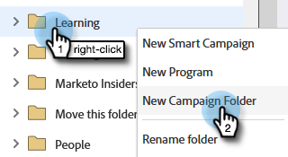

1. Name the campaign folder "Scoring" and click **[!UICONTROL Create]**.

   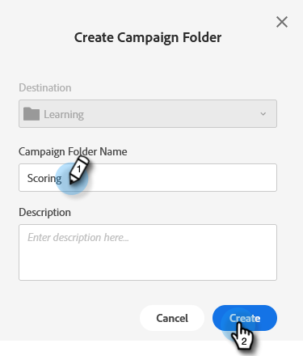

   >[!NOTE]
   >
   >If you already have a Scoring folder, name this one something different, such as Scoring 1. Folder names must be unique.

1. Right-click your **Scoring** folder and select **[!UICONTROL New Smart Campaign]**.

   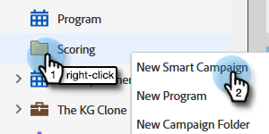

1. Name the campaign "Change Score" and click **[!UICONTROL Create]**.

   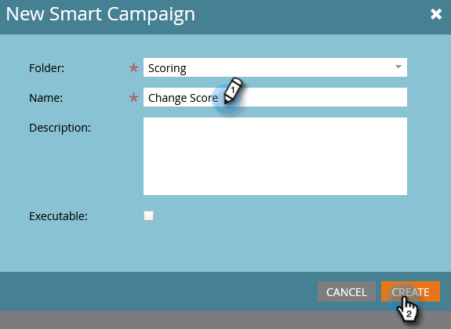

1. Click the **[!UICONTROL Smart List]** tab.

   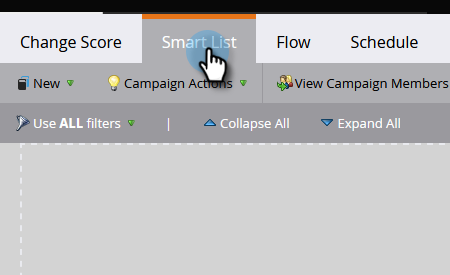

   We want this campaign to run whenever a person fills out your **Trial Request Form**.

1. Find and drag the **[!UICONTROL Fills Out Form]** trigger onto the left canvas.

   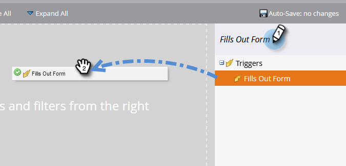

1. Select **My Form**.

   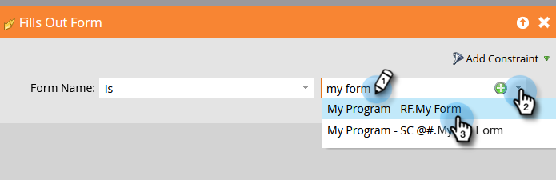

   >[!NOTE]
   >
   >If you completed the [Landing Page with a Form](/help/marketo/getting-started/quick-wins/landing-page-with-a-form.md){target="_blank"} quick win, you should have the form. If you used a different name for your form, select that one.

1. Click the **[!UICONTROL Flow]** tab.

   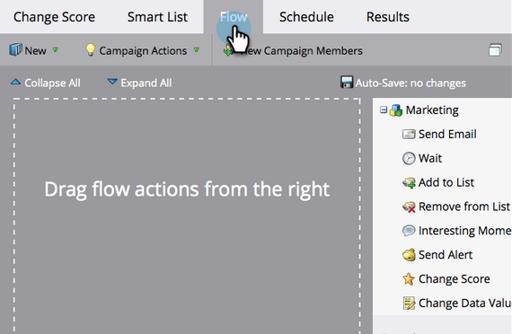

1. Drag the **Change Score** flow action onto the left canvas.

   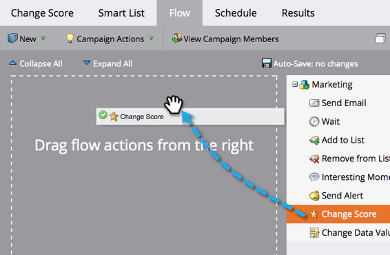

1. You can type any value to add to the person's score. Let's enter "+5" in the **[!UICONTROL Change]** field.

   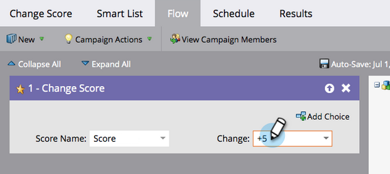

   >[!TIP]
   >
   >Good scoring campaigns are key to delivering high-quality people to Sales. Read [**The Definitive Guide to Lead Scoring**](https://www.marketo.com/definitive-guides/lead-scoring/){target="_blank"}.

1. Click the **[!UICONTROL Schedule]** tab and the **[!UICONTROL Activate]** button.

   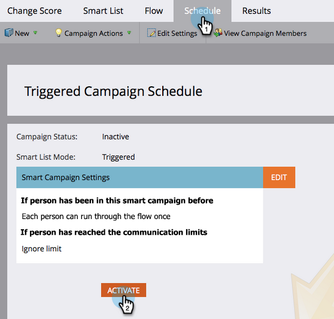

1. Click **[!UICONTROL Activate]** on the confirmation screen.

   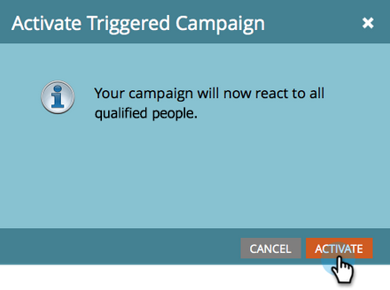

>[!NOTE]
>
>Once active, this campaign will run every time a person fills out the form. The campaign will keep running until it's deactivated.

## Step 2: Fill Out the Form {#step-fill-out-the-form}

1. Select the landing page you created in the [Landing Page with a Form](/help/marketo/getting-started/quick-wins/landing-page-with-a-form.md){target="_blank"} quick win.

   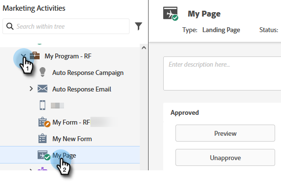

1. Click **[!UICONTROL Preview]**. The landing page will open in a new tab.

   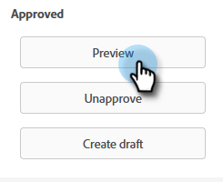

1. Fill out the form with your first name, last name, and email address, then click **[!UICONTROL Submit]**.

   

   >[!NOTE]
   >
   >Use the same name and email address that you used when you first entered yourself as a person in order to apply the "+5" score increase.

## Step 3: View the Person Info {#step-view-the-person-info}

1. Go to the **[!UICONTROL Database]** area.

   

1. Search for email address you used when filling out the form.

   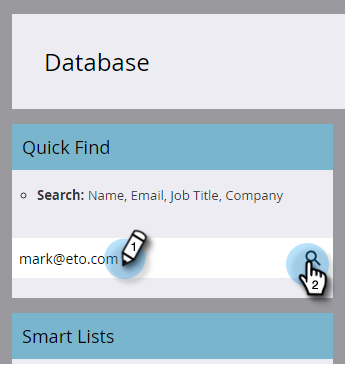

1. Double-click your person.

   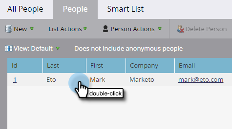

Your person details will open in a new tab or window. See how your score increased by 5 points for filling out the form?

## Mission Complete! {#mission-complete}

 &nbsp;

[◄ Mission 2: Landing Page with a Form](/help/marketo/getting-started/quick-wins/landing-page-with-a-form.md)

[Mission 4: Email Auto-Response ►](/help/marketo/getting-started/quick-wins/email-auto-response.md)
