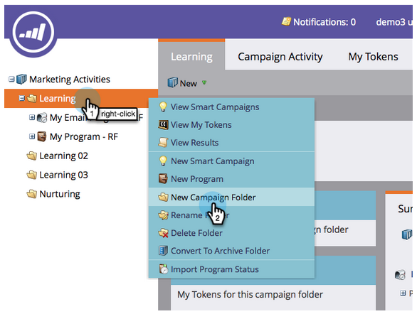
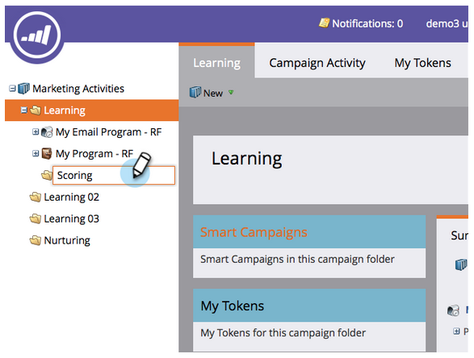
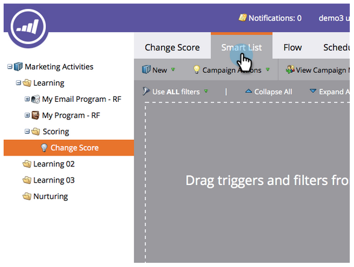
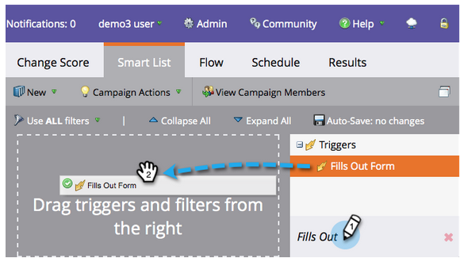
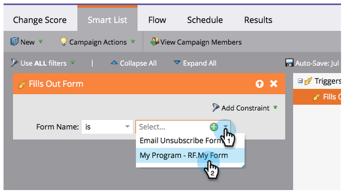
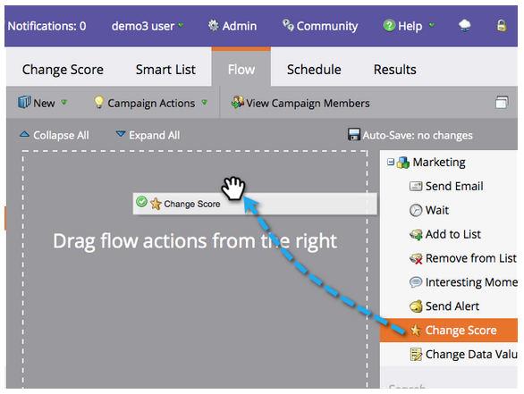
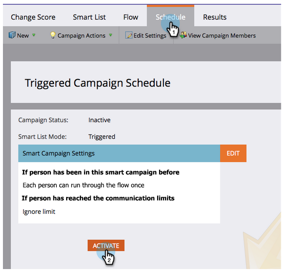
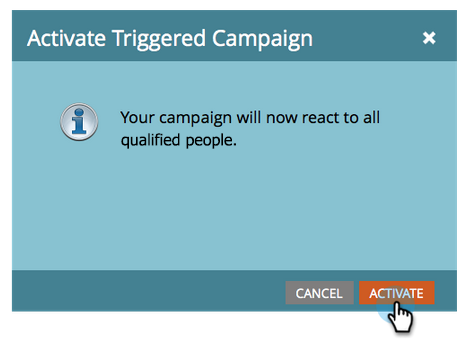
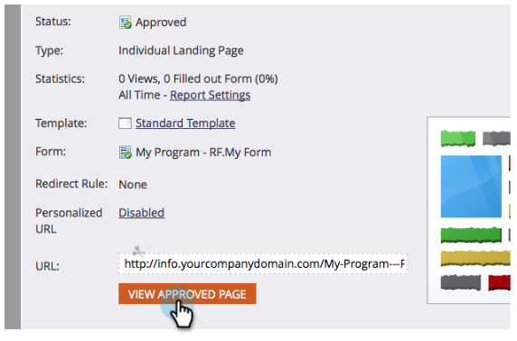
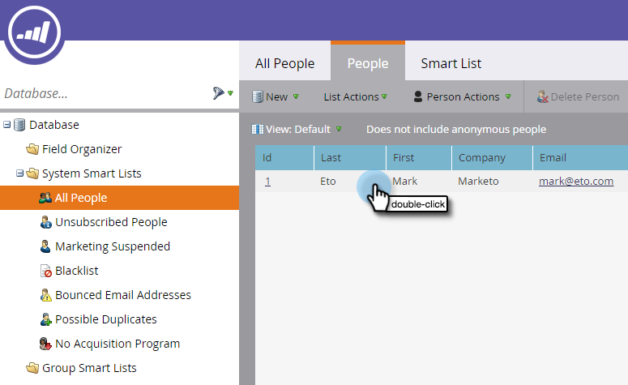

# Simple Scoring {#simple-scoring}

>[!PREREQUISITES]
>
>* [Get Set Up and Add a Person](get-set-up-and-add-a-person.md)
>* [Landing Page with a Form](landing-page-with-a-form.md)

## Step 1: Create a Scoring Campaign {#step-create-a-scoring-campaign}

1. Go to the **Marketing Activities** area.

   

1. Right-click your **Learning** folder and click **New Campaign Folder**.

   

1. Name the campaign folder "Scoring."

   

   >[!NOTE]
   >
   >If you already have a Scoring folder, name this one something different, such as Scoring 1. Folder names must be unique.

1. Then right-click your new **Scoring** folder and select **New Smart Campaign**.

   

1. **Name** the campaign "Change Score" and click **Create**.

   

1. Click the **Smart List** tab.

   

   We want this campaign to run whenever a person fills out your **Trial Request Form**.

1. Find and drag the **Fills Out Form** trigger onto the left canvas.

   

1. Select **My Form**.

   >[!NOTE]
   >
   >If you completed the [Landing Page with a Form](/help/marketo/getting-started/quick-wins/landing-page-with-a-form.md) quick win you should have the form. If you used a different name for your form, select that one.

   

1. Click the **Flow** tab.

   

1. Drag the **Change Score** flow action onto the left canvas.

   

1. You can type any value to add to the person's score. Let's enter "+5" in the **Change** field.

   

   >[!TIP]
   >
   >Good scoring campaigns are key to delivering high-quality people to Sales. Read [**The Definitive Guide to Lead Scoring**](https://www.marketo.com/definitive-guides/lead-scoring/).

1. Click the **Schedule** tab and the **Activate** button.

   

1. Click **Activate** on the confirmation screen.

   

>[!NOTE]
>
>Once active, this campaign will run every time a person fills out the form. The campaign will keep running until it's deactivated.

## Step 2: Fill Out the Form {#step-fill-out-the-form}

1. Select the landing page you created in the [Landing Page with a Form](/help/marketo/getting-started/quick-wins/landing-page-with-a-form.md) quick win.

   

1. Click **View Approved Page**. The landing page will open in a new tab.

   

1. Fill out the form with your first name, last name, and email address, then click **Submit**.

   

   >[!NOTE]
   >
   >Use the same name and email address that you used when you first entered yourself as a person in order to apply the "+5" score increase.

## Step 3: View the Person Info {#step-view-the-person-info}

1. Go to the Database area.

   

1. Search for email address you used when filling out the form.

   

1. Double-click your person.

   

Your person details will open in a new tab or window. See how your score increased by 5 points for filling out the form?!

**Congratulations!** You've created a scoring campaign.
[◄ Mission 2: Landing Page with a Form](/help/marketo/getting-started/quick-wins/landing-page-with-a-form.md)

[Mission 4: Email Auto-Response ►](/help/marketo/getting-started/quick-wins/email-auto-response.md)
