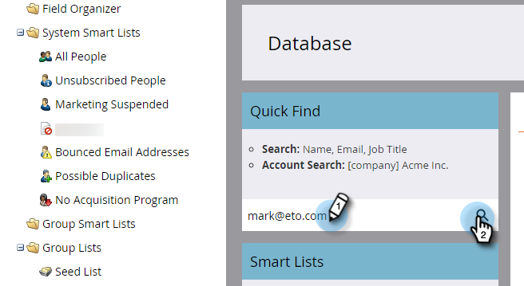
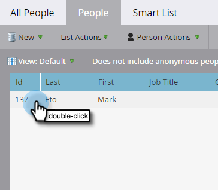
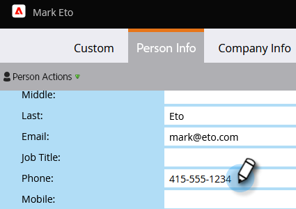

# Update Person Data {#update-person-data}

## Mission: Update a person's contact info or other data {#mission-update-a-persons-contact-info-or-other-data}

>[!PREREQUISITES]
>
>* [Get Set Up and Add a Person](/help/marketo/getting-started/quick-wins/get-set-up-and-add-a-person.md){target="_blank"}
>* [Import a List of People](/help/marketo/getting-started/quick-wins/import-a-list-of-people.md){target="_blank"}

Let's imagine that at your recent tradeshow, a person gave you some additional contact info. Here's how to update person data.  

## Find the Person You Need to Update {#find-the-person-you-need-to-update}

1. Go to your **[!UICONTROL Database]**.

   

1. Search the person's name or email address.

   >[!TIP]
   >
   >Using the email address to search will result in faster search.

   

1. Double-click to open the person detail.

   

   >[!TIP]
   >
   >There are lots of ways to update person data in Marketo. See [Import a List of People](/help/marketo/getting-started/quick-wins/import-a-list-of-people.md){target="_blank"} and [Change Data Value](/help/marketo/product-docs/core-marketo-concepts/smart-campaigns/flow-actions/change-data-value.md){target="_blank"}.

## Update the Person Data {#update-the-person-data}

1. Type in the new info you received and then close the tab.

>[!NOTE]
>
>Once you change the data, Smart Lists and Smart Campaigns will recognize the new information immediately.

## Mission Complete {#mission-complete}

Nice job! You've updated your person data.

 &nbsp;

[◄ Mission 8: Alert the Sales Rep](/help/marketo/getting-started/quick-wins/alert-the-sales-rep.md)

[Mission 10: Redirect a Landing Page ►](/help/marketo/getting-started/quick-wins/redirect-a-landing-page.md)
