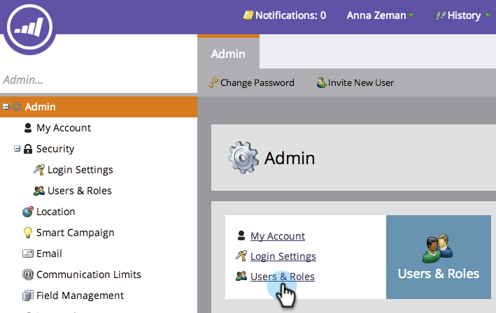
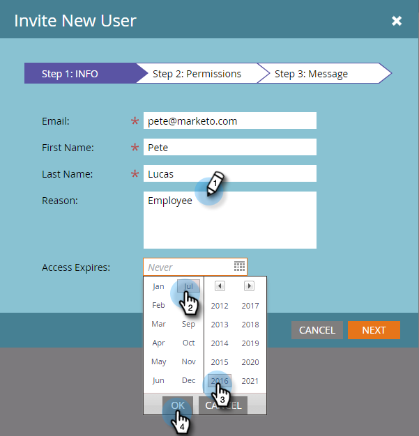
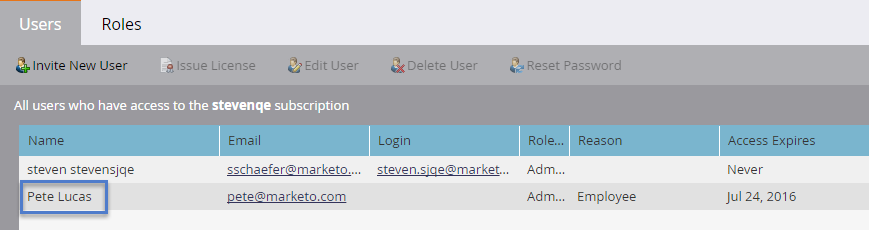
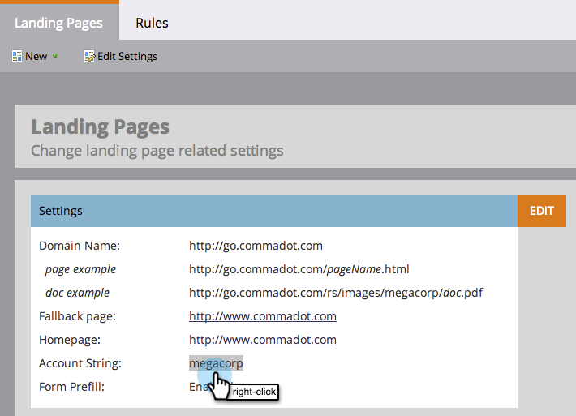
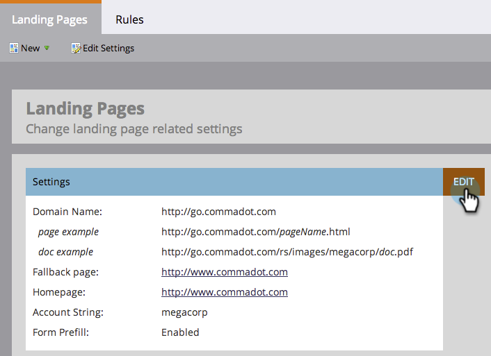
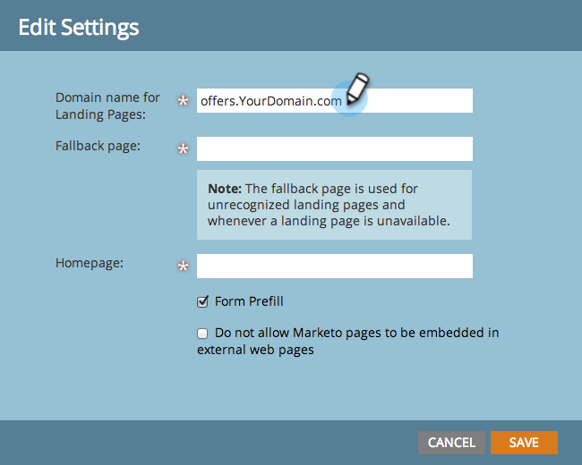
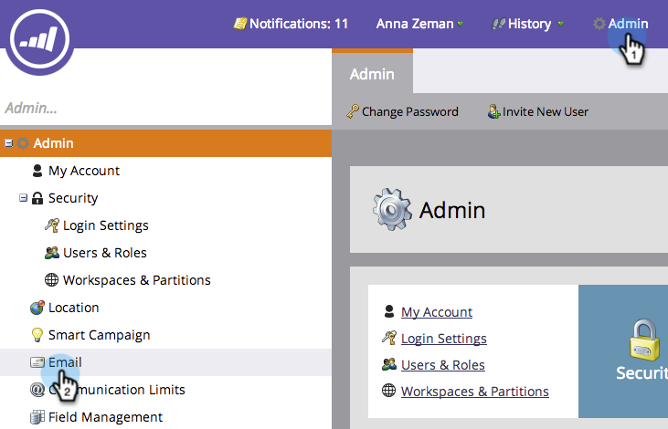
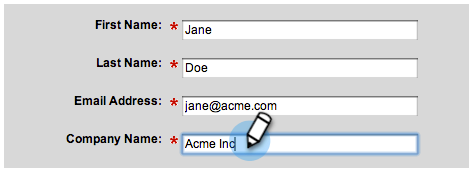
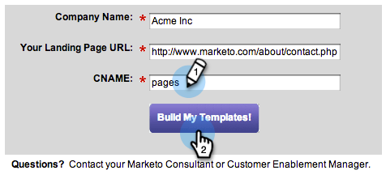

# Setup Steps {#setup-steps}

**Welcome to Marketo!**
Before you dive into using Marketo, there a few steps you need to complete. 

>[!NOTE]
>
>**FYI**
>
>Marketo is now standardizing language across all subscriptions, so you may see lead/leads in your subscription and person/people in docs.marketo.com. These terms mean the same thing; it does not affect article instructions. There are some other changes, too. [Learn more](http://docs.marketo.com/display/DOCS/Updates+to+Marketo+Terminology).

These steps include:

* some basic account setup
* branding your landing page URLs and email links to improve trust and deliverability
* syncing your CRM
* adding tracking code to your corporate website

>[!NOTE]
>
>You only need to do these steps if your company is **new to Marketo**. If not, the setup may already be done.

Some steps require help from your IT group. 

>[!TIP]
>
>If you  [print out this checklist](setup-steps/setup-checklist.md) , you can check items off as you complete them.

1. Log In and Create Additional Marketo Users
1. Log into Marketo [here](https://app.marketo.com/) using the credentials you received by email.

   
   Congratulations! You’re now inside Marketo and can start exploring. You might want to invite your colleagues on the marketing team to join you. You can do this by adding new users.

   Go to the Admin area.

   >[!TIP]
   >
   >While you're here, you can click **My Account** to change your account and location settings, as well as set a new subscription name.

   

   >[!NOTE]
   >
   >**Admin Permissions Required**

   Click Users & Roles.

   

   Click Invite New User.

   

   Fill out your colleague’s email address, first name, and last name.

   

   Optionally, enter a reason for the invitation and an access expiration date, using the calendar picker. Click OK.

   

   Click Next.

   

   >[!TIP]
   >
   >An expiration date is great for short-term external stakeholders or consultants, who need Marketo access only for a brief time.

   >[!NOTE]
   >
   >When the expiration date arrives, the user receives expiration notification, and the account is locked.

   Select a role and click Next. Standard Users have access to all areas except Admin.

   

   >[!NOTE]
   >
   >In addition to the five built-in roles, you can also create custom roles. Learn more about [Managing User Roles and Permissions](../product-docs/administration/users-and-roles/managing-user-roles-and-permissions.md).

   Feel free to tweak the invitation text. Click Send.

   

   The new user is now listed in the Users tab, and should receive an email with a link to create a password and login. Next step!   

1. Set Up Your Authorized Support Contacts

   You might have received an email from Marketo Support stating that you are the Marketo Customer Support Administrator for your company. If so, you can set up **authorized support contacts** for your team. Only authorized support contacts can contact Marketo Customer Support directly through the [Marketo Support Portal](http://support.marketo.com).

   >[!NOTE]
   >
   >The number of support contacts you can create is determined by the package that you purchased. This limit is specified in your email from Marketo Support.

   Authorized Support Contact docs have moved to the Marketo Community. Please see [this article](http://nation.marketo.com/t5/Knowledgebase/Managing-Authorized-Support-Contacts/ta-p/254341).

   >[!NOTE]
   >
   >Only people who have logged into the Marketo Community appear in the list. If you cannot find the person, make sure they log-in to the Community first.

1. Customize Your Landing Page URLs with a CNAME

   >[!NOTE]
   >
   >Are you a Launch Pack customer? You can skip this step. Your consultant will provide you with an IT setup instructions document during your kickoff call.

   >[!NOTE]
   >
   >**Admin Permissions Required**

   Choose a CNAME for your landing pages. Some examples:

    * **go**.[CompanyDomain].com
    * **www2**.[CompanyDomain].com
    * **lp**.[CompanyDomain].com

   >[!TIP]
   >
   >Keep it short! Shorter URLs are easier to remember. We suggest "go" as the domain.

   The first part (in bold) is the [LandingPageCNAME]. You will need it in Step 5. 
   To retrieve the account string that you’ll be replacing with your landing page CNAME, go to the Admin area.

   

   Click Landing Pages.

   

   Copy the Account String from landing page settings.

   

   This is [AccountString]. Save it. You will need to give it to IT in Step 5.

Configure your domain settings so landing pages use your company’s domain instead of Marketo’s (where they are hosted).

1. Ensure Email Deliverability

   >[!NOTE]
   >
   >Are you a Launch Pack customer? You can skip this step. Your consultant will provide you with an IT setup instructions document during your kickoff call.

   There are several measures you can take to ensure that the emails reach as many of your people as possible.

    1. **Brand your tracking links**. You can choose a CNAME to use your own domain (instead of Marketo’s) in the links you include in emails from Marketo. This reinforces your domain branding and increases trust and deliverability with your recipients.
    1. **Add Marketo to your corporate email allowlist.** It is a common best practice to send test emails to your test accounts before sending emails to actual people. By allowlisting Marketo, you can prevent those test emails from being blocked or flagged as spam.
    1. **Set up SPF and DKIM.** These technologies assure your recipients that your Marketo emails are not spam. To help prevent recipients’ spam filters from rejecting you Marketo emails, follow these steps to [Setup a SPF and DKIM for Your Email Deliverability](../product-docs/email-marketing/deliverability/set-up-spf-and-dkim-for-your-email-deliverability.md).
    
    1. **Set up an MX record for your domain.** An MX record allows you to receive mail to the domain that you are sending email from to process replies and auto responders. If you’re sending from your corporate domain, you likely already have this configured. If not, you can usually set up to map to your corporate domain’s MX record. 
    1. **Recommended Settings for the From Address.** You must use a valid, existing and working email domain in the From Address in all email campaigns. It may be beneficial to configure a subdomain of your corporate domain rather than sending from your corporate domain. This will ensure issues from your corporate mailstream do not impact your Marketo mailstream and vice versa. Furthermore, sending mail from [`[email protected]`](http://docs.marketo.com/cdn-cgi/l/email-protection#e99a86848c9d8180878ea98786878c91809a9d8c879d8d8684888087c78a8684) will cause email to be filtered or blocked. Any domain used in the sender's From Address must have a valid and working [[email protected]](http://docs.marketo.com/cdn-cgi/l/email-protection) and [[email protected]](http://docs.marketo.com/cdn-cgi/l/email-protection) account.   
       If you’re using Google Apps to host your corporate email, you won’t be able to create [[email protected]](http://docs.marketo.com/cdn-cgi/l/email-protection) or [[email protected]](http://docs.marketo.com/cdn-cgi/l/email-protection) emails under your domain. To get around this, you need to create groups named “abuse” and “postmaster”. Users that are members of these groups will receive emails sent to those addresses (i.e. [postmaste `[email protected]`](http://docs.marketo.com/cdn-cgi/l/email-protection#88f8e7fbfce5e9fbfcedfac8ece7e5e9e1e6a6ebe7e5)). Detailed instructions for creating groups can be found [here](https://support.google.com/a/answer/33343#adminconsole).

   Choose a CNAME for email tracking links. (Choose one that is *different* from the landing page CNAME you chose in Step 3.) Some examples:

    * go2.[CompanyDomain].com
    * em.[CompanyDomain].com
    * wow.[CompanyDomain].com

   The first part is the email tracking CNAME, [EmailTrackingCNAME]. You will need to give it to IT in Step 5.

   >[!CAUTION]
   >
   >Email and Landing Page CNAMEs must be different. Also, avoid CNAMEs like ‘track’ or ‘link.’ It is often flagged as spam

   To find your Marketo tracking link, go to the Admin area.

   

   Click Email.

   

   Copy the Tracking Link from your email settings.  
  
   The Tracking Link is in the form: mkto-[a-z][4 digits].com

   

   This is your [MktoTrackingLink]. Save it. You will need to give it to IT in Step 5.

   Collect "From" domains. Make a list of all the "From" domains (as in, [Sender]@[FromDomain].com) that you plan to use for sending emails from Marketo. For most, there is just one.

   For example, 'marketo.com,' 'info.marketo.com,'. These are [FromDomain1],[FromDomain2], etc. Save them. You will need to give them to IT in Step 5.

   You now have all the information you need to send your request to IT!

1. Ask IT to Configure Protocols

   >[!NOTE]
   >
   >Are you a Launch Pack customer? You can skip this step. Your consultant will provide you with an IT setup instructions document during your kickoff call.

   Once you have collected all the necessary information, you’re ready to send a request to IT. You can use the text below as a template, replacing the bold text with your own information.

   [Include a link to this article](setup-steps/configure-protocols-for-marketo.md).

   Paste this text into the email, and replace the bolded placeholders:

   >[!NOTE]
   >
   >See Steps 3 and 4 above to determine the text to replace the placeholders. Remember that [LandingPageCNAME] and [EmailTrackingCNAME] must be different.

   Dear Awesome IT Administrator,

   Our Marketing Team is now using the Marketo platform to communicate with our people. To ensure great email deliverability, we need to make the following changes:

   `1)` For our landing pages, add a DNS Entry (CNAME) for **[LandingPageCNAME]**.**[CompanyDomain]**.com, pointing to **[AccountString]**.mktoweb.com.

   `2)` For our tracking links in email, add a DNS Entry (CNAME) for **[EmailTrackingCNAME]**.**[CompanyDomain]**.com, pointing to **[MktoTrackingLink]**.

   `3)` Allowlist Marketo.

    * If we use IP addresses in our Email Allowlist, add the IPs listed below:  
      199.15.212.0/22

      192.28.144.0/20

      192.28.160.0/19

      185.28.196.0/22

      130.248.172.0/24

      130.248.173.0/24

      103.237.104.0/22

      94.236.119.0/26

   NOTE: Reach out to Marketo Support if you’d like an abbreviated list of IPs to allowlist specific to your environment.

    * If our anti-spam system uses From domains, add these:

   **`[FromDomain1]`** 
   **`[FromDomain2]`**

   `4)` We need to set up SPF and DKIM so Marketo is authorized to send signed emails on our behalf.

   `a.` To set up SPF, please add following line to our DNS entries:

   IN  TXT **[From Domain]**:  v=spf1 mx ip4:**[Corporate IP(s)]**** ** 
   include: mktomail.com ~all   
  
   If we already have an existing SPF record in our DNS entry, simply add the following to it: 

   include:mktomail.com

   `[`Replace **From Domain** with your Email From Domain (ex: company.com) and **CorpIP** with the IP address of your corporate email server (ex: 255.255.255.255).  If you are going to be sending email from multiple domains through Marketo, you should have your IT staff add this line for each domain (on one line).`]`

   `b.` For DKIM, please create DNS Resource Records for each domain we'd like to setup. Below are the Host Records and TXT Values for each domain we'll be signing for:

   **`[DKIMDomain1]`**: Host Record is **`[HostRecord1]`** and the TXT Value is **[TXTValue1]**.

   **`[DKIMDomain2]`**: Host Record is **`[HostRecord2]`** and the TXT Value is **`[TXTValue2]`**.

   `[`Copy the **HostRecord** and **TXTValue** for each **DKIMDomain** you've setup after following the [instructions here](../product-docs/email-marketing/deliverability/set-up-a-custom-dkim-signature.md). Don't forget to verify each domain in **Admin > Email > DKIM** after your IT staff has completed this step.`]`
  
   `5)` We need to ensure there is a valid MX record for our FROM domains **[FromDomain1]**, **[FromDomain2]**, etc. Can you confirm? If not, please configure to map to our corporate domain MX record. This will ensure we can process replies/autoresponders to our Marketo mailings.

   Let me know when you have completed these steps, so that I can complete the setup process with Marketo.

   Thank you! You're the best!

   Love,

   **`[Your Name]`**

   Send the email to IT. We understand it can take some time for IT to complete these tasks. You can continue on to Step 7, but remember that you must return Step 6 to complete your Marketo setup.

1. Complete Your Marketo Setup After IT Finishes

   Once IT has completed their tasks, follow these steps to add your landing page and email CNAMEs, and to activate DKIM signing.

   Go to the Admin area to Add Your Landing Page CNAME

   

   Select Landing Pages and click Edit in the Settings area.

   

   Enter your new domain name in the field Domain Name for Landing Pages. This should be in the form:

   [LandingPageCNAME].[CompanyDomain].com

   

   In the Fallback page field, enter the URL you want people to go to if a landing page is unavailable. You can use your company home page if you do not have a fallback page. In the Homepage field, enter your company website.

   

   In the Admin area, select Email to Add your Email CNAME

   

   Scroll down and click Edit.

   

   In the Domain field, enter your email tracking domain. This should be in the form:

   [EmailTrackingCNAME].[CompanyDomain].com. Click **Save**.

   

1. Submit a URL for Landing Page and Email Templates

   Our creative designers can provide you with customized email and landing page templates that make it quick and easy to launch your marketing programs. You need to provide them with some information so that they can match the templates to your company website and logo.

   >[!NOTE]
   >
   >These custom templates are available for Launch Pack customers only.

   Go to the [Marketo Template Design and Build](http://pages2.marketo.com/CESubmit-URL-ForTemplates.html) form. Fill out your company information.

   

   For Your Landing Page URL, enter a sample URL from your company’s website that shows your company’s colors, logo and style. Most customers use a Contact Us page that includes a form.

   

   For CNAME, enter the landing page CNAME that you selected in Step 3 ([LandingPageCNAME]). Submit your request.

   

   >[!NOTE]
   >
   >Your templates cannot be completed until your IT creates a DNS record for your landing page CNAME.

   That’s it! You should see your new templates in the Marketo Design Studio in 3-5 business days.

1. Integrate Your CRM

   This is probably the most exciting step of your setup - it’s time to fill up Marketo with all those leads and contacts you have stored in your CRM!

   Choose from the following, depending on the CRM your company uses.

    * [Integrate Marketo with Salesforce.com](http://docs.marketo.com/display/docs/salesforce+sync)
    * [Integrate Marketo with Microsoft Dynamics](http://docs.marketo.com/pages/viewpage.action?pageid=6094951)

   >[!NOTE]
   >
   >You need the assistance of your company’s CRM administrator to complete these steps.

## 9. Add Tracking Code to Your Website {#add-tracking-code-to-your-website}

>[!NOTE]
>
>Are you a Launch Pack customer? You can skip this step. Your consultant will provide you with Munchkin code instructions in your IT setup instructions document.

Marketo has custom tracking JavaScript (called Munchkin) that you can use to track person activities on any web page. Munchkin is required to integrate your website into Marketo. Follow these steps to [Add Munchkin Tracking Code to Your Website](../product-docs/administration/additional-integrations/add-munchkin-tracking-code-to-your-website.md).

>[!NOTE]
>
>Experience with HTML required to add the tracking code.

All your setup steps are over. Only thing left is to dive in and use Marketo!
