# Setup Steps {#setup-steps}

**Welcome to Marketo Engage!**

Before you dive into using Marketo, there a few steps you need to complete.

These steps include:

* Some basic account setup
* Branding your landing page URLs and email links to improve trust and deliverability
* Syncing your CRM
* Adding tracking code to your corporate website

>[!NOTE]
>
>You only need to do these steps if your company is **new to Marketo**. If not, the setup may already be done.

Some steps require help from your IT team.

>[!TIP]
>
>If you [print out this checklist](/help/marketo/getting-started/setup/setup-checklist.md){target="_blank"}, you can check items off as you complete them.

## Log in and create additional Marketo Users {#log-in-and-create-additional-marketo-users}

Log in to Marketo [here](https://app.marketo.com/){target="_blank"} using the credentials you received by email.

   

Congratulations! You're now in Marketo and can start exploring. You might want to invite your colleagues on the marketing team to join you. You can do this by adding new users.

Go to the **[!UICONTROL Admin]** area.

   >[!TIP]
   >
   >While you're here, you can click **[!UICONTROL My Account]** to change your account and location settings, as well as set a new subscription name.

   

   >[!NOTE]
   >
   >**Admin Permissions Required**

   Click **[!UICONTROL Users & Roles]**.

   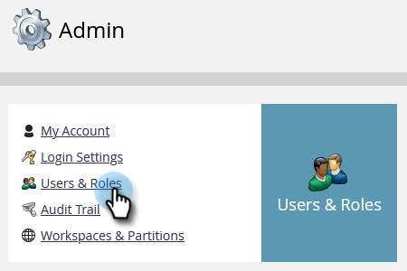

   Click **[!UICONTROL Invite New User]**.

   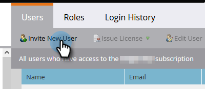

   Fill out your colleague's email address, first name, and last name. _Setting an access expiration date is optional_. Click **[!UICONTROL Next]**.

   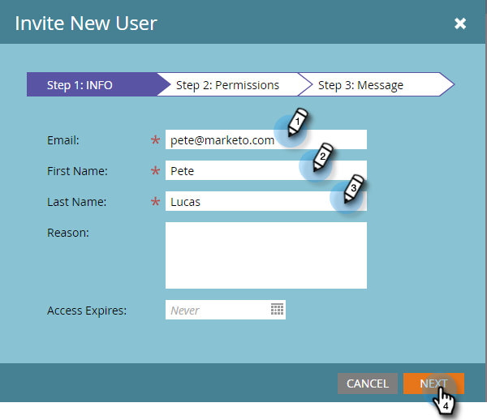

   >[!TIP]
   >
   >An expiration date is great for short-term external stakeholders or consultants who only need Marketo access for a brief period.

   >[!NOTE]
   >
   >When the expiration date arrives, the user receives an expiration notification and the account is locked.

   Select a role and click **[!UICONTROL Next]**. Standard Users have access to all areas except Admin.

   

   >[!NOTE]
   >
   >In addition to the five built-in roles, you can also create custom roles. Learn more about [Managing User Roles and Permissions](/help/marketo/product-docs/administration/users-and-roles/managing-user-roles-and-permissions.md){target="_blank"}.

   Feel free to tweak the invitation text. Click **Send**.

   

   The new user is now listed in the **[!UICONTROL Users]** tab, and should receive an email with a link to create a password and a login. Next step!

   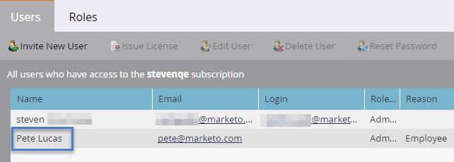

## Set Up Your Authorized Support Contacts {#set-up-your-authorized-support-contacts}

   You might have received an email from Marketo Support stating that you are the Marketo Customer Support Administrator for your company. If so, you can set up **authorized support contacts** for your team. Only authorized support contacts can contact Marketo Customer Support directly through the [Marketo Support Portal](https://support.marketo.com){target="_blank"}.

   >[!NOTE]
   >
   >The number of support contacts you can create is determined by the package that you purchased. This limit is specified in your email from Marketo Support.

   Authorized Support Contact docs have moved to the Marketo Community. Please see [this article](https://nation.marketo.com/t5/Knowledgebase/Managing-Authorized-Support-Contacts/ta-p/254341){target="_blank"}.

   >[!NOTE]
   >
   >Only people who have logged in to the Marketo Community appear in the list. If you cannot find the person, make sure they log in to the Community first.

## Customize Your Landing Page URLs with a CNAME {#customize-your-landing-page-urls-with-a-cname}

   >[!NOTE]
   >
   >Are you a Launch Pack customer? You can skip this step. Your consultant will provide you with an IT setup instructions document during your kickoff call.

   >[!NOTE]
   >
   >**Admin Permissions Required**

   Choose a CNAME for your landing pages. Some examples:

    * **go**.[CompanyDomain].com
    * **www2**.[CompanyDomain].com
    * **lp**.[CompanyDomain].com

   >[!TIP]
   >
   >Keep it short! Shorter URLs are easier to remember. We suggest "go" as the domain.

   The first part (in bold) is the `[LandingPageCNAME]`. You'll need it in Step 5.

   To retrieve the Munchkin ID that you'll be replacing with your landing page CNAME, go to the Admin area.

   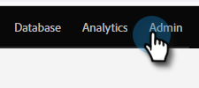

   Click **My Account**.

   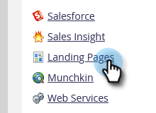

   Copy the [!UICONTROL Account String] from landing page settings.

   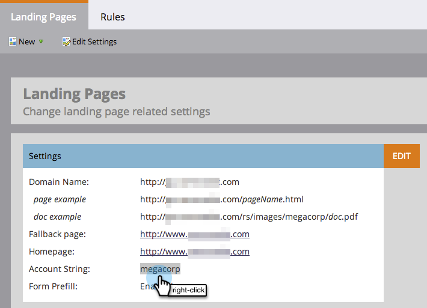

   This is the `[Munchkin ID]`. Save it. You'll need to give it to IT in Step 5.

Configure your domain settings so landing pages use your company's domain instead of Marketo's (where they are hosted).

## Ensure Email Deliverability {#ensure-email-deliverability}

   >[!NOTE]
   >
   >Are you a Launch Pack customer? You can skip this step. Your consultant will provide you with an IT setup instructions document during your kickoff call.

There are several measures you can take to ensure that the emails reach as many of your people as possible.

* **Brand your tracking links**. You can choose a CNAME to use your own domain (instead of Marketo's) in the links you include in emails from Marketo. This reinforces your domain branding and increases trust and deliverability with your recipients.
* **Add Marketo to your corporate email allowlist.** It is a common best practice to send test emails to your test accounts before sending emails to actual people. By allowlisting Marketo, you can prevent those test emails from being blocked or flagged as spam.
* **Set up SPF and DKIM.** These technologies assure your recipients that your Marketo emails are not spam. To help prevent recipients' spam filters from rejecting you Marketo emails, follow these steps to [Setup a SPF and DKIM for Your Email Deliverability](/help/marketo/product-docs/email-marketing/deliverability/set-up-spf-and-dkim-for-your-email-deliverability.md).
* **Set up an MX record for your domain.** An MX record allows you to receive mail to the domain that you are sending email from to process replies and auto responders. If you're sending from your corporate domain, you likely already have this configured. If not, you can usually set up to map to your corporate domain's MX record.
* **Recommended Settings for the From Address.** You must use a valid, existing and working email domain in the From Address in all email campaigns. It may be beneficial to configure a subdomain of your corporate domain rather than sending from your corporate domain. This will ensure issues from your corporate mailstream do not impact your Marketo mailstream and vice versa. Furthermore, sending mail from `something@nonexistentdomain.com` will cause email to be filtered or blocked. Any domain used in the sender's From Address must have a valid and working postmaster@ and abuse@ account.

If you're using Google Apps to host your corporate email, you won't be able to create abuse@ or postmaster@ emails under your domain. To get around this, you need to create groups named "abuse" and "postmaster". Users that are members of these groups will receive emails sent to those addresses (e.g., postmaster@domain.com). Detailed instructions for creating groups can be found [here](https://support.google.com/a/answer/33343#adminconsole){target="_blank"}.

Choose a CNAME for email tracking links (choose one that is _different_ from the landing page CNAME you chose in Step 3). Some examples:

* go2.[CompanyDomain].com
* em.[CompanyDomain].com
* wow.[CompanyDomain].com

The first part is the email tracking CNAME, `[EmailTrackingCNAME]`. You will need to give it to IT in Step 5.

   >[!CAUTION]
   >
   >Email and Landing Page CNAMEs must be different. Also, avoid CNAMEs like 'track' or 'link.' It is often flagged as spam

   To find your Marketo tracking link, go to the **[!UICONTROL Admin]** area.

   

   Click **[!UICONTROL Email]**.

   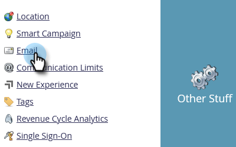

   Copy the [!UICONTROL Tracking Link] from your email settings.  
  
   The [!UICONTROL Tracking Link] is in the form: `mkto-[a-z][4 digits].com`.

   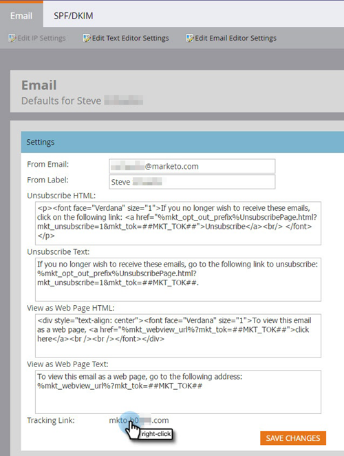

   This is your `[MktoTrackingLink]`. Save it. You'll need to give it to IT in Step 5.

   Collect "From" domains. Make a list of all the "From" domains (as in, `[Sender]@[FromDomain].com`) that you plan to use for sending emails from Marketo. For most, there is just one.

   For example, 'marketo.com,' 'info.marketo.com,'. These are `[FromDomain1]`,`[FromDomain2]`, etc. Save them. You'll need to give them to IT in Step 5.

   You now have all the information you need to send your request to IT!

## Ask IT to Configure Protocols {#ask-it-to-configure-protocols}

   >[!NOTE]
   >
   >Are you a Launch Pack customer? You can skip this step. Your consultant will provide you with an IT setup instructions document during your kickoff call.

   Once you have collected all the necessary information, you're ready to send a request to IT. You can use the text below as a template, replacing the bold text with your own information.

   [Include a link to this article](/help/marketo/getting-started/setup/configure-protocols-for-marketo.md).

   Paste this text into the email, and replace the bolded placeholders:

   >[!NOTE]
   >
   >See Steps 3 and 4 above to determine the text to replace the placeholders. Remember that `[LandingPageCNAME]` and `[EmailTrackingCNAME]` must be different.

`----------------------------------------------`

   Dear Awesome IT Administrator,

   Our Marketing Team is now using the Marketo platform to communicate with our people. To ensure great email deliverability, we need to make the following changes:

   `1)` For our landing pages, add a DNS Entry (CNAME) for **[LandingPageCNAME]**.**[CompanyDomain]**.com, pointing to **[Munchkin ID]**.mktoweb.com.

   `2)` For our tracking links in email, add a DNS Entry (CNAME) for **[EmailTrackingCNAME]**.**[CompanyDomain]**.com, pointing to **[MktoTrackingLink]**.

   `3)` Allowlist Marketo.

    * If we use IP addresses in our Email Allowlist, add the IPs listed below:  
      199.15.212.0/22

      192.28.144.0/20

      192.28.160.0/19

      185.28.196.0/22

      130.248.172.0/24

      130.248.173.0/24

      103.237.104.0/22

      94.236.119.0/26

   >[!NOTE]
   >
   >Reach out to Marketo Support if you'd like an abbreviated list of IPs to allowlist specific to your environment.

    * If our anti-spam system uses From domains, add these:

   **`[FromDomain1]`**
   **`[FromDomain2]`**

   `4)` We need to set up SPF and DKIM so Marketo is authorized to send signed emails on our behalf.

   `a.` To set up SPF, please add following line to our DNS entries:

   IN  TXT **[From Domain]**:  v=spf1 mx ip4:**[Corporate IP(s)]**
    include: mktomail.com ~all
  
   If we already have an existing SPF record in our DNS entry, simply add the following to it:

   include:mktomail.com

   `[`Replace **From Domain** with your Email From Domain (ex: company.com) and **CorpIP** with the IP address of your corporate email server (ex: 255.255.255.255).  If you are going to be sending email from multiple domains through Marketo, you should have your IT staff add this line for each domain (on one line).`]`

   `b.` For DKIM, please create DNS Resource Records for each domain we'd like to setup. Below are the Host Records and TXT Values for each domain we'll be signing for:

   **`[DKIMDomain1]`**: Host Record is **`[HostRecord1]`** and the TXT Value is **[TXTValue1]**.

   **`[DKIMDomain2]`**: Host Record is **`[HostRecord2]`** and the TXT Value is **`[TXTValue2]`**.

   `[`Copy the **HostRecord** and **TXTValue** for each **DKIMDomain** you've setup after following the [instructions here](/help/marketo/product-docs/email-marketing/deliverability/set-up-a-custom-dkim-signature.md). Don't forget to verify each domain in **Admin > Email > DKIM** after your IT staff has completed this step.`]`
  
   `5)` We need to ensure there is a valid MX record for our FROM domains **[FromDomain1]**, **[FromDomain2]**, etc. Can you confirm? If not, please configure to map to our corporate domain MX record. This will ensure we can process replies/autoresponders to our Marketo mailings.

   Let me know when you have completed these steps, so that I can complete the setup process with Marketo.

   Thank you! You're the best!

   Love,

   **`[Your Name]`**

`----------------------------------------------`

   Send the email to IT. We understand it can take some time for IT to complete these tasks. You can continue on to Step 7, but remember that you must return Step 6 to complete your Marketo setup.

## Complete Your Marketo Setup After IT Finishes {#complete-your-marketo-setup-after-it-finishes}

   Once IT has completed their tasks, follow these steps to add your landing page and email CNAMEs, and to activate DKIM signing.

   Go to the **[!UICONTROL Admin]** area to Add Your Landing Page CNAME

   

   Select Landing Pages and click **[!UICONTROL Edit]** in the [!UICONTROL Settings] area.

   

   Enter your new domain name in the field **[!UICONTROL Domain Name for Landing Pages]**. This should be in the form:

   `[LandingPageCNAME].[CompanyDomain].com`

   

   In the **[!UICONTROL Fallback]** page field, enter the URL you want people to go to if a landing page is unavailable. You can use your company home page if you do not have a fallback page. In the **[!UICONTROL Homepage]** field, enter your company website.

   

   In the [!UICONTROL Admin] area, select **[!UICONTROL Email]** to Add your Email CNAME

   

   Scroll down to [!UICONTROL Branding Domains]. Select your domain and click **[!UICONTROL Edit]**.

   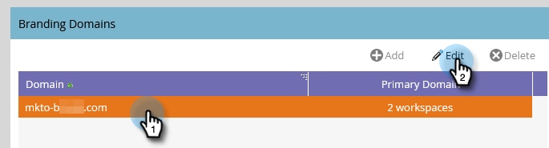

   In the Domain field, enter your email tracking domain. This should be in the form:

   `[EmailTrackingCNAME].[CompanyDomain].com`. Click **[!UICONTROL Save]**.

   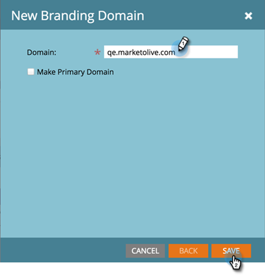

## Integrate Your CRM {#integrate-your-crm}

   This is probably the most exciting step of your setup - it's time to fill up Marketo with all those leads and contacts you have stored in your CRM!

   Choose from the following, depending on the CRM your company uses.

    * [Integrate Marketo with [!DNL Salesforce.com]](/help/marketo/product-docs/crm-sync/salesforce-sync/understanding-the-salesforce-sync.md)
    * [Integrate Marketo with [!DNL Microsoft Dynamics]](/help/marketo/product-docs/crm-sync/microsoft-dynamics-sync/understanding-the-microsoft-dynamics-sync.md)

   >[!NOTE]
   >
   >You need the assistance of your company's CRM administrator to complete these steps.

## Add Tracking Code to Your Website {#add-tracking-code-to-your-website}

>[!NOTE]
>
>Are you a [!DNL Launch Pack] customer? You can skip this step. Your consultant will provide you with [!DNL Munchkin] code instructions in your IT setup instructions document.

Marketo has custom tracking JavaScript (called [!DNL Munchkin]) that you can use to track person activities on any web page. [!DNL Munchkin] is required to integrate your website into Marketo. Follow these steps to [Add [!DNL Munchkin] Tracking Code to Your Website](/help/marketo/product-docs/administration/additional-integrations/add-munchkin-tracking-code-to-your-website.md){target="_blank"}.

>[!NOTE]
>
>Experience with HTML required to add the tracking code.

## Performance Expectations {#performance-expectations}

What can you expect in terms of performance from Marketo? It can vary, depending on the size and complexity of your marketing campaigns. But you can expect performance levels on par with what's outlined in the "Standard" column in several of the tables found in the [Marketo Engage Product description](https://helpx.adobe.com/legal/product-descriptions/adobe-marketo-engage---product-description.html){target="_blank"}. The "Performance" and "Performance Plus" columns refer to performance tier packages that provide [higher performance levels](https://nation.marketo.com/t5/product-documents/marketo-engage-performance-tiers/ta-p/328835){target="_blank"}.

All your setup steps are over. The only thing left is to dive in and use Marketo!
