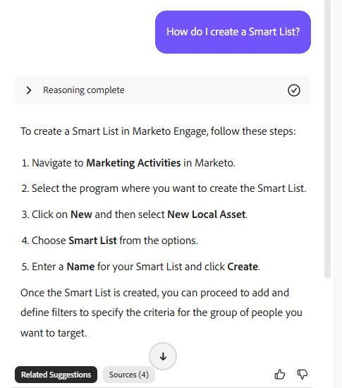

# AI Assistant for product knowledge {#ai-assistant-for-product-knowledge}

AI Assistant for product knowledge is a powerful accelerator for marketing teams, providing conversational access to the full breadth and depth of Marketo Engage product documentation in an instant. It streamlines campaign creation, content development, and user messaging by surfacing accurate, up-to-date product details the moment they're needed.

With the Product Knowledge AI Assistant, your teams move faster, collaborate more effectively, and deliver marketing that's sharp, accurate, and impactful.

## Use the assistant {#use-the-assistant}

1. Log in to Marketo Engage via the [Adobe Experience Cloud](https://experience.adobe.com/). 

1. Select the AI assistant icon on the right side of the header.

   

1. Enter the desired prompt using natural language. 

   

1. Click the blue arrow to submit your prompt. 

   

   >[!TIP]
   >
   >Use this icon  to expand the screen, and this icon  to view your history or start a new conversation.

## Quick start: video overview {#video}

See how the AI Assistant for product knowledge works, in about a minute.

>[!VIDEO](https://video.tv.adobe.com/v/3480115?learn=on){transcript=true}
