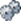
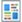

# Classic Icon Glossary {#classic-icon-glossary}

Below are the old icons from the Marketo Classic interface. The current icon glossary can be [found here](/help/marketo/getting-started/things-to-know/icon-glossary.md){target="_blank"}.

**General Icons**

<table> 
 <tbody> 
  <tr> 
   <th style="width:10%">Icon</th>
   <th style="width:90%">Name</th>
  </tr> 
  <tr> 
   <td></td> 
   <td>Folder</td> 
  </tr> 
  <tr> 
   <td>
     </td> 
   <td>Create New Folder</td> 
  </tr> 
  <tr> 
   <td> 
    </td> 
   <td>Delete Folder</td> 
  </tr> 
  <tr> 
   <td> 
    </td> 
   <td>Edit/Rename Folder Name</td> 
  </tr> 
  <tr> 
   <td> 
    </td> 
   <td>The source folder you shared with another workspace</td> 
  </tr> 
  <tr> 
   <td> 
    </td> 
   <td>Destination folder that was shared from another workspace  (padlock indicates edits cannot be made)</td> 
  </tr> 
  <tr> 
   <td> 
    </td> 
   <td>Archive Folder or Convert to Archive Folder(This can appear for any folder and archived Programs)</td> 
  </tr> 
  <tr> 
   <td> 
    </td> 
   <td>Success! (Frequently shown as Program Success, Successful Run, or Active)</td> 
  </tr> 
  <tr> 
   <td> 
    </td> 
   <td>Filter, View, View All</td> 
  </tr> 
  <tr> 
   <td> 
    </td> 
   <td>Trigger</td> 
  </tr> 
  <tr> 
   <td> 
    </td> 
   <td>Community</td> 
  </tr> 
  <tr> 
   <td> 
    </td> 
   <td>History</td> 
  </tr> 
  <tr> 
   <td> 
    </td> 
   <td>Help</td> 
  </tr> 
  <tr> 
   <td> 
    </td> 
   <td>Subscription Information</td> 
  </tr> 
  <tr> 
   <td> 
    </td> 
   <td>Customer Support</td> 
  </tr> 
  <tr> 
   <td> 
    </td> 
   <td>About Marketo</td> 
  </tr> 
 </tbody> 
</table>

## Admin Icons {#admin-icons}

<table> 
 <tbody> 
  <tr> 
   <th style="width:10%">Icon</th>
   <th style="width:90%">Name</th>
  </tr> 
  <tr> 
   <td> 
    </td> 
   <td>Workspaces & Partitions</td> 
  </tr> 
  <tr> 
   <td> 
    </td> 
   <td>My Account</td> 
  </tr> 
  <tr> 
   <td> 
    </td> 
   <td>Security/Logout</td> 
  </tr> 
  <tr> 
   <td> 
    </td> 
   <td>Users & Roles</td> 
  </tr> 
  <tr> 
   <td> 
    </td> 
   <td>Login Settings</td> 
  </tr> 
  <tr> 
   <td> 
    </td> 
   <td>Location</td> 
  </tr> 
  <tr> 
   <td> 
    </td> 
   <td>Smart Campaign</td> 
  </tr> 
  <tr> 
   <td> 
    </td> 
   <td>Email</td> 
  </tr> 
  <tr> 
   <td> 
    </td> 
   <td>Communication Limits</td> 
  </tr> 
  <tr> 
   <td> 
    </td> 
   <td>Field Management</td> 
  </tr> 
  <tr> 
   <td> 
    </td> 
   <td>Integration</td> 
  </tr> 
  <tr> 
   <td> 
    </td> 
   <td>Salesforce (SFDC)</td> 
  </tr> 
  <tr> 
   <td> 
    </td> 
   <td>Sales Insight</td> 
  </tr> 
  <tr> 
   <td> 
    </td> 
   <td>Landing Pages</td> 
  </tr> 
  <tr> 
   <td> 
    </td> 
   <td>Munchkin</td> 
  </tr> 
  <tr> 
   <td> 
    </td> 
   <td>Web Services</td> 
  </tr> 
  <tr> 
   <td> 
    </td> 
   <td>LaunchPoint</td> 
  </tr> 
  <tr> 
   <td> 
    </td> 
   <td>Webhooks</td> 
  </tr> 
  <tr> 
   <td> 
    </td> 
   <td>Tags - Program Attribute</td> 
  </tr> 
  <tr> 
   <td> 
    </td> 
   <td>Revenue Cycle Analytics</td> 
  </tr> 
  <tr> 
   <td> 
    </td> 
   <td>Treasure Chest</td> 
  </tr> 
  <tr> 
   <td> 
    </td> 
   <td>Admin</td> 
  </tr> 
  <tr> 
   <td> 
    </td> 
   <td>Notifications - Important Systemwide Alerts</td> 
  </tr> 
 </tbody> 
</table>

### Marketing Activities Icons {#marketing-activities-icons}

<table> 
 <tbody> 
  <tr> 
   <th style="width:10%">Icon</th>
   <th style="width:90%">Name</th> 
  </tr> 
  <tr> 
   <td> 
    </td> 
   <td>Event Program</td> 
  </tr> 
  <tr> 
   <td> 
    </td> 
   <td>Program - Default Type</td> 
  </tr> 
  <tr> 
   <td> 
    </td> 
   <td>Import Program</td> 
  </tr> 
  <tr> 
   <td> 
    </td> 
   <td>Engagement Nurture</td> 
  </tr> 
  <tr> 
   <td> 
    </td> 
   <td>Add to Engagement Program</td> 
  </tr> 
  <tr> 
   <td> 
    </td> 
   <td>Change Engagement Cadence (Paused,Normal)</td> 
  </tr> 
  <tr> 
   <td> 
    </td> 
   <td>Change Engagement Stream</td> 
  </tr> 
  <tr> 
   <td> 
    </td> 
   <td>Smart Campaign - Active and Triggered</td> 
  </tr> 
  <tr> 
   <td> 
    </td> 
   <td>Smart Campaign that is Requested(By Sales Insight or Marketo Flow Action)</td> 
  </tr> 
  <tr> 
   <td> 
    </td> 
   <td>Smart Campaign - Batch(Has been executed before)</td> 
  </tr> 
  <tr> 
   <td> 
    </td> 
   <td>Smart Campaign - Inactive, or never executed</td> 
  </tr> 
  <tr> 
   <td> 
    </td> 
   <td>Invalid Campaigns</td> 
  </tr> 
  <tr> 
   <td> 
    </td> 
   <td>Email Program  (Red flag down = email hasn't been sent yet)</td> 
  </tr> 
  <tr> 
   <td> 
    </td> 
   <td>Email Program scheduled with Head Start</td> 
  </tr> 
  <tr> 
   <td> 
    </td> 
   <td>Smart Campaign - Scheduled Batch(Check mark indicates it has been executed before)</td> 
  </tr> 
  <tr> 
   <td> 
    </td> 
   <td>Scheduled Batch Campaigns</td> 
  </tr> 
  <tr> 
   <td> 
    </td> 
   <td>Flow Action</td> 
  </tr> 
  <tr> 
   <td> 
    </td> 
   <td>Edit Settings</td> 
  </tr> 
  <tr> 
   <td> 
    </td> 
   <td>Form</td> 
  </tr> 
  <tr> 
   <td> 
    </td> 
   <td>Clone Form</td> 
  </tr> 
  <tr> 
   <td> 
    </td> 
   <td>Edit Form</td> 
  </tr> 
  <tr> 
   <td> 
    </td> 
   <td>Form Approved</td> 
  </tr> 
  <tr> 
   <td> 
    </td> 
   <td>Social</td> 
  </tr> 
  <tr> 
   <td> 
    </td> 
   <td>Social Button Actions</td> 
  </tr> 
  <tr> 
   <td> 
    </td> 
   <td>Edit Draft</td> 
  </tr> 
  <tr> 
   <td> 
    </td> 
   <td>Preview</td> 
  </tr> 
  <tr> 
   <td> 
    </td> 
   <td>Clone</td> 
  </tr> 
  <tr> 
   <td> 
    </td> 
   <td>Delete</td> 
  </tr> 
  <tr> 
   <td> 
    </td> 
   <td>Embed Code</td> 
  </tr> 
  <tr> 
   <td> 
    </td> 
   <td>Youtube Video Actions</td> 
  </tr> 
  <tr> 
   <td> 
    </td> 
   <td>Edit Draft</td> 
  </tr> 
  <tr> 
   <td> 
    </td> 
   <td>Preview</td> 
  </tr> 
  <tr> 
   <td> 
    </td> 
   <td>Approve</td> 
  </tr> 
  <tr> 
   <td> 
    </td> 
   <td>Clone</td> 
  </tr> 
  <tr> 
   <td> 
    </td> 
   <td>Delete</td> 
  </tr> 
  <tr> 
   <td> 
    </td> 
   <td>Sweepstakes Actions</td> 
  </tr> 
  <tr> 
   <td> 
    </td> 
   <td>Edit Draft</td> 
  </tr> 
  <tr> 
   <td> 
    </td> 
   <td>Preview</td> 
  </tr> 
  <tr> 
   <td> 
    </td> 
   <td>Approve</td> 
  </tr> 
  <tr> 
   <td> 
    </td> 
   <td>Clone</td> 
  </tr> 
  <tr> 
   <td> 
    </td> 
   <td>Delete</td> 
  </tr> 
  <tr> 
   <td> 
    </td> 
   <td>Pick Winners</td> 
  </tr> 
  <tr> 
   <td> 
    </td> 
   <td>Download HTML</td> 
  </tr> 
  <tr> 
   <td> 
    </td> 
   <td>Move</td> 
  </tr> 
  <tr> 
   <td> 
    </td> 
   <td>Delete</td> 
  </tr> 
  <tr> 
   <td> 
    </td> 
   <td>Clone</td> 
  </tr> 
  <tr> 
   <td> 
    </td> 
   <td>Unapprove</td> 
  </tr> 
  <tr> 
   <td> 
    </td> 
   <td>Send Sample</td> 
  </tr> 
  <tr> 
   <td> 
    </td> 
   <td>Preview</td> 
  </tr> 
  <tr> 
   <td> 
    </td> 
   <td>New Test</td> 
  </tr> 
  <tr> 
   <td> 
    </td> 
   <td>Deliverability Tools</td> 
  </tr> 
 </tbody> 
</table>

### Design Studio Icons {#design-studio-icons}

<table> 
 <tbody> 
  <tr> 
   <th style="width:10%">Icon</th>
   <th style="width:90%">Name</th> 
  </tr> 
  <tr> 
   <td> 
    </td> 
   <td>Landing Page. Landing Page Actions</td> 
  </tr> 
  <tr> 
   <td> 
    </td> 
   <td>Edit Draft</td> 
  </tr> 
  <tr> 
   <td> 
    </td> 
   <td>Preview</td> 
  </tr> 
  <tr> 
   <td> 
    </td> 
   <td>Unapprove</td> 
  </tr> 
  <tr> 
   <td> 
    </td> 
   <td>Publish to Facebook</td> 
  </tr> 
  <tr> 
   <td> 
    </td> 
   <td>Convert to Test Group</td> 
  </tr> 
  <tr> 
   <td> 
    </td> 
   <td>Clone Landing Page</td> 
  </tr> 
  <tr> 
   <td> 
    </td> 
   <td>Delete Landing Page</td> 
  </tr> 
  <tr> 
   <td> 
    </td> 
   <td>URL Tools/URL Builder</td> 
  </tr> 
  <tr> 
   <td> 
    </td> 
   <td>Move Program</td> 
  </tr> 
  <tr> 
   <td> 
    </td> 
   <td>Enable Personalized URLs</td> 
  </tr> 
  <tr> 
   <td> 
    </td> 
   <td>Landing Page - Approved</td> 
  </tr> 
  <tr> 
   <td> 
    </td> 
   <td>Landing Page/Email Template - Unapproved</td> 
  </tr> 
  <tr> 
   <td> 
    </td> 
   <td>Landing Page/Email Template - Approved</td> 
  </tr> 
  <tr> 
   <td> 
    </td> 
   <td>Email - Unapproved or Draft</td> 
  </tr> 
  <tr> 
   <td> 
    </td> 
   <td>Email Approved</td> 
  </tr> 
  <tr> 
   <td> 
    </td> 
   <td>Forms - Unapproved</td> 
  </tr> 
  <tr> 
   <td> 
    </td> 
   <td>Template - Approved with Draft</td> 
  </tr> 
  <tr> 
   <td> 
    </td> 
   <td>Draft of an Approved Asset (not live until Draft is Approved)</td> 
  </tr> 
  <tr> 
   <td> 
    </td> 
   <td>Images &amp; Files</td> 
  </tr> 
  <tr> 
   <td> 
    </td> 
   <td>Snippet - Unapproved or Draft</td> 
  </tr> 
  <tr> 
   <td> 
    </td> 
   <td>Snippet - Approved</td> 
  </tr> 
  <tr> 
   <td> 
    </td> 
   <td>New</td> 
  </tr> 
  <tr> 
   <td> 
    </td> 
   <td>Grab Images from Web</td> 
  </tr> 
  <tr> 
   <td> 
    </td> 
   <td>Upload Image or File</td> 
  </tr> 
 </tbody> 
</table>

### Analytics Icons {#analytics-icons}

<table> 
 <tbody> 
  <tr> 
   <th style="width:10%">Icon</th>
   <th style="width:90%">Name</th>
  </tr> 
  <tr> 
   <td> 
    </td> 
   <td>Revenue Cycle Model</td> 
  </tr> 
  <tr> 
   <td> 
    </td> 
   <td>Revenue Cycle Model (RCM) - Unapproved</td> 
  </tr> 
  <tr> 
   <td> 
    </td> 
   <td>Revenue Cycle Model (RCM) - Approved</td> 
  </tr> 
  <tr> 
   <td> 
    </td> 
   <td>Revenue Cycle Model (RCM) - Approved with Draft</td> 
  </tr> 
  <tr> 
   <td> 
    </td> 
   <td>Report Actions</td> 
  </tr> 
  <tr> 
   <td> 
    </td> 
   <td>Report</td> 
  </tr> 
  <tr> 
   <td> 
    </td> 
   <td>New Report Subscription</td> 
  </tr> 
  <tr> 
   <td> 
    </td> 
   <td>Delete Report</td> 
  </tr> 
  <tr> 
   <td> 
    </td> 
   <td>View Qualified Lead</td> 
  </tr> 
  <tr> 
   <td> 
    </td> 
   <td>Interesting Moments Overview</td> 
  </tr> 
  <tr> 
   <td> 
    </td> 
   <td>Expand All</td> 
  </tr> 
  <tr> 
   <td> 
    </td> 
   <td>Collapse All</td> 
  </tr> 
  <tr> 
   <td> 
    </td> 
   <td>Group Leads By</td> 
  </tr> 
  <tr> 
   <td> 
    </td> 
   <td>Custom Columns</td> 
  </tr> 
 </tbody> 
</table>

### My Tokens Icons {#my-tokens-icons}

<table> 
 <tbody> 
  <tr> 
   <th style="width:10%">Icon</th>
   <th style="width:90%">Name</th> 
  </tr> 
  <tr> 
   <td> 
    </td> 
   <td>Calendar ICS - iCalendars, (Integrated Calendars)</td> 
  </tr> 
  <tr> 
   <td> 
    </td> 
   <td>Rich Text (not a Landing Page)</td> 
  </tr> 
  <tr> 
   <td> 
    </td> 
   <td>Number</td> 
  </tr> 
  <tr> 
   <td> 
    </td> 
   <td>Salesforce (also on all SFDC related items)</td> 
  </tr> 
  <tr> 
   <td> 
    </td> 
   <td>Schedule the Smart Campaign to Run Once</td> 
  </tr> 
  <tr> 
   <td> 
    </td> 
   <td>Edit Settings</td> 
  </tr> 
  <tr> 
   <td> 
    </td> 
   <td>Refresh (Usually Run Count, Report, Smart List)</td> 
  </tr> 
  <tr> 
   <td> 
    </td> 
   <td>View Smart Members (Previously qualified, and current)</td> 
  </tr> 
 </tbody> 
</table>

### Campaign Menus {#campaign-menus}

<table> 
 <tbody> 
  <tr> 
   <th style="width:10%">Icon</th>
   <th style="width:90%">Name</th>
  </tr> 
  <tr> 
   <td> 
    </td> 
   <td>Schedule Recurrence of Campaign (Multiple Runs)</td> 
  </tr> 
  <tr> 
   <td> 
    </td> 
   <td>Cancel the Run, Action, or Delete</td> 
  </tr> 
  <tr> 
   <td> 
    </td> 
   <td>Edit Qualification Rules</td> 
  </tr> 
  <tr> 
   <td> 
    </td> 
   <td>Salesforce (also on all SFDC related items)</td> 
  </tr> 
  <tr> 
   <td> 
    </td> 
   <td>Text Only</td> 
  </tr> 
  <tr> 
   <td> 
    </td> 
   <td>Relative Score (also visible on all Scoring flow actions)</td> 
  </tr> 
  <tr> 
   <td> 
    </td> 
   <td>Relative Urgency</td> 
  </tr> 
  <tr> 
   <td> 
    </td> 
   <td>Email Script (for Velocity only)</td> 
  </tr> 
  <tr> 
   <td> 
    </td> 
   <td>Date - Formatted as "MM-DD-YYYY"</td> 
  </tr> 
 </tbody> 
</table>

### Database Icons {#database-icons}

<table> 
 <tbody> 
  <tr> 
   <th style="width:10%">Icon</th>
   <th style="width:90%">Name</th> 
  </tr> 
  <tr> 
   <td> 
    </td> 
   <td>Smart List</td> 
  </tr> 
  <tr> 
   <td> 
    </td> 
   <td>Smart List - Cached</td> 
  </tr> 
  <tr> 
   <td> 
    </td> 
   <td>Segmentation Or Segment - Unapproved</td> 
  </tr> 
  <tr> 
   <td> 
    </td> 
   <td>Segmentation Or Segment - Approved or Draft</td> 
  </tr> 
  <tr> 
   <td> 
    </td> 
   <td>Segmentation Or Segment - Approved</td> 
  </tr> 
  <tr> 
   <td> 
    </td> 
   <td>Field Organizer</td> 
  </tr> 
  <tr> 
   <td> 
    </td> 
   <td>Email Script (for Velocity only)</td> 
  </tr> 
  <tr> 
   <td> 
    </td> 
   <td>Static List</td> 
  </tr> 
  <tr> 
   <td> 
    </td> 
   <td>New</td> 
  </tr> 
  <tr> 
   <td> 
    </td> 
   <td>New Segmentation</td> 
  </tr> 
  <tr> 
   <td> 
    </td> 
   <td>Import</td> 
  </tr> 
 </tbody> 
</table>
