# Help Center {#help-center}

The Help Center in Adobe Marketo Engage serves as a centralized location for getting assistance. In addition to linking out to various resources (e.g., [product documentation](/help/marketo/home.md){target="_blank"}, [release information](/help/marketo/release-notes/current.md){target="_blank"}, the [Marketing Nation Community](https://nation.marketo.com/){target="_blank"}), you can access helpful in-product walkthroughs organized by experience level.

## How to Access {#how-to-access}

There are two different experiences, depending on if your subscription has been migrated to Adobe Identity Management System (IMS) yet.

### Pre-Adobe IMS Migration {#pre-adobe-ims-integration}

These steps are for Marketo Engage users who have _not_ been migrated to [Adobe IMS](/help/marketo/product-docs/administration/marketo-with-adobe-identity/adobe-identity-management-overview.md){target="_blank"} yet.

[Log in](https://login.marketo.com/){target="_blank"} to Marketo Engage and click the Help icon.

   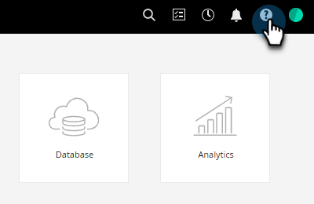

#### Guides {#guides}

Guides serve as quick walkthroughs for popular features.

   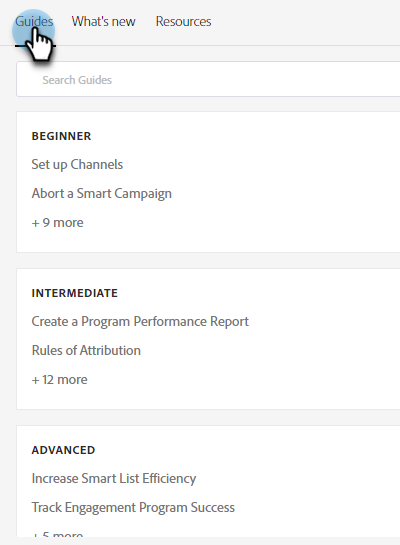

1. Click the desired guide to view it.

   

1. Click **Get Started**.

   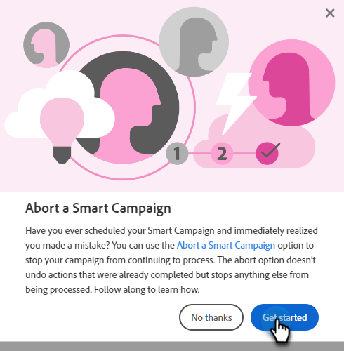

1. Click **Next** to continue.

   

1. Click **Done** to exit the walkthrough.

   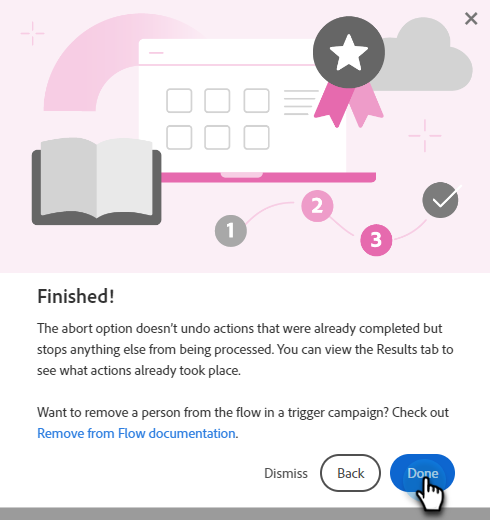

   >[!TIP]
   >
   >Exit the guide at any time by clicking **Dismiss**.

#### What's New {#whats-new}

The What's New tab contains the details of Marketo Engage's latest release.

   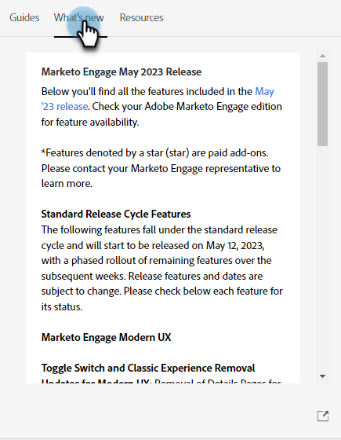

   >[!TIP]
   >
   >Click the arrow icon at the bottom to view the page in Experience League.

#### Resources {#resources}

The Resources tab gives you quick and direct access to various ways you can get additional help with your Marketo Engage instance.

   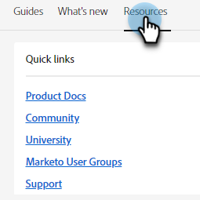

### Post-Adobe IMS Migration {#post-adobe-ims-integration}

These steps are for Marketo Engage users who have already been migrated to [Adobe IMS](/help/marketo/product-docs/administration/marketo-with-adobe-identity/adobe-identity-management-overview.md){target="_blank"}.

[Log in](https://experience.adobe.com/){target="_blank"} to Marketo Engage and click the Help icon.

   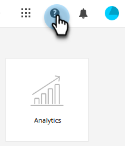

The Help Center appears. Click on any of the help resources listed to be taken to its respective area. You can also search for specific terms.

   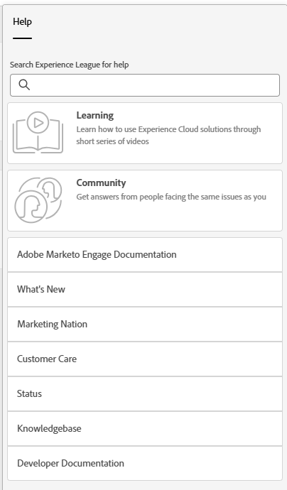

Guides (formerly part of the Help Center pre-Adobe IMS migration) are now in the left navigation area.

   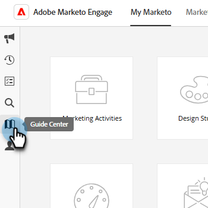

The Guide Center has two tabs, Guides and What's New. Guides serve as quick walkthroughs for popular features in Marketo Engage. Click on a desired Guide, or search for a specific one.

   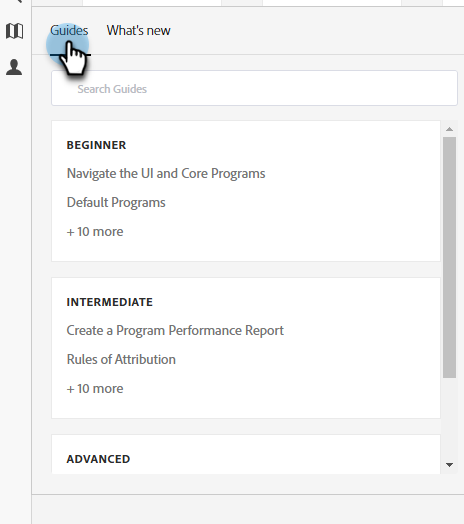

The What's New tab contains the details of Marketo Engage's latest release.

   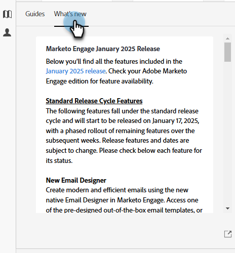
