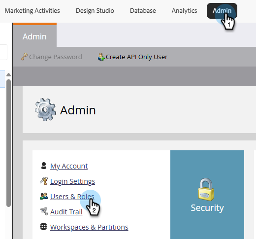

# Marketo Engage New UI {#new-ui}

Thank you for participating in the New Marketo Engage UI beta. This update modernizes the styling of Marketo Engage and improves responsiveness, without altering functionality. The new UI is accessed using a drop-down that appears at the top-right corner of most pages in Marketo Engage.

## Before you start {#before-starting}

Before you can access the new UI, you must have:

* Been provided with the _Access New UI_ permission to one or more of your Marketo Engage User Roles.

* Accepted the open beta test terms when prompted.

## New UI permission {#new-ui-permission}

Admins can grant _Access New UI_ permission to one or more user roles.

1. In the **Admin** area, select **Users & Roles**.

   

1. Click the **Roles** tab. Select the desired role and click **Edit Role**.

   

>[!NOTE]
>
>You can also create a new role.

1. Select the **Access New Theme** checkbox and click **Save**.

   

## New and Classic UI {#new-and-classic}

To switch to the new UI, click the UI drop-down in the top-right corner and select **New (Beta)**.

   

If you need to switch back for any reason, click the UI drop-down again and select **Classic**.

## Submitting feedback {#feedback}

We very much welcome your feedback. If you encounter any issues accessing or using the functionality while exploring the new UI, or have any suggestions or concerns, click the UI Beta Feedback button on the top-right.

   
