# Subscribe to system status notifications {#subscribe-to-system-status-notifications}

Learn how to subscribe to different status notifications to stay up to date on current issues.

>[!PREREQUISITES]
>
>Before you can create a subscription, you must first identify what data center and pod/server your subscription is located in.

## Identify your data center {#identify}

+++Identify your data center and pod/server

1. In the **Admin** section of Marketo Engage, click **My Account**.

   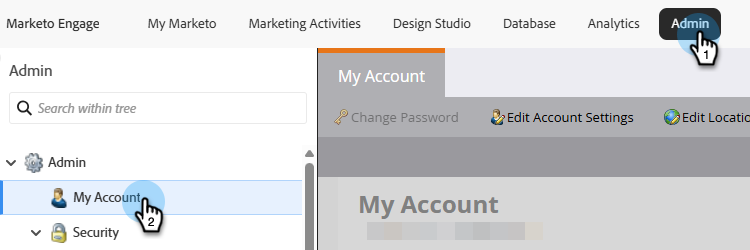

1. Scroll down to _Support Information_.  

   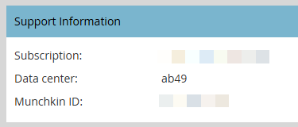

In the _Data center_ field, the letters are the data center and the numbers are the pod. In the example above, the user is in our Ashburn data center on pod 49. 

In step 7 of [creating a subscription](#create-a-subscription), this user would select the regional location **Marketo Ashburn** and pod **ab49**.

<table style="width:300px;">
  <tr>
    <th colspan="2">Data center abbreviations</th>
  </tr>
  <tr>
    <td style="width:25%;">ab</td>
    <td>Ashburn</td>
  </tr>
  <tr>
    <td style="width:25%;">sj</td>
    <td>San Jose</td>
  </tr>
  <tr>
    <td style="width:25%;">sn</td>
    <td>Sydney</td>
  </tr>
  <tr>
    <td style="width:25%;">lon</td>
    <td>London</td>
  </tr>
  <tr>
    <td style="width:25%;">nld</td>
    <td>Amsterdam</td>
  </tr>
</table>

>[!TIP]
>
>This method can also be used to identify what Real Time Personalization (RTP) pod/server your subscription is in.

+++

## Create a subscription {#create-a-subscription}

After [identifying your data center and pod/server](#identify), follow the steps below to create a subscription.

1. On [status.adobe.com](https://status.adobe.com), click **Manage Subscriptions**.

   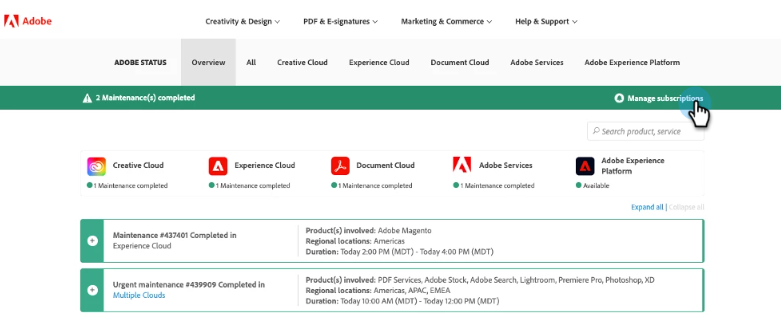

1. Sign in (if you're not already) using your Adobe credentials, or click **Create an account** if you don't have one.

   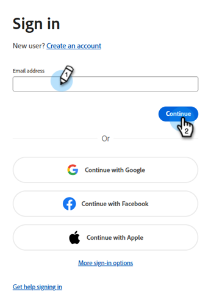
 
1. Stay in the _Product descriptions_ tab and click **Create subscriptions**.

   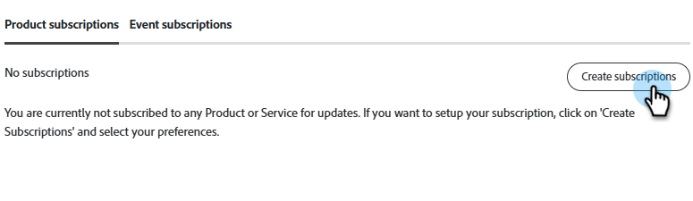

1. Click the  icon next to _Experience Cloud_ to expand the menu. Do the same for _Adobe Marketo Engage_.

   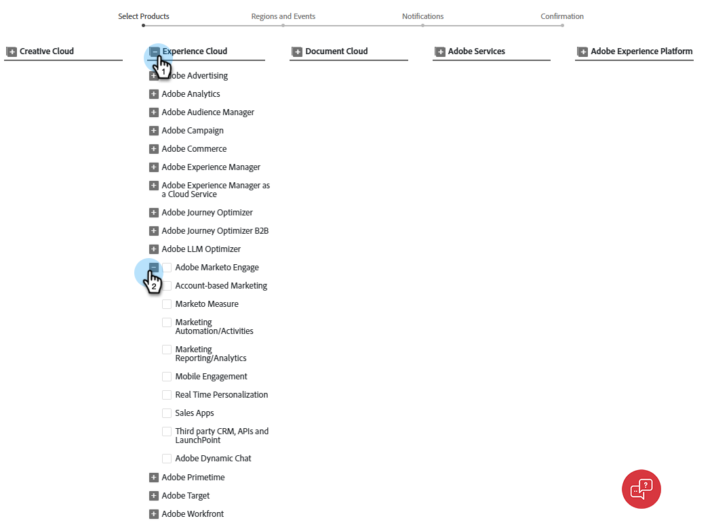{width="800"}

1. Select the product offerings/services you want to receive notifications about and click **Continue**.

   >[!TIP]
   >
   >Check _Adobe Marketo Engage_ to select all.

   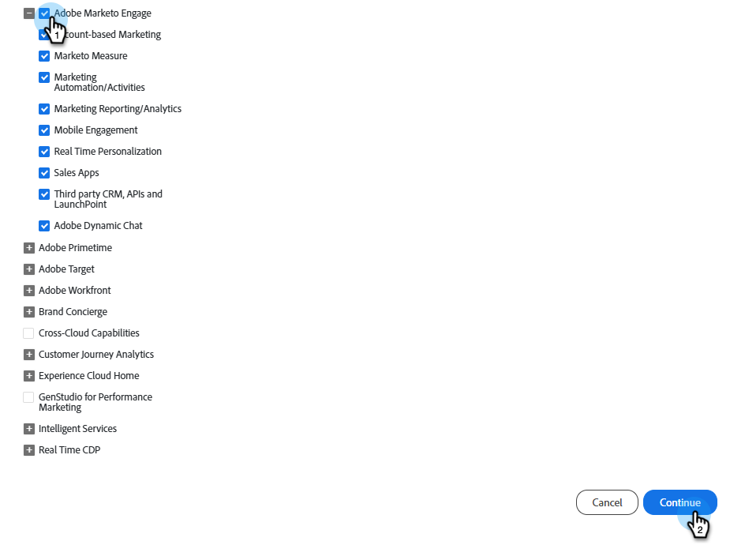{width="800"}

1. Select the desired event types.

   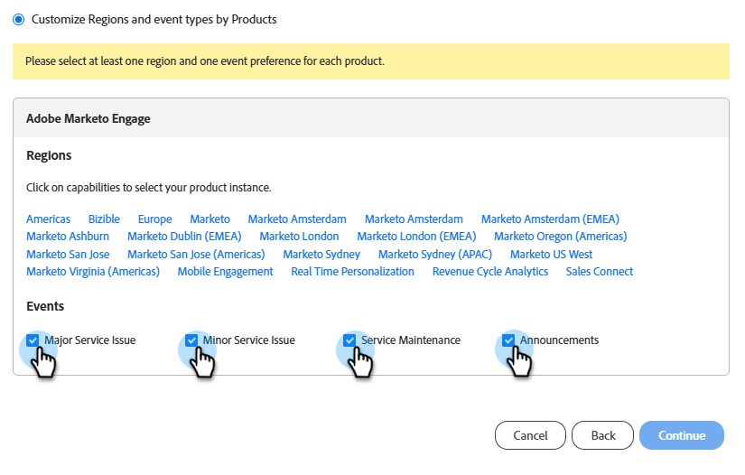

   <table style="width:500px;">
   <tr>
   <td style="width:35%;"><b>Major Service Issue</b></td>
   <td>Service unavailability or severe performance degradation for multiple users on production systems.</td>
   </tr>
   <tr>
   <td style="width:35%;"><b>Minor Service Issue</b></td>
   <td>Partial service unavailability or moderate performance degradation for multiple users on production systems.</td>
   </tr>
   <tr>
   <td style="width:35%;"><b>Service Maintenance</b></td>
   <td>Scheduled windows to perform product maintenance that may impact product availability or performance.</td>
   </tr>
   <tr>
   <td style="width:35%;"><b>Announcements</b></td>
   <td>Global, product family, or product-related messages that have a wide impact.</td>
   </tr>
   </table>

1. Select the regional location and environment. Click **Continue**.

   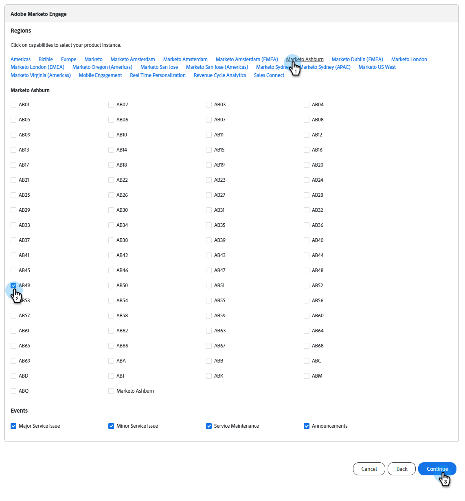{width="900"}

   >[!NOTE]
   >
   >If you missed where to find this, see [Identify your data center](#identify).

1. Choose your subscription preference, **Email** or **Slack**, and click **Continue**.

   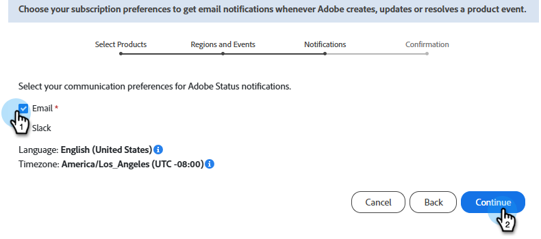

1. Review your selections and click **Confirm preferences**.

   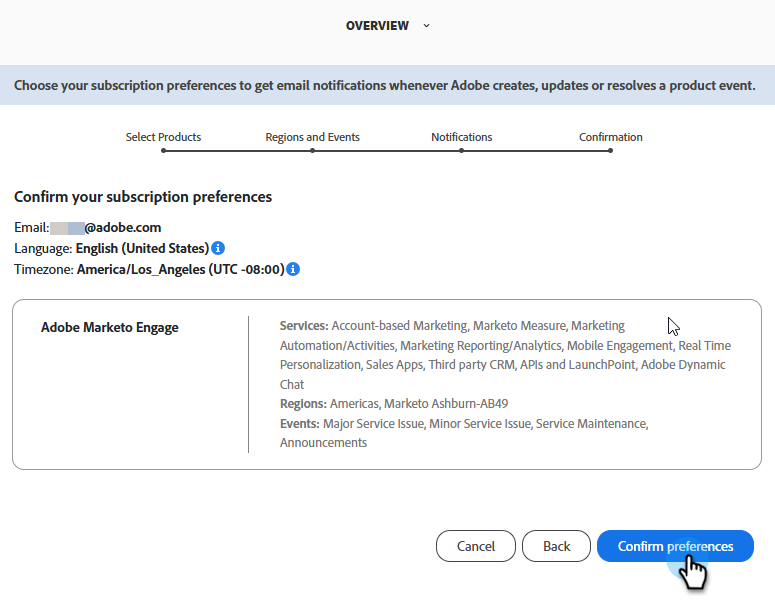
