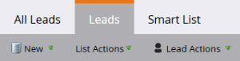
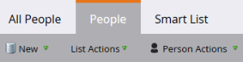
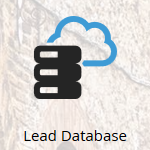
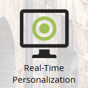

# Updates to Marketo Terminology {#updates-to-marketo-terminology}

We are making some changes to our platform, which will affect what some things are called. If you have a new Marketo instance as of March 2016, or if your company renewed after July 2016, you may be seeing the new terminology now.

While you may see different terminology in Marketo documentation, rest assured every article will soon be updated to reflect these changes. All instructions are the same.

So, what's changed?

## Lead is Now Person {#lead-is-now-person}

The biggest change is the renaming of Lead/Leads to Person/People.

<table> 
 <colgroup> 
  <col> 
  <col> 
 </colgroup> 
 <tbody> 
  <tr> 
   <td><strong>Old</strong></td> 
   <td><strong>New</strong></td> 
  </tr> 
  <tr> 
   <td> 
    
 
      
    
</td> 
   <td> 
    
 
      
    
</td> 
  </tr> 
 </tbody> 
</table>

In some cases, the word "Lead" is simply removed.

<table> 
 <colgroup> 
  <col> 
  <col> 
 </colgroup> 
 <tbody> 
  <tr> 
   <td><strong>Old</strong></td> 
   <td><strong>New</strong></td> 
  </tr> 
  <tr> 
   <td> 
    
 
      
    
</td> 
   <td> 
    
 
     

 
    
</td> 
  </tr> 
 </tbody> 
</table>

Lead and Person **are the same thing**.

## Tokens {#tokens}

Tokens with the word lead in them **are not changing**. We apologize for any confusion; however changing all tokens to match the new terminology would break a whole lot of tokens currently in use. So you will still see tokens such as "{{lead.First Name}}." There are no person-specific tokens.

>[!NOTE]
>
>There *is* a token called "Person Notes," however that token was always there. It is typically used for a description field in your CRM, if at all.

## Field Management {#field-management}

Fields that contained the term Lead have either been substituted with Person, or the word Lead has been dropped. One notable exception however is the field "Lead Owner." It is now known as "Sales Owner."

<table> 
 <colgroup> 
  <col> 
  <col> 
 </colgroup> 
 <tbody> 
  <tr> 
   <td><strong>Old</strong></td> 
   <td><strong>New</strong></td> 
  </tr> 
  <tr> 
   <td> 
    
 
      
    
</td> 
   <td> 
    
 
      
    
</td> 
  </tr> 
 </tbody> 
</table>

>[!NOTE]
>
>For a complete list of field names affected, please visit this [Support Article](https://nation.marketo.com/docs/DOC-4218#jive_content_id_Field_Names_and_Tokens).

## Real-Time Personalization (RTP) is Now Web Personalization {#real-time-personalization-rtp-is-now-web-personalization}

<table> 
 <colgroup> 
  <col> 
  <col> 
 </colgroup> 
 <tbody> 
  <tr> 
   <td><strong>Old</strong></td> 
   <td><strong>New</strong></td> 
  </tr> 
  <tr> 
   <td> 
    
 
      
    
</td> 
   <td> 
    
 
      
    
</td> 
  </tr> 
 </tbody> 
</table>

In addition to the name change, it now consists of four separate apps:

| ** [Web Personalization](http://docs.marketo.com/display/DOCS/Web+Personalization+-+RTP)** |Has own tile on home screen |
|---|---|
| ** [Account-Based Web Marketing](http://docs.marketo.com/display/DOCS/Account-Based+Web+Marketing)** |Accessible via Web Personalization tile |
| ** [Personalized Retargeting](http://docs.marketo.com/display/DOCS/Website+Retargeting)** |Accessible via Web Personalization tile |
| ** [Predictive Content](http://docs.marketo.com/display/DOCS/Predictive+Content)** |Has own tile on home screen |

>[!NOTE]
>
>The tiles visible on your home screen will reflect modules purchased.

Thank you for your patience during this update.

