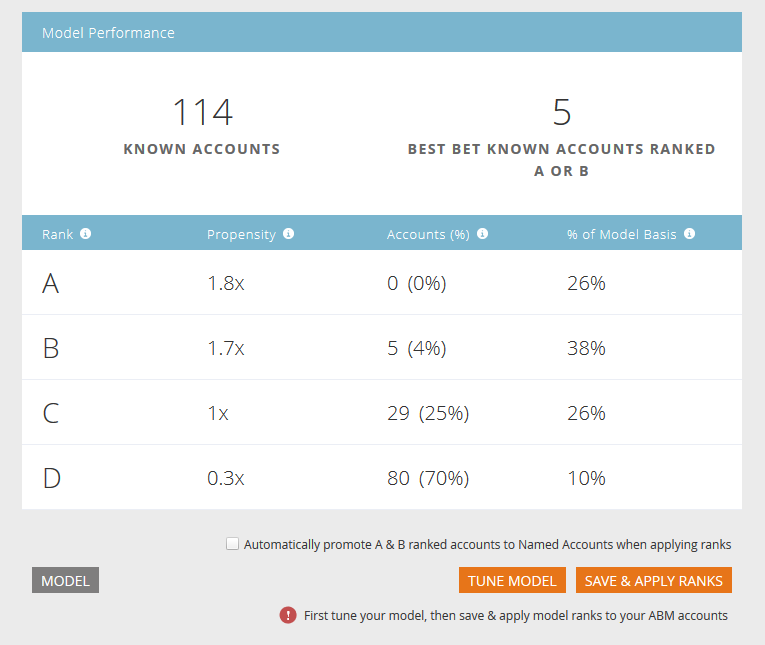
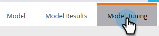
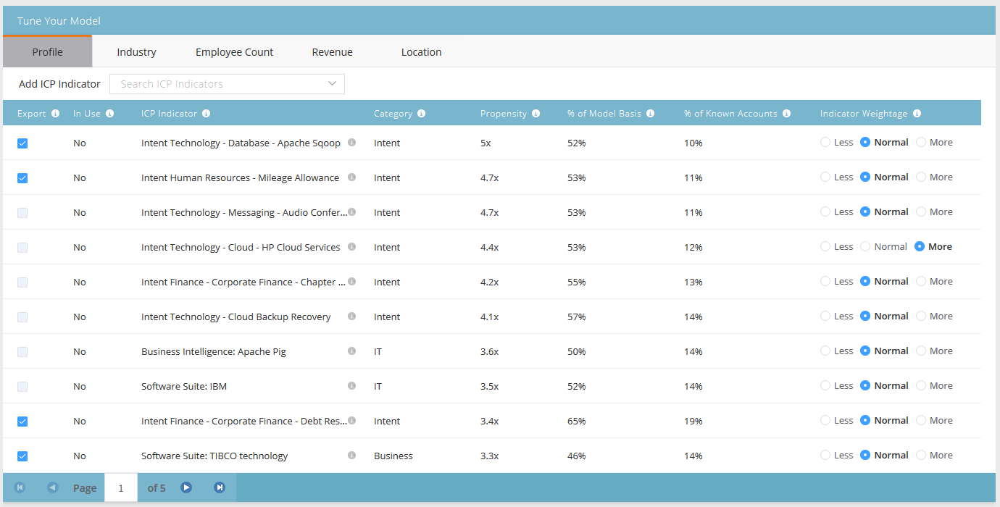
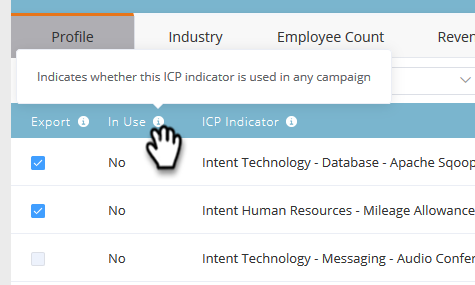
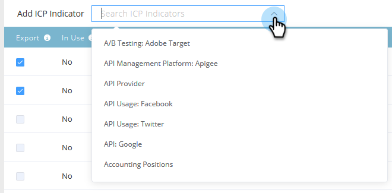
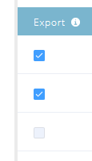
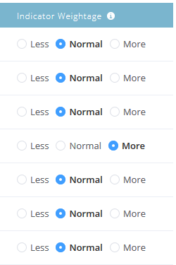
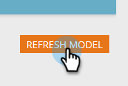

# Account Profiling Ranking and Tuning {#account-profiling-ranking-and-tuning}

Account Profiling Ranking and Tuning - Marketo Docs - Product Documentation

Account Profiling identifies your Ideal Customer Profile (ICP), ranks companies in your database based on the ICP, and adds ICP Indicator data to accounts promoted as Named Accounts.

### What's in this article? {#whats-in-this-article}

[Model Results](#model-results)  
[Model Tuning](#model-tuning)

#### Model Results {#model-results}

##### The results show you all of your known accounts broken down by grade. A is the highest grade, D is the lowest. {#the-results-show-you-all-of-your-known-accounts-broken-down-by-grade-a-is-the-highest-grade-d-is-the-lowest}

##### While optional, we recommend selecting the Automatically promote checkbox, as it will save you a ton of time. However, if you'd like to go through each account and [add them manually](http://docs.marketo.com/display/DOCS/Discover+Accounts#DiscoverAccounts-DiscoverCRMAccounts), simply leave the box unchecked. {#while-optional-we-recommend-selecting-the-automatically-promote-checkbox-as-it-will-save-you-a-ton-of-time-however-if-youd-like-to-go-through-each-account-and-add-them-manually-simply-leave-the-box-unchecked}

| **Rank** | 
Account rank based on the Ideal Customer Profile. A is the best fit, D is the least fit.  |
|---|---|
| **Propensity** | 
Estimated increase in conversion rate compared to a non-ICP based selection of accounts.  |
| **Accounts (%)** | 
Percentage of accounts in model input that have this rank.  |
| **% of Model Basis** | 
Percentage of accounts in model basis that have this rank.  |

#### Model Tuning {#model-tuning}

##### Click the Model Tuning tab to tune your model. {#click-the-model-tuning-tab-to-tune-your-model}

##### There are several tabs to choose from, allowing for in-depth customization. {#there-are-several-tabs-to-choose-from-allowing-for-in-depth-customization}

##### Indicator Categories {#indicator-categories}

| **Compliance** |Certifications, compliance-related positions/hiring. |
|---|---|
| **Operations** |Operations-related positions/hiring. |
| **HR** |HR or Payroll software, HR-related positions/hiring. |
| **Engineering** |Technologies, frameworks, engineering-related positions/hiring. |
| **Sales** |Solutions and software for sales, sales-related positions/hiring. |
| **Intent** |Intent indicators. |
| **IT** |Hardware and software solutions, technologies, IT-related positions/hiring. |
| **Finance** |Finance software, finance-related positions/hiring. |
| **Marketing** |Marketing technologies and software, marketing-related positions/hiring. |
| **Business** |Forbes or Inc listings or business partnerships. |
| **Customer Experience & Relations** |Customer success and customer relations positions/hiring. |

##### Hover over the tool tips for a description of each column. {#hover-over-the-tool-tips-for-a-description-of-each-column}

##### Click the Add ICP Indicator drop-down to insert additional indicators into your model. {#click-the-add-icp-indicator-drop-down-to-insert-additional-indicators-into-your-model}

##### Checking the Export box allows you to see the ICP indicator on the Named Account details page, as well as use the selected ICP indicator as constraints in [named account filters](http://docs.marketo.com/display/DOCS/Account+Filters). {#checking-the-export-box-allows-you-to-see-the-icp-indicator-on-the-named-account-details-page-as-well-as-use-the-selected-icp-indicator-as-constraints-in-named-account-filters}

>[!NOTE]
>
>ICP indicators are included as constraints in **Member of Named Account** Filters and Triggers.

##### Indicator Weightage is what controls the level of importance each indicator receives in your model. {#indicator-weightage-is-what-controls-the-level-of-importance-each-indicator-receives-in-your-model}

##### Click Refresh Model in order for those changes to take effect. {#click-refresh-model-in-order-for-those-changes-to-take-effect}

When you're done tuning your model (after you refresh it), go back to the Model Results tab and click **Save & Apply Ranks**.

