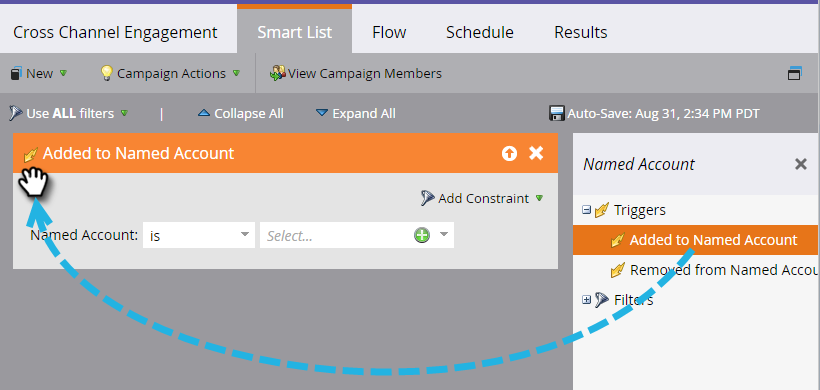
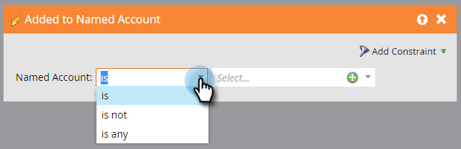
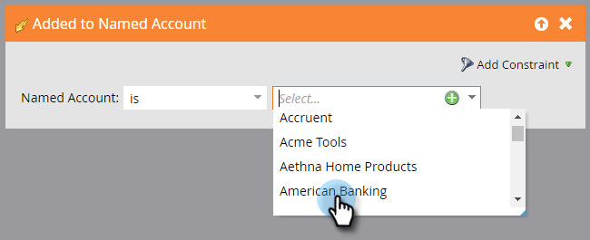

# Account Triggers {#account-triggers}

Listen and act on important account-level behavioral activities across different channels (e.g. email, web, ads) using account-level triggers.

##### Select your smart campaign and click Smart List. {#select-your-smart-campaign-and-click-smart-list}

##### Enter "Named Account" into the search box to find both Named Account triggers. {#enter-named-account-into-the-search-box-to-find-both-named-account-triggers}

##### Drag the trigger you want onto the canvas. In this example we're using *Added to Named Account*. {#drag-the-trigger-you-want-onto-the-canvas-in-this-example-were-using-added-to-named-account}

##### Choose a qualifier. {#choose-a-qualifier}

   
Click the named account drop-down...

...and choose your desired named account(s).

That's it! After you finish the rest of your smart campaign, remember to activate it. 

>[!NOTE]
>
>**Related Articles**
>
>* [Account Filters](account-filters.md)
>

