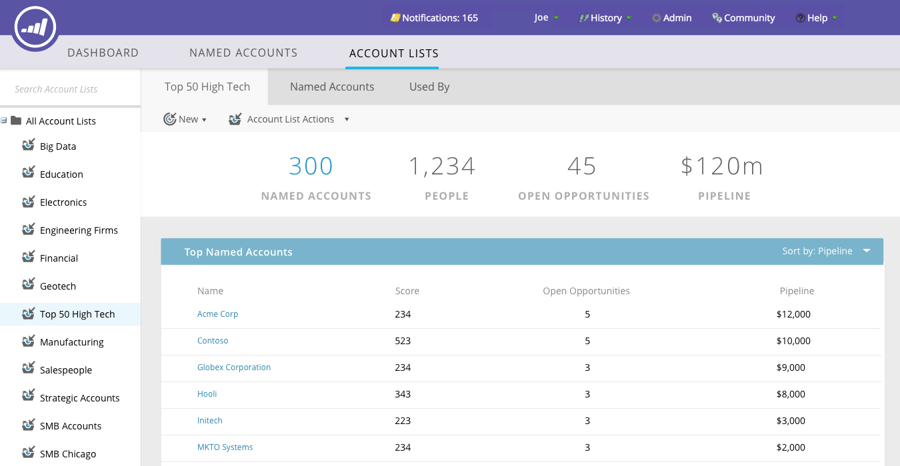
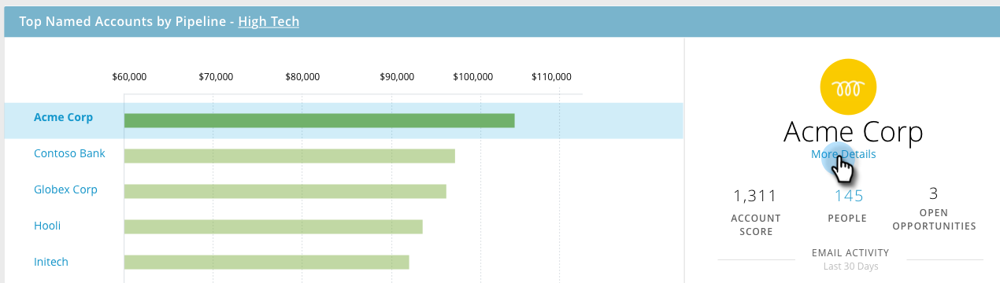
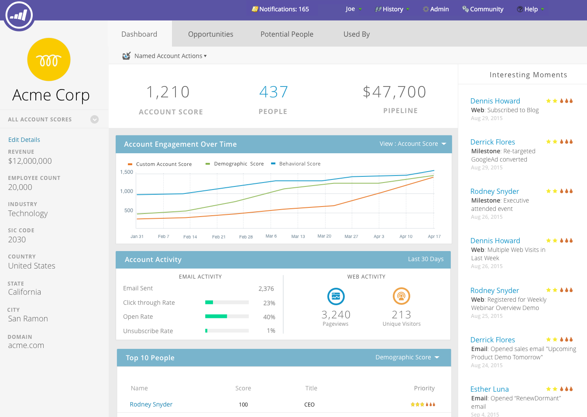

# ABM Main Dashboard {#abm-main-dashboard}

The main dashboard provides a summary of your Account Based Marketing efforts. You're able to see the target accounts or account lists that are showing success, and the ones that need more attention.

##### To filter by account list, click the View drop-down... {#to-filter-by-account-list-click-the-view-drop-down}

##### ...and make a selection. In this example, we're choosing our "High Tech" account list. {#and-make-a-selection-in-this-example-were-choosing-our-high-tech-account-list}

##### To view the [Account List Dashboard](http://docs.marketo.com/display/DOCS/Account+List+Insights#AccountListInsights-AccountListDashboard), click the name of the account list you selected... {#to-view-the-account-list-dashboard-click-the-name-of-the-account-list-you-selected}

##### ...and the dashboard loads. {#and-the-dashboard-loads}

If instead of viewing the Account List Dashboard you want to drill-down into a named account, click **More Details** under its name...

...and view the [named account's insights](http://docs.marketo.com/display/DOCS/Named+Account+Insights).

