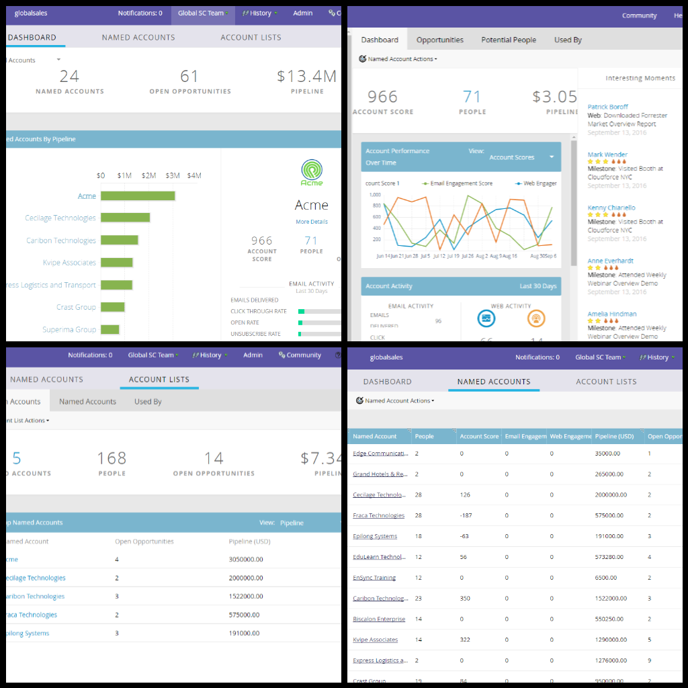

# Account Based Marketing Overview {#account-based-marketing-overview}

Marketer, meet Account Based Marketing. Account Based Marketing, meet marketer.

##### What is Marketo Account Based Marketing? {#what-is-marketo-account-based-marketing}

Marketo Account Based Marketing brings sales and marketing teams together to target and engage key accounts in a highly coordinated fashion, bridging the gap between account-centric strategy, execution and success - all within a single platform.

##### Why use Marketo Account Based Marketing?  
{#why-use-marketo-account-based-marketing}

Marketo unifies ABM and lead management in one solution, making it easy for marketers to execute personalized campaigns for both accounts and leads in one motion. You also benefit from reaching key decision makers and deal influencers.  
  
Marketo ABM consists of three components:

**1) [Target](http://docs.marketo.com/display/docs/target)**

* Account Discovery
* Lead-to-Account Matching
* Named Account Lists

**2) [Engage](http://docs.marketo.com/display/docs/engage)**

* Account-based Personalization
* Cross-Channel Engagement
* Account-specific Workflows

**3) [Measure](http://docs.marketo.com/display/docs/measure)**

* Account and List-level Insights
* Account Engagement Score
* Pipeline & Revenue Impact

Marketo Account Based Marketing also offers various tools to personalize the named account experience across channels.

* Email & Landing Page [Personalization](http://docs.marketo.com/display/DOCS/Personalization)
* Web [Personalization](http://docs.marketo.com/display/DOCS/Account-Based+Web+Marketing)
* URL [Personalization](http://docs.marketo.com/display/DOCS/Enable+Personalized+URLs+for+Your+Account)
* Ad [Personalization](http://docs.marketo.com/display/DOCS/Create+a+Custom+Audience+in+Facebook)
* [Personalized](http://docs.marketo.com/display/DOCS/Website+Retargeting) Remarketing

##### I'm in! How do I get started? {#im-in-how-do-i-get-started}

We thought you'd never ask! ABM is available as an add-on to your Marketo subscription, so please contact your Sales Rep to have it implemented. Once you have it, check out this article: [Getting Started with ABM](getting-started-with-abm.md).

>[!NOTE]
>
>Named Accounts managed in Marketo ABM can be accessed directly from Web ABM for web personalization needs. Learn more [here](http://docs.marketo.com/display/public/DOCS/Account-Based+Web+Marketing+with+ABM).

Welcome to Marketo ABM, and enjoy targeted marketing!
