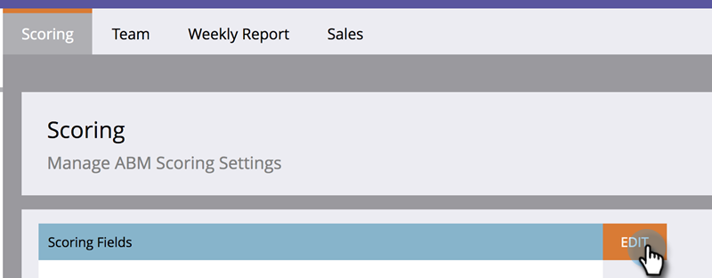

# Account Score {#account-score}

Account Scoring is a vital part of Account Based Marketing. It helps you determine the level of engagement of your accounts.

## What is Account Scoring? {#what-is-account-scoring}

It's a systematic approach designed to help Sales and Marketing teams identify and prioritize the companies (including prospects) that are most likely to make a purchase.

In the complex world of B2B buying processes, it’s rare that a single individual makes a purchase decision. There are often various roles involved, each with their own needs. Account-based scoring takes this into account by aggregating the lead scores from multiple leads and providing a score at an account level.

## Common Examples {#common-examples}

| **Account Engagement Score** |Depth of engagement based on behavioral activities tracked across various channels (e.g. email, web, ad) from people in specific target accounts. |
|---|---|
| **Account Product Interest Score** |People from target accounts showing interest in the content from a specific product (e.g. downloading a white paper). |
| **Account Web Engagement Score** |People from target accounts visiting web channel. Same score can be created to measure channel engagement from email, ad, or other channels. |

## How to Configure Account Score {#how-to-configure-account-score}

>[!NOTE]
>
>To calculate account scores, you first need to create lead scores. Marketo ABM automatically aggregates lead scores to account scores. As an example, we'll take two of the above examples (_Account Product Interest Score_ and _Account Web Engagement Score_).
>
>First, create lead score fields that capture relevant details from each lead of a target account.  
>Then assign those lead scores to their respective account scores:  
>Account Product Interest Score = SUM (Lead Product Interest Score)  
>Account Web Engagement Score = SUM (Lead Web Engagement Score)

>[!NOTE]
>
>Users can create multiple account engagement scores and assign different person scores to different account scores.

Once you've configured the lead score, proceed by following the steps below.

1. Click **Admin**.

   

1. Click **ABM**.

   

1. In Scoring Fields, click **Edit**.

   

   >[!NOTE]
   >
   >You can choose up to **five** fields to calculate the Account Score.

1. Enter the Account Score name, click the **Select Person Score** drop-down and select the corresponding score.

   

1. Click **+Add** to add more scores.

   

1. Add all desired scores. Click **Save** when done.

   
