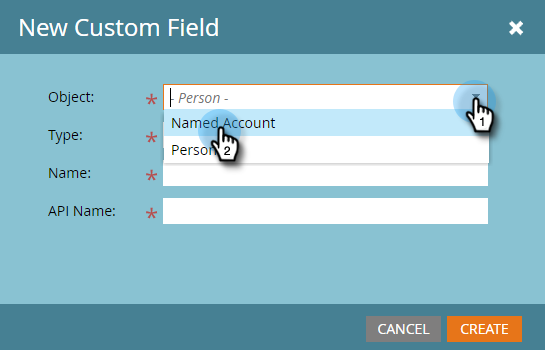
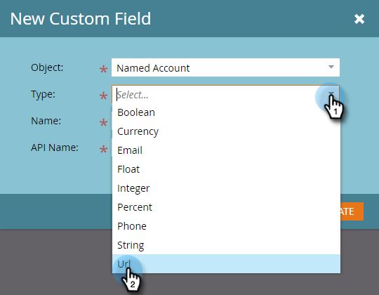
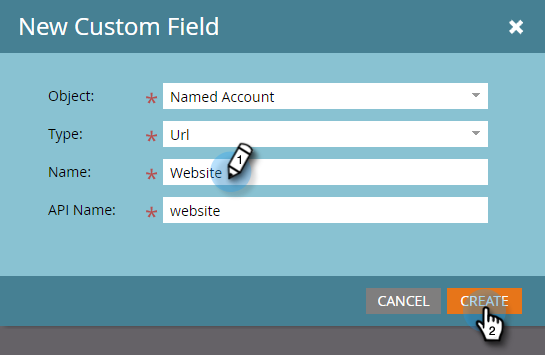
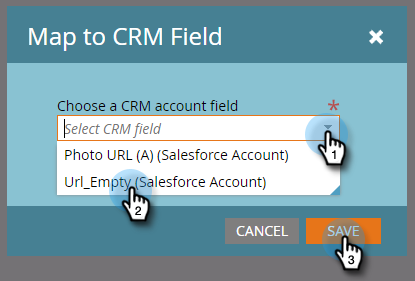

# Create a Custom Field for CRM Discovery {#create-a-custom-field-for-crm-discovery}

Add custom fields to accounts, map them to your CRM, and use them for CRM Account Discovery in Marketo.

1. Click **Admin**.

   

1. Click **Field Management**, then **New Custom Field**.

   

1. Click the **Object** drop-down and select **Named Account**.

   

1. Click the **Type** drop-down and select a type.

   

1. Enter a **Name** (the API Name will populate automatically) and click **Create**.

   

1. After the field is created, select it from the tree on the right. Click the **Field Actions** drop-down and select **Map to CRM Field**.

   

1. Select the CRM account field you want to map to and click **Save**.

   

   Once synced, your new field will appear on the far right in your Discover CRM grid.

   

