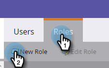
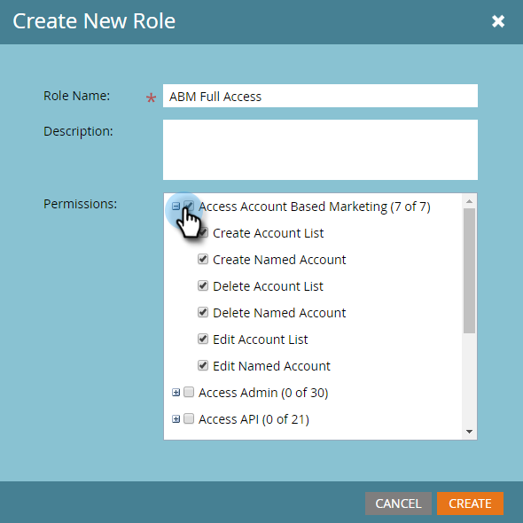
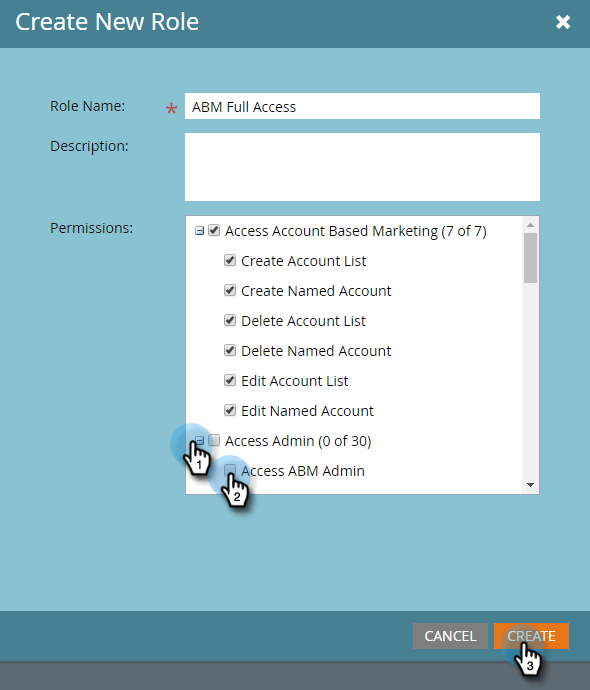

# Permissions {#permissions}

You'll need to set-up permissions for your users to be able to use ABM. Here's how.

1. Click **Admin**.

   

1. Click **Users & Roles**.

   

   >[!NOTE]
   >
   >You can add ABM permissions for an existing role, or create a brand new one. This example uses a new role.

1. Click **Roles**, then **New Role**.

   

1. Enter a Role Name and click the **+** icon next to the Access Account Based Marketing checkbox.

   

1. To select *all* permissions, simply check the **Access Account Based Marketing** checkbox.

   

   >[!NOTE]
   >
   >You also have the option to select only some of the options. Do that by checking each checkbox individually.

1. Click the **+** to open the Access Admin menu. Check the **Access ABM Admin** checkbox.

     
   Your new ABM role is now ready to be [assigned to a user](http://docs.marketo.com/display/public/DOCS/Managing+User+Roles+and+Permissions#ManagingUserRolesandPermissions-AssignRolestoaUser)!

   

