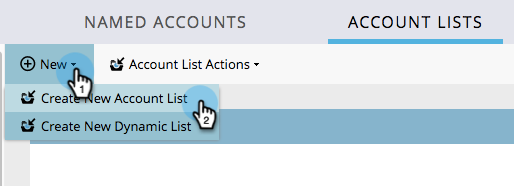
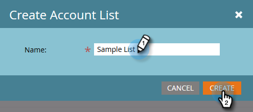
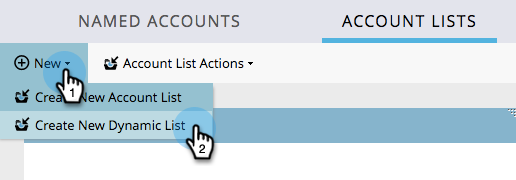
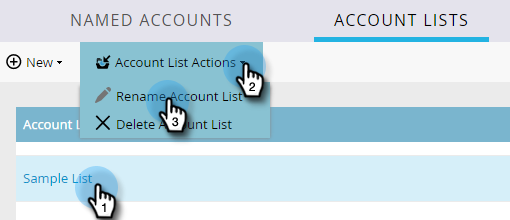
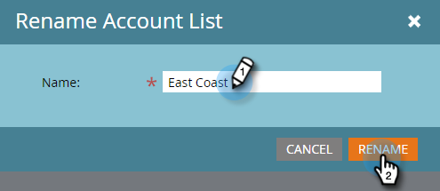
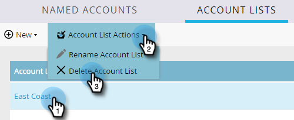
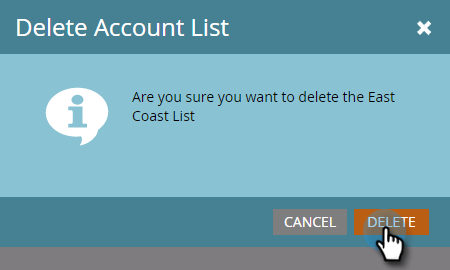

# Account Lists {#account-lists}

An account list is a collection of named accounts that can be targeted together. Account lists allow you to target named accounts by industry, location, or size of the company.

In addition to account lists, you can also create dynamic account lists that are generated from public CRM Account Views. A CRM Account View is a set of rules that acts as a filter when displaying accounts. For example, you can use it to find accounts where Industry is Healthcare *and* Revenue is over $100M.

### What's in this article? {#whats-in-this-article}

[Create a New Account List](#create-a-new-account-list)  
[Create a New Dynamic Account List](#create-a-new-dynamic-account-list)  
[Rename an Account List](#rename-an-account-list)  
[Delete an Account List](#delete-an-account-list)  

>[!NOTE]
>
>Account lists created in Marketo Account Based Marketing are automatically available when building smart lists and web campaigns in [Web Personalization](http://docs.marketo.com/display/DOCS/RTP+Segments).

#### Create a New Account List {#create-a-new-account-list}

1. Click the **New** drop-down and select **Create New Account List**.

   

1. Give your list a name and click **Create**.

   

1. After you create your account list, get started on [adding named accounts to it](http://docs.marketo.com/display/DOCS/Add+an+Existing+Named+Account+to+an+Account+List)!

   >[!NOTE]
   >
   >Marketo will only display insights for account lists with 2,000 or fewer named accounts.

#### Create a New Dynamic Account List {#create-a-new-dynamic-account-list}

1. Click the **New** drop-down and select **Create New Dynamic List**.

   

1. In the dialog, select a **CRM Account View** from the drop-down, or type in the name to search for it.

   

1. Click **Create**.

   

   >[!NOTE]
   >
   >In Salesforce, be sure to provide List View Object permissions to the sync user.

#### Rename an Account List {#rename-an-account-list}

>[!NOTE]
>
>These steps apply only to account lists. *Dynamic* account lists use the name of their associated CRM Account Views.

1. Select the account you want to rename, click the **Account List Actions** drop-down and select **Rename Account List**.

   

1. Enter the new name and click **Rename**.

   

   >[!NOTE]
   >
   >The CRM Account View syncs to the dynamic account list every 8 hours. If they are not yet synced, Marketo will sync them during the next cycle.

#### Delete an Account List {#delete-an-account-list}

>[!NOTE]
>
>These steps are the same for both account lists and dynamic account lists.

1. Select the account you want to delete, click the **Account List Actions** drop-down and select **Delete Account List**.

   

1. Click **Delete**.

   

>[!NOTE]
>
>**Related Articles**
>
>* [Add an Existing Named Account to an Account List](named-accounts/add-an-existing-named-account-to-an-account-list.md)
>* [Account List Insights](../../../product-docs/account-based-marketing/measure/account-list-insights.md)
>

