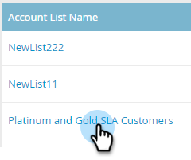
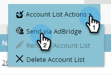
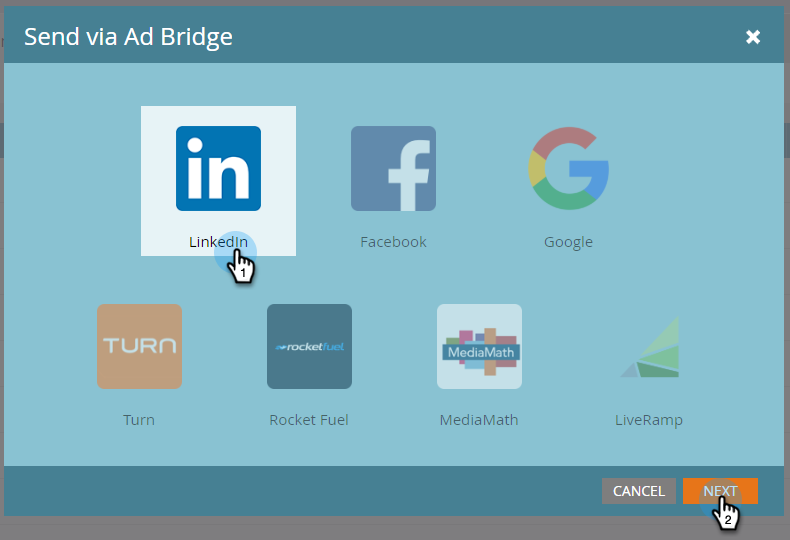
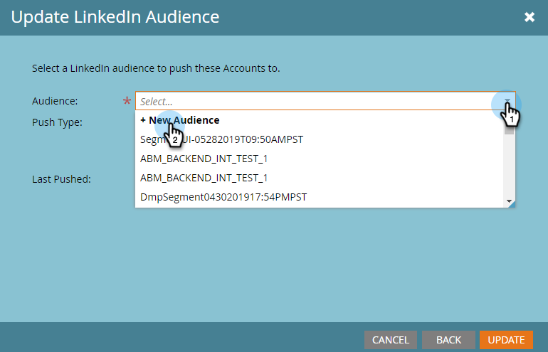
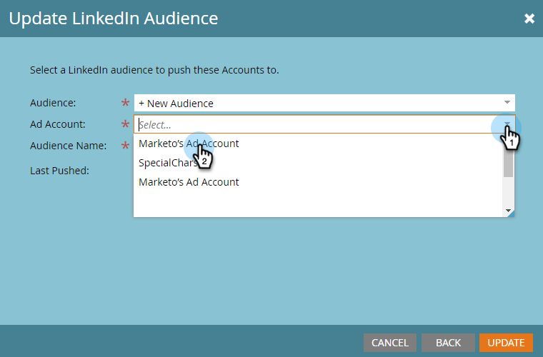

# Create a Matched Audience on LinkedIn {#create-a-matched-audience-on-linkedin}

Create matched audiences from your ABM Account Lists for LinkedIn Ad Targeting.

>[!PREREQUISITES]
>
>[Add LinkedIn Matched Audiences as a LaunchPoint Service](http://docs.marketo.com/x/I4Fy)

1. In ABM, click the **Account Lists** tab.

   

1. Choose your desired account list.

   

1. Click the **Account List Actions** drop-down and select **Send via AdBridge**.

   

1. Choose **LinkedIn** and click **Next**.

   

1. Click the **Audience** drop-down. You can select an existing audience or create a new one. In this example, we'll create a new one (if you select an existing audience, skip to Step 7).

   

1. Click the **Ad Account** drop-down and select the target ad account.

   

1. Name your audience and click **Update**.

   

   And that's it. Your audience has been pushed over to LinkedIn.

>[!NOTE]
>
>**Related Articles**
>
>* [Use a Marketo List or Smart List as a LinkedIn Audience Segment](http://docs.marketo.com/x/NIFy)
>

