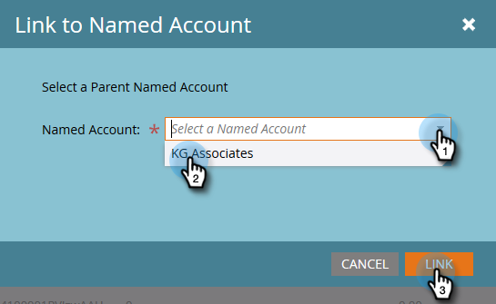

# Create a Hierarchy {#create-a-hierarchy}

Hierarchies are meant to be created in CRMs. However if you don't have a CRM, follow these steps to create a hierarchy manually.

1. In Named Accounts, click the **Group by Hierarchy** checkbox.

   

   >[!NOTE]
   >
   >**Reminder**
   >
   >
   >Only non-CRM accounts can be used to manually create a hierarchy. CRM-linked accounts need to have their hierarchies created in the CRM.

1. Using ctrl+click (Windows) or Cmd+click (Mac), select all of the accounts you want to group together in a hierarchy.

   

1. Click the **Named Account Actions** drop-down and select **Link to Named Account**.

   

   >[!NOTE]
   >
   >If you want to unlink accounts, follow the steps above but choose **Unlink From Named Account**.

1. Select a Parent Named Account from the drop-down and click **Link**.

   

1. Your named accounts are now part of a hierarchy. Click the arrow to the left to see all of its child accounts.

   

