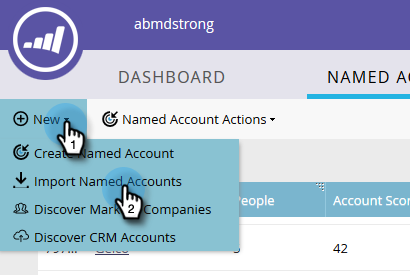
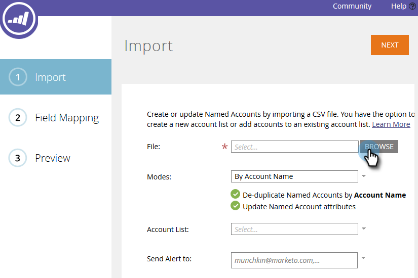
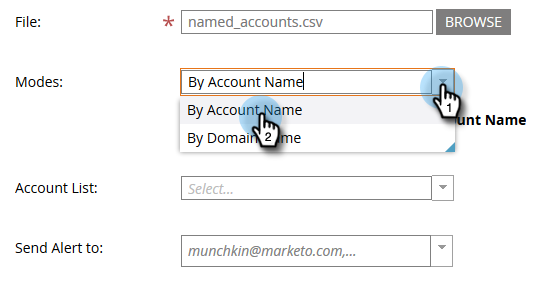
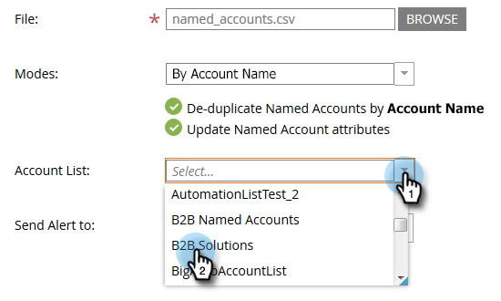
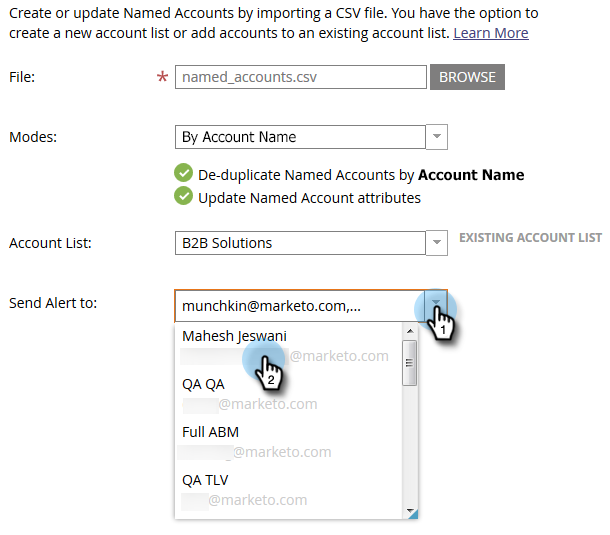
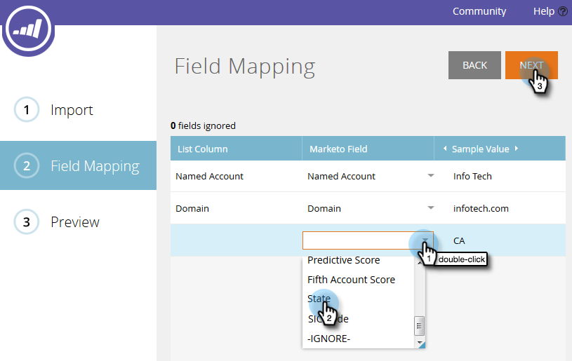

# Import Named Accounts {#import-named-accounts}

Already have a CSV full of potential target accounts? Import them directly into ABM!

1. Click the **New** drop-down and select **Import Named Accounts**.

   

1. A new window will open. Click **Browse**, then select the file of named accounts you want to import.

   

   >[!TIP]
   >
   >In your file, provide [as much information](http://docs.marketo.com/display/DOCS/Named+Account+Overview#NamedAccountOverview-NamedAccountAttributes) as possible. You can only add firmographic information; nothing Marketo calculates (i.e. Pipeline). To create named accounts based on CRM accounts, simply export the account name and CRM ID from your CRM into a CSV file, use the Account Name option, and map the CRM ID during the import process. To properly link a CRM account to a named account, you must provide the CRM account's exact name.

1. Choose from two dedupe modes: Account Name or Domain Name. In this example we'll choose Account. Click the **Modes** drop-down and select **By Account Name**.

   

   >[!NOTE]
   >
   >If you choose **By Domain Mode**, both the named account and domain fields must be included.

1. To choose which account list your named account gets added to, click the **Account List** drop-down and make your selection.

   

   >[!NOTE]
   >
   >You can also create a brand new Account List by simply typing its name in the drop-down box.

1. To send a notification of the import, click the **Send Alert To** drop-down and select a Marketo user. You *cannot* manually enter an email address.

   

1. Click **Next**.

   

1. Map each field by double-clicking on the **Marketo Field** drop-down and selecting the appropriate field. Click **Next** when done.

   

   Success!

   

   >[!NOTE]
   >
   >"Check Import Status" only shows the last three days of activity.

<table> 
 <tbody> 
  <tr> 
   <td>Importing record with existing Named Account name</td> 
   <td>
We will update the existing record
</td> 
  </tr> 
  <tr> 
   <td>Importing record with new Named Account name</td> 
   <td>We will create a new record</td> 
  </tr> 
 </tbody> 
</table>

   Scenarios when you dedupe by Domain Name:

   | **Importing record with a new account name & new domain name** |We will create a new Named Account with the info provided |
   |---|---|
   | **Importing record with an existing account name & existing domain name** |We will update the existing Named Account |
   | **Importing record with a new account name & existing domain name** |We will append the new account name to the existing Named Account that matches the domain name and update other info (i.e. Industry, State, etc) |
   | **Importing record with existing Named Account name & new domain name** |We will append the new domain name to the existing Named Account that matches the account name and update other info (i.e. Industry, State, etc) |

   >[!NOTE]
   >
   >When Marketo appends a named account, we are updating a rule (behind the scenes) that allows us to identify people that should be a part of the Named Account. Example: if you update "IBM" to "IBM, USA," people with either company name will be associated to the Named Account.

   If Marketo finds records that we see as duplicates, we will only process the first one.

Scenarios when you dedupe by Account Name: 