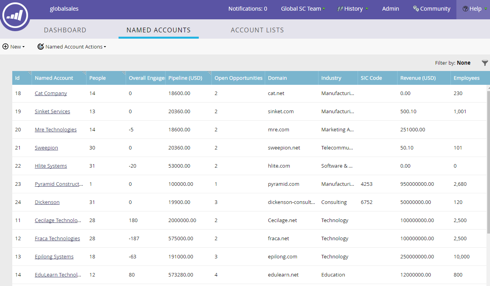

# Named Account Overview {#named-account-overview}

Named Accounts hold the people from the companies you're targeting. The dashboard provides current data of each attribute for all your named accounts.

### What's in this article? {#whats-in-this-article}

[Named Accounts Dashboard](#named-accounts-dashboard)  
[Named Account Attributes](#named-account-attributes)

#### Named Accounts Dashboard {#named-accounts-dashboard}

>[!TIP]
>
>Named accounts are sorted by Created Date by default, however you can sort by any column that has a sort icon in its header.

>[!NOTE]
>
>Marketo shows all CRM users synced into Marketo as filter values of "Account Owner" or "Member of Account Team."

#### Named Account Attributes {#named-account-attributes}

<table> 
 <tbody> 
  <tr> 
   <td><strong>ID</strong></td> 
   <td>Named Account's identification number</td> 
  </tr> 
  <tr> 
   <td><strong>Named Account</strong></td> 
   <td>Named Account's name</td> 
  </tr> 
  <tr> 
   <td><strong>People</strong></td> 
   <td>Amount of people attributed to Named Account</td> 
  </tr> 
  <tr> 
   <td><strong>Pipeline</strong></td> 
   <td>Sum of Amount of all the opportunities in your CRM system that aren't Closed Won or Closed Lost</td> 
  </tr> 
  <tr> 
   <td><strong>Open Opportunities</strong></td> 
   <td>All the opportunities in your CRM that are not Closed Won or Closed Lost.</td> 
  </tr> 
  <tr> 
   <td><strong>Domain</strong></td> 
   <td>Named Account's domain (e.g. marketo.com)</td> 
  </tr> 
  <tr> 
   <td><strong>Industry</strong></td> 
   <td>Type of industry attributed to Named Account</td> 
  </tr> 
  <tr> 
   <td><strong>SIC Code</strong></td> 
   <td><strong>S</strong>tandard <strong>I</strong>ndustrial <strong>C</strong>lassification - four-digit code for classifying industries </td> 
  </tr> 
  <tr> 
   <td><strong>Revenue</strong></td> 
   <td>The company's annual revenue</td> 
  </tr> 
  <tr> 
   <td><strong>Employees</strong></td> 
   <td>Number of employees attributed to a Named Account</td> 
  </tr> 
  <tr> 
   <td colspan="1"><strong>Account Score</strong></td> 
   <td colspan="1">Aggregate of lead scores from multiple leads to provide score at an account level</td> 
  </tr> 
  <tr> 
   <td colspan="1"><strong>City</strong></td> 
   <td colspan="1">Named Account's city</td> 
  </tr> 
  <tr> 
   <td colspan="1"><strong>State/Region</strong></td> 
   <td colspan="1">Named Account's state or region</td> 
  </tr> 
  <tr> 
   <td colspan="1"><strong>Country</strong></td> 
   <td colspan="1">Named Account's country</td> 
  </tr> 
  <tr> 
   <td colspan="1"><strong>Created Date</strong></td> 
   <td colspan="1">Date the Named Account was created</td> 
  </tr> 
  <tr> 
   <td colspan="1"><strong>Account Owner</strong></td> 
   <td colspan="1">Owner of specified account</td> 
  </tr> 
  <tr> 
   <td colspan="1"><strong>Account Team Member</strong></td> 
   <td colspan="1">Member of group of stakeholders that work together on specific accounts</td> 
  </tr> 
 </tbody> 
</table>

