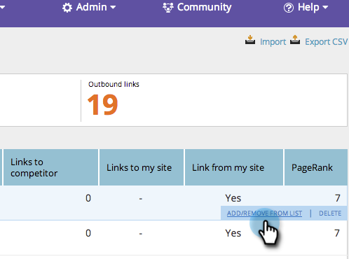
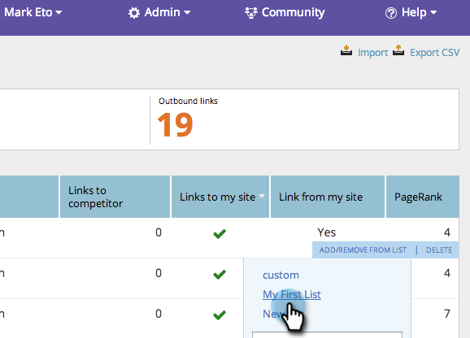
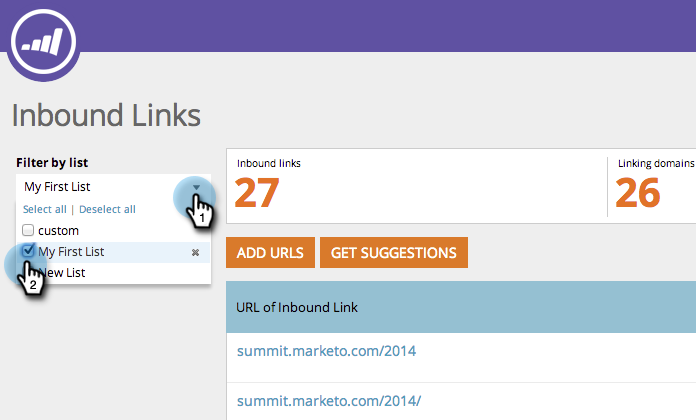
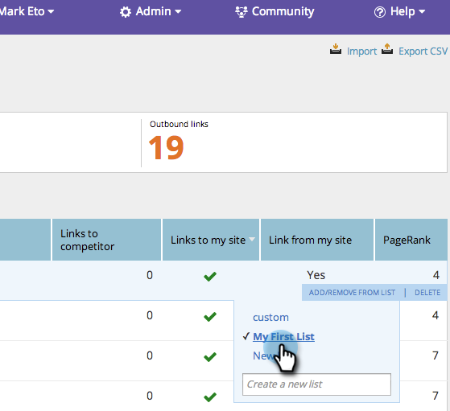

# SEO - Add/Remove an Inbound Link URL From a List {#seo-add-remove-an-inbound-link-url-from-a-list}

You can organize your inbound link URLs to your heart's content.

## Add an Inbound Link URL to a List {#add-an-inbound-link-url-to-a-list}

1. Go to the **[!UICONTROL Inbound Links]** section.

   

1. Hover over the inbound link URL you want to categorize. Click **[!UICONTROL Add/Remove From List]**.

   

1. Click on the list you'd like your inbound link URL to go.

   

>[!TIP]
>
>You can also make a new list for your keyword to go. Just type your desired name in [!UICONTROL Create a new list].

## Remove an Inbound Link URL from a List {#remove-an-inbound-link-url-from-a-list}

Sometimes you'll want to remove an inbound link URL's from a list.

1. Click **[!UICONTROL Inbound Links]**.

   

1. Click the **[!UICONTROL Filter by list]** drop-down. Click the list you want to clean up.

   

1. Hover over the inbound link URL you'd like to remove. Click **[!UICONTROL Add/Remove From List]**.

   

1. The list you'd like to organize will be checked. Click the list name to remove the inbound link URL from this list.

   

You did it! Refresh the page to update the display.
