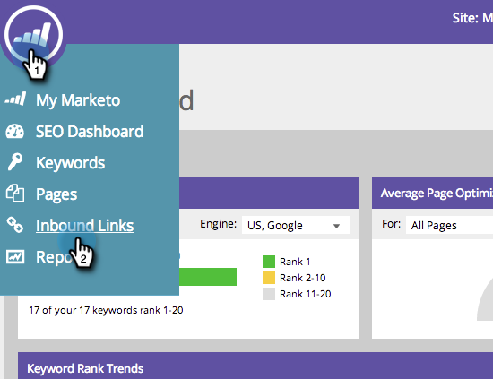
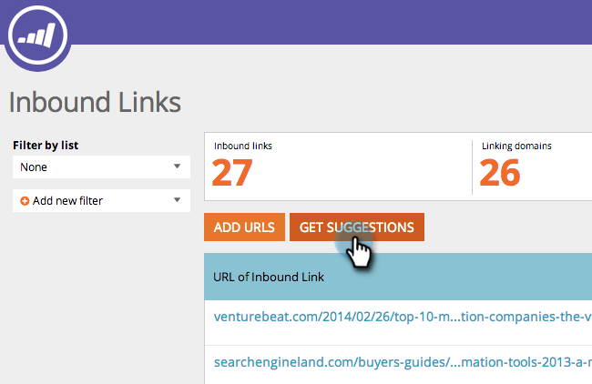
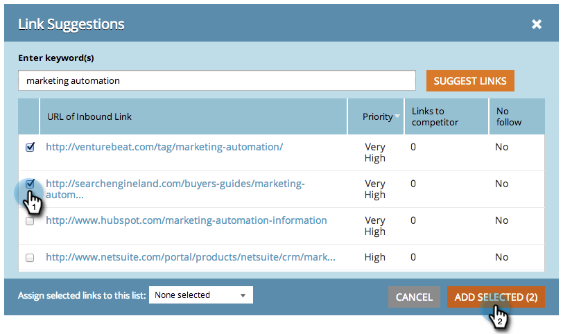

# SEO - Get Inbound Link Suggestions {#seo-get-inbound-link-suggestions}

Marketo can suggest which inbound links are valuable to your [off-page optimization](../../../../product-docs/additional-apps/seo/understanding-seo/understanding-search-engine-optimization.md).

1. Go to the **Inbound Links** section.

   

1. Click **GET SUGGESTIONS**.  

   

1. Enter a keyword. Click **SUGGEST LINKS**.

   

1. Select the links. Click **ADD SELECTED**. 

   

   >[!TIP]
   >
   >Did you know you can&nbsp; [add your link to a new or existing list](seo-add-remove-an-inbound-link-url-from-a-list.md)? Check it out!

1. Awesome! These added links will now be tracked.

   >[!NOTE]
   >
   >**Related Articles**
   >
   >    
   >    
   >    * [Understanding Inbound Links](seo-understanding-inbound-links.md)
   >    
   >

