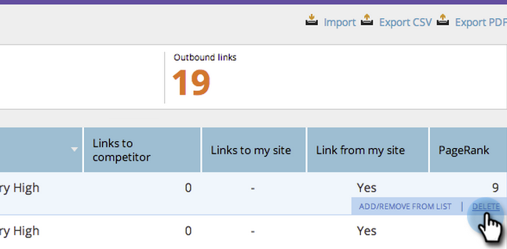

# SEO - Remove/Delete an Inbound Link URL {#seo-remove-delete-an-inbound-link-url}

Sometimes you're gonna want to remove inbound links. Here's how:

1. Go to the&nbsp;**Inbound Links**&nbsp;section.&nbsp;

   

1. Hover over the inbound link URL you want to delete. 

   
   Click REMOVE.
   

   Level up! You've now deleted this inbound link.

