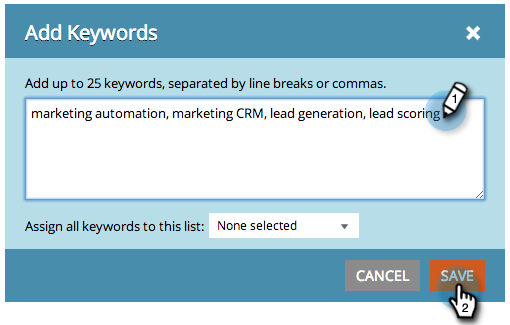

# SEO - Add Keywords {#seo-add-keywords}

Keywords are phrases people type into search engines. Add the keywords most relevant to your business.

>[!NOTE]
>
>If you have a lot of keywords, you can  [import them with a CSV file](seo-importing-keywords-with-a-csv.md).

1. Go to the **Keywords** section.

   

1. Enter the keywords you want to target and click **SAVE**.

   

   >[!TIP]
   >
   >Separate the keywords with line breaks or commas.

   

   >[!NOTE]
   >
   >**Related Articles**
   >
   >    
   >    
   >    * [Understanding Keywords (Summary View)](seo-understanding-keywords.md)
   >    
   >

Good job! You should now see your new additions to the keyword list. 